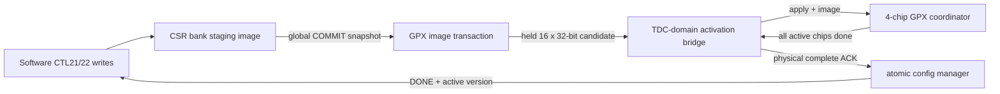

# Checkpoint H2B-2B: GPX Image Portal and Physical Activation

## 1. 판정

H2B-2B 범위는 **PASS**이다.

통합 CSR의 한 번의 COMMIT이 runtime configuration과 16-entry GPX register
image를 함께 고정하고, 모든 build-time present GPX chip이 실제 programming을 완료한 뒤에만
성공으로 끝나는 경로를 구성했다. H2B-2A coordinator의 Shot/data path는
변경하지 않았다.

Stage 5 전체 sign-off는 아직 H3 v1 oracle 통합 비교가 남아 있으므로 완료로
판정하지 않는다.

## 2. 구조와 역할



| 모듈 | 책임 |
|---|---|
| `lidar_csr_bank` | CTL21/22 indexed staging/active view, encoding guard, revision 관리 |
| `lidar_gpx_image_transaction` | 승인된 global COMMIT 시 16-entry image snapshot, 성공 후 active image 갱신 |
| `lidar_config_gateway` | TDC ACTIVATE를 물리 programming 완료까지 ACK하지 않음 |
| `lidar_gpx_config_activation` | held mailbox image를 TDC clock에서 capture하고 coordinator ready/done/fault 중계 |
| `lidar_gpx_acquisition_coordinator` | apply를 모든 활성 chip에 전달하고 전체 완료를 한 event로 축약 |

## 3. CSR 계약

전체 레지스터 수는 기존과 같은 **32 CTL / 32 STAT / 4 IRQ**이다.

| Word | Field | 의미 |
|---:|---|---|
| CTL20 | `[15:0] CHANNEL_0_DELAY` | Echo simulation 채널 0 지연, 5 ns ticks |
| CTL20 | `[31:16] CHANNEL_STEP` | 다음 채널마다 더할 지연, 5 ns ticks/channel |
| CTL21 | `[3:0] GPX_IMAGE_INDEX` | GPX register 0..15 선택 |
| CTL21 | `[8] VIEW_ACTIVE` | 0 staging, 1 마지막 성공 active image |
| CTL22 | `[27:0] GPX_IMAGE_DATA` | 선택된 GPX register data |

Echo의 최대 32채널 지연은 다음 식으로만 생성한다.

```text
delay_5ns[n] = CHANNEL_0_DELAY + n * CHANNEL_STEP, n = 0..31
```

채널별 32-entry CSR table은 만들지 않았다. GPX image도 16개 주소를 추가하지
않고 INDEX/DATA 두 word만 사용했으므로 CTL23..31은 계속 reserved이다.

## 4. Echo build option 비회귀

다음 build option을 그대로 유지한다.

| 설정 | 결과 |
|---|---|
| `enable_echo_receiver=false` | Echo receiver와 synthetic STOP 경로를 합성에서 제거 |
| `enable_echo_receiver=true`, `enable_echo_simulation=false` | physical LVDS-to-STOP만 합성 |
| `enable_echo_receiver=true`, `enable_echo_simulation=true` | physical 경로와 synthetic test source를 합성 |

CTL20은 simulation delay용이며 physical LVDS-to-STOP의 초저지연 경로에
들어가지 않는다. H2B-2B의 GPX image portal은 CTL20과 Echo build option을
재사용하거나 변경하지 않는다.

## 5. Atomic 적용 규칙

1. software가 CTL21/22로 staging image를 편집한다.
2. CTL0.COMMIT이 승인된 clock에서 runtime config와 image를 각각 snapshot한다.
3. TDC gateway가 safe-point에서 candidate config를 capture한다.
4. activation bridge는 coordinator가 ready일 때만 한 cycle apply를 발생시킨다.
5. build-time present chip 전체가 register programming을 완료해야 complete를
   발생시킨다.
6. 그 뒤에만 TDC ACTIVATE ACK와 central DONE이 돌아오고 active image가 바뀐다.
7. 2~6 중 staging image를 다시 써도 진행 중 candidate에는 섞이지 않으며 다음
   COMMIT 후보로 남는다.

`i_tdc_config_ready/done`의 기본값은 0이다. 물리 적용을 사용하도록 build한 뒤
coordinator를 연결하지 않은 경우 거짓 성공할 수 없고 transaction이 timeout/
fault로 종료되는 fail-safe 계약이다.

## 6. 검증

### 기능 회귀

- GPX reset image가 검증된 v1 `c_GPX_DEFAULT_IMAGE`와 동일함;
- CTL21 index/view의 reserved encoding 거부;
- CTL22 `[31:28]` non-zero write 거부, 28-bit data 무손실;
- active view write 거부 및 active-valid 전 zero readback;
- COMMIT image snapshot과 진행 중 edit 격리;
- coordinator ready backpressure 동안 apply/ACK 미발생;
- 모든 build-time present chip의 done 전 central DONE 미발생;
- coordinator fault가 gateway/CSR recovery 경로로 전파됨;
- 150/200 MHz와 200/150 MHz coordinator 연결 회귀 PASS.

Evidence:

```text
signoff_results/sessions/260805_stage5_h2b2b_csr_r6_external_apply_v2_unified_csr
signoff_results/sessions/260805_stage5_h2b2b_coord_link_r1_v2_gpx_acquisition_coordinator
```

### 구현 결과

| Profile | WNS | Latch | Critical CDC | ASYNC_REG |
|---|---:|---:|---:|---:|
| PROC 150 / TDC 200 MHz | +0.667 ns | 0 | 0 | 124 |
| PROC 200 / TDC 150 MHz | +0.614 ns | 0 | 0 | 124 |

CDC-15 2,682건은 기존 runtime configuration과 새 GPX image의 bundled-data
mailbox이다. source payload는 COMMIT snapshot 뒤 handshake 종료까지 고정되고,
동기화된 request 뒤에만 destination register가 capture한다. 두 profile 모두
Critical CDC는 0이다.

## 7. 다음 단계

H3에서 v1 board-proven oracle과 다음 항목을 end-to-end exact compare한다.

- chip별 IFIFO1/IFIFO2 drain ordering;
- 28-bit raw data와 하위 17-bit hit identity;
- 16 STOP channel, rising/falling topology, 최대 7 Return;
- Shot boundary, terminal event, timeout/fault behavior;
- 32/64/128-bit output handoff 전 acquisition 결과 identity.
