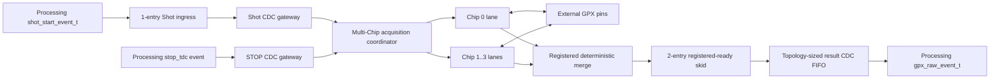

# Checkpoint H3 GPX Acquisition Subsystem

## 1. 판정

Stage 5 / Checkpoint H의 B5 GPX acquisition 경계는 통과했다. H3는
Processing-domain Shot/STOP event부터 외부 GPX pin, 검증된 v1 Chip controller,
다중 Chip result merge와 Processing-domain result 반환까지 하나의 production
subsystem으로 조립한다.

검증 범위는 4 Chip x 8 STOP = 32개 물리 STOP lane, 전용 2-Rise/2-Fall
topology에서 16 APD 채널의 양 edge, STOP/slope당 최대 7 Return, GPX 원본
28-bit word, 150/200 MHz 및 200/150 MHz 비동기 조합이다. Hit 17-bit 해석과
Cell/Frame/VDMA 조립은 Stage 6 이후 책임이므로 이번 판정에 포함하지 않는다.

## 2. 모듈과 데이터 흐름



| 모듈 | 클럭 | 역할 |
|---|---|---|
| `lidar_gpx_acquisition_subsystem` | Processing + TDC | H3 production 조립과 named CDC 경계 소유 |
| `lidar_gpx_shot_gateway` | Processing -> TDC | 95-bit Shot 문맥을 원자적으로 전달 |
| `lidar_gpx_stop_gateway` | Processing -> TDC | STOP one-shot을 유실 없이 전달하고 overflow 진단 |
| `lidar_gpx_acquisition_coordinator` | TDC | active Chip 전체에 Shot 원자 배포, 결과 순서 보존 |
| `lidar_gpx_acquisition_lane` | TDC | 검증된 v1 Chip controller를 typed event 경계로 감쌈 |
| `lidar_gpx_result_gateway` | TDC -> Processing | 149-bit raw-result와 Shot identity를 함께 버퍼링 |
| `tdc_gpx_skid_buffer` | TDC | merge의 ready 경로를 result FIFO의 reset/full 조합 경로에서 분리 |

외부 GPX `D[27:0]`은 lane에서 수정되지 않는다. `raw_word[27:0]` 전체와 그중
거리 hit인 하위 `[16:0]`은 같은 result payload 안에서 이동하므로
backpressure와 CDC 중에도 분리되지 않는다.

## 3. 물리 Drain 상한

물리 IFIFO에서 안전하게 관찰할 수 있는 최대 word 수는 runtime
`max_hits_per_stop`이 아니라 합성 전 topology로 결정한다.

```text
STOP_CHANNELS_PER_IFIFO_CAP = min(STOPS_PER_CHIP, 4)
SLOPE_CAPACITY(chip) =
    RISE_CAPABILITY(chip) + FALL_CAPABILITY(chip)  -- 1 or 2
WORDS_PER_IFIFO_CAP(chip) =
    STOP_CHANNELS_PER_IFIFO_CAP
    * MAX_RETURNS_PER_STOP
    * SLOPE_CAPACITY(chip)
DRAIN_CAP_QUADS(chip) = ceil(WORDS_PER_IFIFO_CAP(chip) / 4)
```

현재 최대 profile은 다음과 같다.

```text
STOPS_PER_CHIP       = 8
STOPS_PER_IFIFO      = 4
MAX_RETURNS_PER_STOP = 7
SLOPE_CAPACITY       = 1  (dedicated chip)
WORDS_PER_IFIFO_CAP  = 28
DRAIN_CAP_QUADS      = 7
```

`max_returns_per_stop=7`은 활성 slope lane별 Return 수다. 따라서 한 APD의
Rise/Fall을 같은 Chip에서 동시에 처리하는 dual-edge Chip은 IFIFO당 56 word,
14 quad가 필요하다. 기본 2-Rise/2-Fall 전용 구성은 Chip마다 slope가 하나라
IFIFO당 28 word, 7 quad만 필요하다. 이 차이는 capability mask에서 자동으로
도출되며 CSR이나 추가 generic을 만들지 않는다.

`max_hits_per_stop`은 이후 Hit/Cell/formatter가 보존할 Return 수를 제한하는
runtime 정책이다. 이 값을 GPX raw drain 상한으로 사용하면 물리 FIFO tail이
남으므로 두 의미를 결합하지 않는다.

28 word를 넘는 비정상 IFIFO는 bounded data까지만 결과로 내보내고 나머지는
purge한다. 이때 faulted terminal event와 `drain_cap_sticky`를 모두 남긴다.
sticky는 다음 두 원인을 합친 진단이다.

- immutable physical IFIFO output cap 도달;
- 기존 response-bus quarantine cap 도달.

이벤트 발생과 software clear가 같은 clock이면 fault 이벤트가 우선한다.

## 4. Result FIFO 용량

downstream이 한 Shot 전체 동안 정지해도 TDC drain을 막지 않도록 result FIFO는
합성 topology로 자동 산정한다.

```text
EVENTS_PER_CHIP(chip) =
    2 * (4 * DRAIN_CAP_QUADS(chip))
    + IFIFO1_DONE + TERMINAL

EVENTS_PER_SHOT = sum(EVENTS_PER_CHIP(chip))
RESULT_FIFO_DEPTH = max(16, next_power_of_two(EVENTS_PER_SHOT))
```

기본 4 Chip x 8 STOP x 7 Return, 전용 2-Rise/2-Fall profile에서는 Chip당
58 event, Shot당 232 event이며 FIFO depth는 256이다. 4 Chip 모두 dual-edge면
Chip당 114 event, Shot당 456 event, FIFO depth 512로 자동 확대된다. XPM memory
type은 `auto`로 두어 작은 command FIFO는 distributed RAM을 유지하고 큰 result
FIFO는 BRAM으로 추론되게 한다. 사용자가 별도 memory generic을 관리할 필요는
없다.

## 5. Echo 비회귀 계약

H3는 Echo CSR 수를 늘리지 않았다. 최대 32채널의 synthetic delay는 CTL20 한
word의 두 값만으로 전개한다.

| CTL20 field | Bit | 단위 | 의미 |
|---|---:|---|---|
| `CHANNEL_0_DELAY` | `[15:0]` | 5 ns ticks | 채널 0 기준 지연 |
| `CHANNEL_STEP` | `[31:16]` | 5 ns ticks/channel | 다음 채널마다 더할 지연 |

```text
delay[0] = CHANNEL_0_DELAY
delay[n] = CHANNEL_0_DELAY + n * CHANNEL_STEP, n = 1..31
```

32개 채널별 CSR table, Echo 전용 INDEX/DATA portal 또는 별도 APPLY command는
추가하지 않았다. 두 source 값은 atomic configuration commit에 포함되고,
simulation profile block이 활성 채널 수만큼 순차 전개한다.

| Build option | 합성 결과 |
|---|---|
| `enable_echo_receiver=false` | physical receiver와 synthetic STOP 경로 모두 제거 |
| `enable_echo_receiver=true`, `enable_echo_simulation=false` | physical LVDS-to-STOP만 합성 |
| `enable_echo_receiver=true`, `enable_echo_simulation=true` | physical 경로와 synthetic test source 합성 |
| receiver=false, simulation=true | build validation에서 거부 |

## 6. 기능 검증

두 비동기 clock profile에서 다음 시나리오를 동일하게 실행했다.

| 시나리오 | 자극 | exact-compare 결과 |
|---|---|---|
| Normal full capacity | 각 Chip의 IFIFO1/2에 각각 28 word, Processing result ready를 한 Shot 전체가 저장될 때까지 low | 58 event/Chip, 총 232 event, Chip/IFIFO/raw-28/Shot/sequence/순서 PASS |
| Timeout | STOP CDC 전달 후 IrFlag를 발생시키지 않고 run stop | Chip당 `GPX_RAW_TIMEOUT`, cause=`111`, safe recovery PASS |
| Physical cap | IFIFO1=32 word, IFIFO2=1 word | IFIFO1 28 word까지만 관찰, tail purge, faulted terminal, sticky, empty-read 0 PASS |

추가 비회귀:

- 공용 Shot/result gateway의 150/200, 200/150 및 기존 150/150 경로 PASS;
- 단일 acquisition lane의 150 MHz와 200 MHz 회귀 PASS;
- result backpressure 동안 모든 149-bit payload field 안정성 PASS.

용량을 실제 8-STOP topology로 바로잡은 첫 구현에서는 result async FIFO의
reset/full ready 경로가 merge arbitration과 149-bit event register까지 이어져
150/200 MHz profile의 WNS가 `-0.281 ns`였다. 기존 검증된 2-entry
registered-ready skid를 merge와 result CDC FIFO 사이에 배치해 이 조합 경로를
끊었다. 처리율은 II=1로 유지되고 TDC-domain latency만 1 clock 증가하며,
payload, 순서와 backpressure 계약은 바뀌지 않는다.

## 7. 구현 결과

대상 part는 `xc7z020clg484-2`, OOC post-route 결과다.

| Profile | WNS | Latch | Critical CDC | Blocking DRC |
|---|---:|---:|---:|---:|
| Processing 150 / TDC 200 MHz | +0.313 ns | 0 | 0 | 0 |
| Processing 200 / TDC 150 MHz | +0.668 ns | 0 | 0 | 0 |

BRAM 자동 선택 후 자원은 다음과 같다.

| Profile | LUT | Logic LUT | LUTRAM | FF | RAMB36 | RAMB18 |
|---|---:|---:|---:|---:|---:|---:|
| 150/200 MHz | 4,584 | 4,486 | 98 | 4,280 | 3 | 2 |
| 200/150 MHz | 4,537 | 4,439 | 98 | 4,276 | 3 | 2 |

이전 distributed-only 구현의 150/200 profile은 LUT 5,272, LUTRAM 962,
FF 4,906이었다. 큰 result FIFO를 BRAM으로 이동해 LUTRAM 864개와 LUT
688개를 줄였다. 실제 topology 보정과 149-bit registered skid를 포함하고도
FF는 626개 줄었으며, 별도 runtime 변수나 CSR은 추가하지 않았다.

CDC report의 유일한 `CDC-15` 경고는 STOP gateway의 AMD
`xpm_fifo_async` 내부 RAM write/read 구조다. 사용자 RTL 경로의 Critical CDC는
0이고 동기화 경로 6개가 인식되었다. `PLIO-6`, `RTSTAT-10`, `ZPS7-1`은
pin/PS를 갖지 않는 OOC harness에서만
발생하는 예상 경고이며 blocking DRC는 0이다.

## 8. 증적과 Sign-off 경계

최종 증적:

- `signoff_results/sessions/260805_h3_capacity_fix_sim_v2_gpx_acquisition_subsystem`
- `signoff_results/sessions/260805_h3_capacity_fix_impl_v2_gpx_acquisition_subsystem`
- `signoff_results/sessions/260805_h3_capacity_fix_gateway_v2_gpx_event_gateway`
- `signoff_results/sessions/260805_h3_capacity_fix_lane_v2_gpx_acquisition_lane`

H3 통과로 Stage 5의 B5 GPX bus/acquisition 경계는 닫힌다. 이는 전체 LiDAR IP
또는 보드 sign-off를 의미하지 않는다. 다음 단계는 Stage 6의 28-bit raw word
해석, 하위 17-bit Hit/거리 처리와 Cell/Frame 경계 마이그레이션이다. 최종
parent XDC, board pin, 전체 배치배선 및 물리 GPX 측정은 Stage 9에서 별도로
닫는다.
