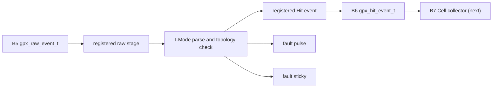

# Checkpoint I1 GPX Hit Decoder

## 1. 판정

Stage 6의 첫 구현 경계 B6를 완료했다. H3가 Processing domain으로 전달한
`gpx_raw_event_t`를 `gpx_hit_event_t`로 변환하며, GPX I-Mode 28-bit field,
Shot 문맥과 Chip sequence를 손실 없이 보존한다. Cell, Frame, VDMA byte 조립은
아직 포함하지 않으므로 Stage 6 전체와 통합 IP sign-off는 닫지 않는다.

## 2. 모듈과 데이터 흐름



| 파일 | 역할 |
|---|---|
| `pkg/lidar_gpx_data_pkg.vhd` | I-Mode bit 위치, slope, Hit event와 fault record의 단일 정의 |
| `rtl/proc/lidar_gpx_hit_decoder.vhd` | field 분해, STOP 복원, topology 검사와 ready/valid 소유 |
| `tb/tb_lidar_gpx_hit_decoder.vhd` | dedicated, dual-edge, fault/backpressure exact compare |
| `scripts/run_v2_gpx_hit_decoder.ps1` | 150/200 MHz 기능 및 OOC 구현 회귀와 증적 보관 |

디코더 경계는 입력 register와 출력 register로 분리했다. 입력 `ready`는 로컬 입력
register의 빈 상태로만 결정되므로 B7의 backpressure가 B6의 28-bit decode cone을
거쳐 upstream까지 조합 경로로 이어지지 않는다. 같은 cycle output refill도 하지
않는다. 처리량보다 단계 간 타이밍 독립성을 우선한 구조이며, B7이 더 느린 현재
pipeline에서는 전체 처리량을 제한하지 않는다. output backpressure 중에는 typed
record 전체를 유지하고, abort 중에는 `o_raw_ready=0`으로 내려 폐기 event를 정상
handshake로 오해하지 않게 한다.

## 3. Bit 단위 변환

| Raw bit | B6 field | 폭 | 처리 |
|---:|---|---:|---|
| `[27:26]` | `channel_code` | 2 | 원본 보존 |
| `[25:18]` | `start_number` | 8 | single-shot 기본 0 여부와 무관하게 보존 |
| `[17]` | `slope` | 1 | `1=Rise`, `0=Fall` enum으로 변환 |
| `[16:0]` | `hit` | 17 | Hit MSB를 포함해 전체 보존 |
| IFIFO id | `stop_index` | 3 | IFIFO1 `0..3`, IFIFO2 `4..7` |

`gpx_hit_event_t`는 위 필드 외에도 `chip_index`, `ififo_id`, `faulted`,
`timeout_cause`, 전체 `shot_context`, `chip_shot_seq`를 갖는다.
control event는 overlaid TUSER bit가 아니라 enum kind로 구분한다.

## 4. Return 소유 경계

B6에는 Return counter와 `return_index`가 없다. GPX raw word에는 Return 번호가
실려 있지 않고, 그 번호는 같은 Cell에 도착한 유효 Hit의 순서이기 때문이다.
Cell의 정의와 저장 주소를 소유하는 B7이 다음 key로 Return 순서를 단독 관리한다.

```text
Cell key = Shot + Chip + STOP + slope
B6       = raw word parse + topology validation
B7       = accepted Return count 0..7 + 8번째 overflow 진단
```

이 분리는 동일 의미 counter를 B6와 B7에 중복 보유하지 않게 하고, B6의 wide
counter reset과 decoder 출력 mux를 제거한다. dual-edge에서도 Rise와 Fall은 B7의
서로 다른 Cell 주소를 사용하므로 각각 독립적으로 Return 0..6을 갖는다.

## 5. 진단

| Fault | 발생 조건 | 데이터 처리 |
|---|---|---|
| `chip_index_error` | 존재하지 않는 build Chip event | consume-drop |
| `stop_index_error` | 복원 STOP >= `stops_per_chip` | consume-drop |
| `slope_role_error` | raw slope가 해당 Chip build capability와 불일치 | consume-drop |

8번째 Return과 runtime Hit 제한은 Cell 주소와 count를 소유하는 B7 진단이다.

각 fault는 1-clock pulse와 software status 연결용 sticky를 함께 제공한다. CSR bit
배정은 Cell/Frame 진단 전체를 본 뒤 한 번에 정리하며, 이 단계에서 CTL/STAT 수를
늘리지 않았다. sticky clear와 같은 clock에 새 fault가 들어오면 새 fault가
남는다.

## 6. 기능 검증

| Scenario | 150 MHz | 200 MHz | 확인 내용 |
|---|---|---|---|
| Dedicated 2-Rise/2-Fall | PASS | PASS | 4 Chip x 8 STOP, 32 물리 lane, 16 논리 APD field exact compare |
| One-Chip dual-edge | PASS | PASS | Rise/Fall topology 분리와 field 보존 |
| Identity/timeout | PASS | PASS | absent Chip, STOP 범위, slope role, timeout 문맥과 reset |
| Backpressure/abort | PASS | PASS | record 안정성, abort ready 차단 |

Dedicated test는 Hit `[16]`을 반복적으로 0/1로 바꾸고 `StartNum`도 0이 아닌 값으로
채워 모든 B6 field를 exact compare했다.

## 7. 구현 결과

대상 part는 `xc7z020clg484-2`, OOC post-route 결과다.

| Processing clock | WNS | LUT | FF | Latch | Blocking DRC |
|---:|---:|---:|---:|---:|---:|
| 150 MHz | +3.938 ns | 14 | 303 | 0 | 0 |
| 200 MHz | +2.391 ns | 14 | 303 | 0 | 0 |

default 8-STOP build에서는 모든 2-bit ChaCode가 유효하므로 synthesis가
`stop_index_error` pulse 일부를 상수 최적화한다. 6-STOP 기능 TB에서는 해당
진단이 실제로 검증되며, 이것은 기능 누락이 아니라 build 상한에 따른 정상 제거다.

최종 증적:

- `signoff_results/sessions/260805_b6_no_refill_final_v2_gpx_hit_decoder`

## 8. Echo 비회귀와 다음 단계

Echo Receiver 구조는 변경하지 않았다.

| Build option | 유지된 결과 |
|---|---|
| `enable_echo_receiver=false` | physical receiver와 synthetic STOP 경로 제거 |
| receiver true, simulation false | physical LVDS-to-STOP만 합성 |
| receiver true, simulation true | physical + synthetic source 합성 |

Synthetic delay는 계속 CTL20의 두 값만 사용한다.

```text
delay[channel] = CHANNEL_0_DELAY + channel * CHANNEL_STEP
```

32개 채널 지연 CSR table은 추가하지 않았다. B7 Cell collector와의 직접 연결
회귀는 `V2_CHECKPOINT_I2A_GPX_PIPELINE_OPTIMIZATION.md`에 기록한다. 다음 신규
기능 단계는 B8 Frame lane assembly다.
