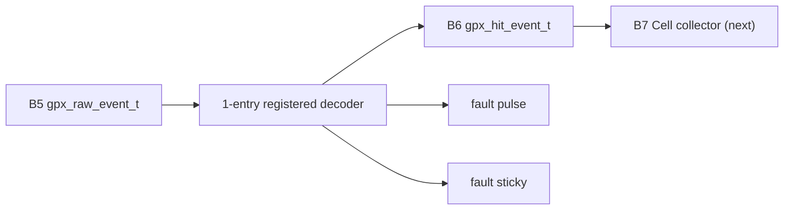

# Checkpoint I1 GPX Hit Decoder

## 1. 판정

Stage 6의 첫 구현 경계 B6를 완료했다. H3가 Processing domain으로 전달한
`gpx_raw_event_t`를 `gpx_hit_event_t`로 변환하며, GPX I-Mode 28-bit field,
Shot 문맥과 Chip sequence를 손실 없이 보존한다. Cell, Frame, VDMA byte 조립은
아직 포함하지 않으므로 Stage 6 전체와 통합 IP sign-off는 닫지 않는다.

## 2. 모듈과 데이터 흐름



| 파일 | 역할 |
|---|---|
| `pkg/lidar_gpx_data_pkg.vhd` | I-Mode bit 위치, slope, Hit event와 fault record의 단일 정의 |
| `rtl/proc/lidar_gpx_hit_decoder.vhd` | field 분해, STOP 복원, Return identity와 ready/valid 소유 |
| `tb/tb_lidar_gpx_hit_decoder.vhd` | dedicated, dual-edge, fault/backpressure exact compare |
| `scripts/run_v2_gpx_hit_decoder.ps1` | 150/200 MHz 기능 및 OOC 구현 회귀와 증적 보관 |

디코더 경계는 1-entry elastic register다. output이 비어 있거나 같은 clock에
소비될 때만 새 raw event를 받으므로 II=1을 유지한다. output backpressure 중에는
typed record 전체를 유지한다. abort 중에는 `o_raw_ready=0`으로 내려 upstream이
폐기된 event를 정상 handshake로 오해하지 않게 한다.

## 3. Bit 단위 변환

| Raw bit | B6 field | 폭 | 처리 |
|---:|---|---:|---|
| `[27:26]` | `channel_code` | 2 | 원본 보존 |
| `[25:18]` | `start_number` | 8 | single-shot 기본 0 여부와 무관하게 보존 |
| `[17]` | `slope` | 1 | `1=Rise`, `0=Fall` enum으로 변환 |
| `[16:0]` | `hit` | 17 | Hit MSB를 포함해 전체 보존 |
| IFIFO id | `stop_index` | 3 | IFIFO1 `0..3`, IFIFO2 `4..7` |

`gpx_hit_event_t`는 위 필드 외에도 `chip_index`, `ififo_id`, `return_index`,
`faulted`, `timeout_cause`, 전체 `shot_context`, `chip_shot_seq`를 갖는다.
control event는 overlaid TUSER bit가 아니라 enum kind로 구분한다.

## 4. Return counter 구조

counter key는 `Chip + STOP + slope`이고 Shot terminal에서 해당 Chip의 counter만
clear한다.

```text
return_index = count[chip][stop][slope]
accept data  = count < build max_returns_per_stop
next count   = count + 1
overflow     = consume raw word, emit no Hit, set pulse/sticky
```

counter는 4 Chip x 8 STOP x 2 slope x 3 bit의 최대 192 state bit다. runtime
곱셈이나 채널별 CSR는 없다. synthesis-time mask가 전용 slope 역할을 제거할 수
있고, STOP과 Return 상한은 기존 `G_BUILD_CONFIG`에서 가져온다.

v1 중간 metadata는 STOP당 하나의 counter를 Rise/Fall이 공유했다. v2는 사용자
요구와 Cell의 실제 slope 분리 의미에 맞춰 per-slope counter로 고쳤다. 따라서
dual-edge에서 Rise/Fall 모두 독립적으로 Return `0..6`을 갖는다.

## 5. 진단

| Fault | 발생 조건 | 데이터 처리 |
|---|---|---|
| `chip_index_error` | 존재하지 않는 build Chip event | consume-drop |
| `stop_index_error` | 복원 STOP >= `stops_per_chip` | consume-drop |
| `slope_role_error` | raw slope가 해당 Chip build capability와 불일치 | consume-drop |
| `return_overflow` | 같은 Chip/STOP/slope의 허용 Return 초과 | consume-drop, no wrap |

각 fault는 1-clock pulse와 software status 연결용 sticky를 함께 제공한다. CSR bit
배정은 Cell/Frame 진단 전체를 본 뒤 한 번에 정리하며, 이 단계에서 CTL/STAT 수를
늘리지 않았다. sticky clear와 같은 clock에 새 fault가 들어오면 새 fault가
남는다.

## 6. 기능 검증

| Scenario | 150 MHz | 200 MHz | 확인 내용 |
|---|---|---|---|
| Dedicated 2-Rise/2-Fall | PASS | PASS | 4 Chip x 8 STOP x 7 Return, 32 물리 lane, 16 논리 APD |
| One-Chip dual-edge | PASS | PASS | Rise/Fall 각각 Return 0..6, 8번째 no-wrap drop |
| Identity/timeout | PASS | PASS | absent Chip, STOP 범위, slope role, timeout 문맥과 reset |
| Backpressure/abort | PASS | PASS | record 안정성, abort ready 차단 |

Dedicated test는 Hit `[16]`을 반복적으로 0/1로 바꾸고 `StartNum`도 0이 아닌 값으로
채워 모든 B6 field를 exact compare했다.

## 7. 구현 결과

대상 part는 `xc7z020clg484-2`, OOC post-route 결과다.

| Processing clock | WNS | LUT | FF | Latch | Blocking DRC |
|---:|---:|---:|---:|---:|---:|
| 150 MHz | +1.593 ns | 196 | 256 | 0 | 0 |
| 200 MHz | +0.434 ns | 196 | 256 | 0 | 0 |

default 8-STOP build에서는 모든 2-bit ChaCode가 유효하므로 synthesis가
`stop_index_error` pulse 일부를 상수 최적화한다. 6-STOP 기능 TB에서는 해당
진단이 실제로 검증되며, 이것은 기능 누락이 아니라 build 상한에 따른 정상 제거다.

최종 증적:

- `signoff_results/sessions/260805_stage6_i1_b6_final_v2_gpx_hit_decoder`

## 8. Echo 비회귀와 다음 단계

Echo Receiver 구조는 변경하지 않았다.

| Build option | 유지된 결과 |
|---|---|
| `enable_echo_receiver=false` | physical receiver와 synthetic STOP 경로 제거 |
| receiver true, simulation false | physical LVDS-to-STOP만 합성 |
| receiver true, simulation true | physical + synthetic source 합성 |

Synthetic delay는 계속 CTL20의 두 값만 사용한다.

```text
delay[channel] = CHANNEL_0_DELAY + channel * CHANNEL_STEP
```

32개 채널 지연 CSR table은 추가하지 않았다. 다음 작업은 B7 Cell collector다.
`gpx_hit_event_t`를 Chip/STOP/slope Cell로 수집하면서 runtime
`max_hits_per_stop`, Hit `[16]` metadata와 비활성 lane 무동작을 검증한다.
