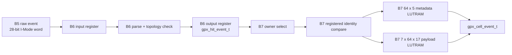

# Checkpoint I2A GPX Hit-to-Cell Pipeline Optimization

## 1. 목적과 판정

I2A는 신규 기능 추가가 아니라 B6/B7 경계의 책임 중복과 긴 조합 경로를 제거한
구조 최적화 checkpoint다. 다음 원칙을 적용했다.

1. B6는 GPX I-Mode 28-bit parse와 build topology 검사만 소유한다.
2. B7은 `Shot + Chip + STOP + slope` Cell의 Return 순서와 최대 7 Return을
   단독 소유한다.
3. ready, owner context 선택, identity compare, RAM read/write를 register 단계로
   분리한다.
4. payload와 metadata RAM에는 일괄 reset을 걸지 않는다.
5. 물리 `fire_done -> start_tdc`와 Echo LVDS-to-TDC STOP 경로는 변경하지 않는다.

B6 단독, B7 단독, B6+B7 직접 연결을 150/200 MHz에서 모두 검증했고, post-route
WNS, latch 및 blocking DRC 기준을 통과했다. 따라서 B6/B7 최적화는 닫고 다음
기능 단계인 I3/B8 Frame lane assembly로 진행할 수 있다.

## 2. 책임 분리



### 2.1 B6 소유 정보

| 항목 | 처리 |
|---|---|
| `ChaCode[27:26]` | IFIFO 내부 채널 보존 |
| `StartNum[25:18]` | 8 bit 전체 보존 |
| `Slope[17]` | Rise/Fall enum 변환 |
| `Hit[16:0]` | 17 bit 전체 보존 |
| IFIFO id | STOP 0..3 또는 4..7 복원 |
| topology | Chip 존재, STOP 범위, slope capability 검사 |

B6에는 per-Cell counter, Return 번호, runtime max_hits 비교가 없다.

### 2.2 B7 소유 정보

| 항목 | 처리 |
|---|---|
| Cell key | `Shot + Chip + STOP + slope` |
| Return order | 정상 수신 순서대로 bank 0..6 선택 |
| 물리 상한 | 7개, 8번째부터 no-wrap consume-drop |
| runtime 상한 | `max_hits_per_stop`까지만 Cell에 노출 |
| Shot identity | sequence, active version, shot, face, source 비교 |
| Cell output | Rise STOP 순서 후 Fall STOP 순서 |

동일 의미의 Return counter를 두 모듈에 두지 않으므로 소유권과 fault 위치가
명확하다. dual-edge Chip도 Rise와 Fall이 서로 다른 Cell 주소를 사용한다.

## 3. 순차 파이프라인

### 3.1 B6

```text
raw handshake
  -> input register
  -> field parse/topology check
  -> held output register
  -> B7 handshake
```

`o_raw_ready`는 로컬 input register가 비었는지만 본다. B7 ready가 B6 decode logic을
거쳐 B5로 되돌아가는 조합 경로가 없고, output consume와 refill을 같은 cycle에
실행하지 않는다. 이 선택은 최소 latency보다 clock 경계의 예측 가능성을 우선한다.

### 3.2 B7 정상 Hit

```text
S_COLLECT
  -> S_EVENT_SELECT
  -> S_EVENT_CHECK
  -> S_EVENT_ROUTE
  -> S_HIT_META_READ
  -> S_HIT_APPLY
  -> S_COLLECT
```

52-bit Shot identity는 한 번에 비교하지 않는다.

```text
16 bit sequence
16 bit active_version
16 bit shot_index
4 bit face/source group
+ runtime max_hits/config validity
```

각 부분 비교 결과를 register에 저장한 뒤 다음 단계에서 OR 축약한다. 정상 활성
Shot에서 Hit handshake 간격은 6 Processing clocks다.

### 3.3 새 Chip Shot scrub

payload와 metadata RAM은 reset하지 않는다. `shot_active=0`인 Chip의 첫 event를
보관한 뒤 해당 Chip의 16개 Cell metadata를 순차로 지운다.

```text
Chip base + 0 ... Chip base + 15 : one metadata write per clock
```

따라서 새 Chip Shot의 첫 event에는 16 clocks가 추가된다. count를 먼저 0으로
만드므로 이전 payload는 읽혀도 Cell 출력에 노출되지 않는다. abort 직후에도 다음
Shot 첫 event가 동일 절차를 수행한다.

### 3.4 Cell 출력

```text
metadata read
  -> seven payload banks read and count mask
  -> output register load
  -> ready/valid wait
```

Data Cell은 downstream wait를 제외하고 4개 상태를 사용한다. control Cell은 load와
wait의 2개 상태를 사용한다. AXIS 32/64/128-bit repack과 VDMA padding은 B8 이후
경계이며 B7 RAM 주소나 canonical Hit 수를 바꾸지 않는다.

## 4. 저장 구조

| 저장소 | 구성 | 용도 |
|---|---:|---|
| payload bank 0..6 | 각각 `64 x 17` | Return 0..6 Hit 값 |
| metadata | `64 x 5` | count[2:0], dropped, error |

```text
address = chip * 16 + slope_offset + stop
slope_offset = 0 for Rise, 8 for Fall
```

FIFO는 입력 순서 보존에는 적합하지만 Chip/STOP/slope가 섞인 입력을 Cell 순서로
재정렬하는 데 추가 저장소가 필요하다. 현재 64주소 random-access와 작은 총 용량에는
LUTRAM이 더 직접적이다. 합성 결과는 payload와 metadata를 합쳐 LUTRAM 176개이며
BRAM과 DSP는 사용하지 않는다.

## 5. 진단 소유권

| 모듈 | Fault | 의미 |
|---|---|---|
| B6 | `chip_index_error` | build에 없는 Chip |
| B6 | `stop_index_error` | 복원 STOP 범위 초과 |
| B6 | `slope_role_error` | Chip capability와 raw slope 불일치 |
| B7 | `context_mismatch` | 같은 Chip Shot의 owner 문맥 불일치 |
| B7 | `return_overflow` | 같은 Cell의 8번째 이후 Return |
| B7 | `start_number_nonzero` | 현재 single-START Frame 계약 밖의 값 |
| B7 | `hit_capacity_drop` | runtime visible-Hit 상한 초과 |

모든 fault는 pulse와 sticky를 제공한다. 8번째 Return은 B6에서 제거되지 않고 B7까지
전달되므로 실제 Cell count 기준으로 정확히 진단된다.

## 6. 검증

### 6.1 기능 시나리오

| 시나리오 | 150 MHz | 200 MHz | 확인 내용 |
|---|---|---|---|
| B6 dedicated | PASS | PASS | I-Mode field와 topology exact compare |
| B6 dual-edge | PASS | PASS | Rise/Fall field 보존 |
| B6 fault/backpressure | PASS | PASS | 세 fault, held output, abort |
| B7 dedicated | PASS | PASS | Cell ordering, Hit[16], runtime limit |
| B7 dual-edge | PASS | PASS | Rise/Fall 독립 Cell |
| B7 fault/abort | PASS | PASS | 8번째 Return, timeout, stale scrub |
| B6+B7 linked | PASS | PASS | raw word부터 Cell까지 exact compare와 output stall |

linked test는 `max_hits_per_stop=3`, 8번째 Return, nonzero StartNum, Rise/Fall,
Cell output backpressure 및 다음 Shot stale-data 차단을 함께 검사한다.

### 6.2 구현 결과

대상 part는 `xc7z020clg484-2`다.

| 구현 경계 | Clock | WNS | Total LUT | LUTRAM | FF | Latch | Blocking DRC |
|---|---:|---:|---:|---:|---:|---:|---:|
| B6 | 150 MHz | +3.938 ns | 14 | 0 | 303 | 0 | 0 |
| B6 | 200 MHz | +2.391 ns | 14 | 0 | 303 | 0 | 0 |
| B7 | 150 MHz | +1.674 ns | 651 | 176 | 1,170 | 0 | 0 |
| B7 | 200 MHz | +0.864 ns | 651 | 176 | 1,170 | 0 | 0 |
| B6+B7 | 150 MHz | +2.195 ns | 666 | 176 | 1,473 | 0 | 0 |
| B6+B7 | 200 MHz | +0.745 ns | 666 | 176 | 1,473 | 0 | 0 |

B7 최적화 전 200 MHz WNS는 `+0.369 ns`, LUT/FF는 약 `1,565/1,554`였다.
최종 B7은 WNS `+0.864 ns`, LUT/FF `651/1,170`이다. linked 200 MHz에서도
`+0.745 ns`를 확보했고, 최악 경로는 더 이상 B6-B7 cross-module ready/owner
경로가 아니라 B7 내부 metadata-to-payload write-enable 경로다.

## 7. 저지연 예외와 남은 범위

이번 순차화는 Processing-domain 저장/정렬 pipeline에만 적용했다.

| 경로 | 정책 |
|---|---|
| 물리 `fire_done -> start_tdc` | 기능적 시간 기준이므로 기존 저지연 경로 유지 |
| Echo LVDS -> TDC STOP | 측정 시작점이므로 기존 초저지연 경로 유지 |
| B6/B7 데이터 처리 | register와 순차 RAM pipeline 적용 |

Stage 6 전체 sign-off는 아직 아니다. B8 Frame lane assembly와 I4 B5..B8 통합
검증에서 전체 Shot 처리 예산 및 parent clock insertion/skew를 다시 확인한다.

## 8. 증적

- B6: `signoff_results/sessions/260805_b6_no_refill_final_v2_gpx_hit_decoder`
- B7: `signoff_results/sessions/260805_b6b7_input_select_final_v2_gpx_cell_collector`
- B6+B7: `signoff_results/sessions/260805_b6b7_sequential_final_v2_gpx_cell_collector`

Vivado가 외부 Xilinx TclStore catalog 손상 경고를 표시한 실행이 있었지만, 각 구현의
design critical warning/error, latch와 blocking DRC는 0이었다. 이 경고는 RTL
판정과 분리된 host tool-cache 항목이며, parent 구현 전에 Vivado cache 정리 여부를
별도로 확인한다.
