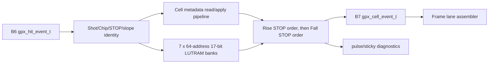

# Checkpoint I2 GPX Cell Collector

## 1. 목적과 완료 범위

I2/B7은 B6의 `gpx_hit_event_t`를 폭에 의존하지 않는
`gpx_cell_event_t`로 수집한다. 이 단계의 Cell 정의는 다음과 같다.

```text
Cell = Shot 1개 x GPX Chip 1개 x STOP 1개 x slope 1개
```

Cell은 최대 7개의 17-bit Hit와 해당 Hit의 유효 개수, Drop, 오류 및
Shot 문맥을 가진다. AXIS `32/64/128-bit`, byte repack, line padding,
VDMA HSIZE/VSIZE는 B7 입력이나 저장 주소에 존재하지 않는다. 따라서 출력
폭을 바꿔도 Cell의 정보량과 canonical byte 수는 바뀌지 않는다.

## 2. 모듈 역할과 데이터 흐름



| 파일 | 역할 |
|---|---|
| `pkg/lidar_gpx_data_pkg.vhd` | Hit array, Cell record, Cell event kind와 fault record 정의 |
| `rtl/proc/lidar_gpx_cell_collector.vhd` | Hit 수집, runtime Hit 제한, Cell 정렬과 timeout 복구 |
| `tb/tb_lidar_gpx_cell_collector.vhd` | dedicated, dual-edge, fault, timeout, abort와 backpressure 검증 |
| `tb/lidar_gpx_cell_collector_impl.vhd` | OOC 합성용 평탄화 하네스 |
| `scripts/run_v2_gpx_cell_collector.ps1` | 150/200 MHz 기능 및 구현 회귀와 증거 보관 |

## 3. 저장 구조

최대 주소 공간은 다음 64개다.

```text
address = chip * 16 + slope_offset + stop
slope_offset = 0 for Rise, 8 for Fall
chip = 0..3, stop = 0..7
```

Hit payload는 Return 번호별 7개 LUTRAM bank에 저장한다.

```text
bank[return 0] : 64 x 17 bit
...
bank[return 6] : 64 x 17 bit
total          : 64 x 7 x 17 = 7,616 bit
```

입력은 한 사이클에 Hit 하나만 쓰고, Cell 출력은 선택된 주소의 7개 bank를
병렬로 읽는다. payload RAM은 reset하지 않는다. 대신 `visible_count=0`으로
Cell을 무효화하고, 읽을 때 유효 개수 밖의 slot을 0으로 마스킹한다. 이 방식은
큰 RAM reset fanout 없이 abort 이후 stale Hit가 다음 Shot에 노출되는 것을
막는다.

### 3.1 LUTRAM을 선택한 이유

FIFO는 받은 순서대로 내보낼 때 적합하다. B7 입력은 Chip, STOP, slope가 섞여
들어오지만 출력은 Cell 주소 순서로 다시 정렬해야 하므로 random-access 저장소가
필요하다. FIFO를 사용하면 최대 64개 Cell별 FIFO 또는 별도 재정렬 RAM이 다시
필요해진다.

BRAM은 119-bit Cell 폭에서 17-bit Return slot 하나만 갱신하려면 여러 BRAM을
낭비하거나 read-modify-write가 필요하다. 현재 7,616-bit 용량에는 7개의
17-bit LUTRAM bank가 더 단순하다. 최종 합성은 `RAM64M` 42개, report 기준
LUTRAM 168개로 정상 추론됐다.

## 4. Hit 수집 규칙

### 4.1 Return과 visible Hit

B6 Return 번호는 물리 drain 결과이므로 항상 build 최대 7개까지 유지된다.
runtime `max_hits_per_stop`은 Cell에 보이는 Hit 수만 제한한다.

```text
seen_count    = 실제 수신 Return 수, 0..7
visible_count = Cell에 저장한 Hit 수, 0..runtime max_hits
```

예를 들어 runtime 값이 3이면 Return 0, 1, 2는 저장하고 Return 3..6은 계속
소비하되 저장하지 않는다. 해당 Cell의 `hit_dropped=1`과
`hit_capacity_drop` 진단을 남긴다. GPX IFIFO drain 수를 줄이지 않으므로 다음
Shot에 이전 데이터가 남는 원인이 되지 않는다.

runtime 값은 첫 Chip/Shot event에서 snapshot한다. 같은 Chip Shot 중 값이나
active version이 바뀌면 `context_mismatch`로 진단한다.

### 4.2 Hit bit 보존

모든 Hit는 B7까지 `Hit[16:0]` 17 bit로 저장된다. `Hit[16]`을 payload에서
미리 제거하지 않는다. B8/B9 formatter가 canonical 32-bit word를 만들 때만
하위 16 bit payload와 Hit-MSB metadata를 구성한다.

### 4.3 현재 StartNum 정책

B6는 GPX `StartNum[7:0]`을 손실 없이 전달한다. 현재 Frame ABI는 한 Shot의
START 하나만 표현하므로 B7에서 `StartNum /= 0`을 unsupported multi-START로
진단하고 Cell을 faulted로 표시한다. 값을 조용히 무시하거나 다른 Shot에 합치지
않는다.

## 5. Cell 출력 순서

Chip별 IFIFO 제어 event가 Cell serialization 경계를 연다.

| 입력 제어 event | Cell 출력 | 마지막 제어 Cell |
|---|---|---|
| `GPX_HIT_IFIFO1_DONE` | 활성 Rise STOP 0..3, 활성 Fall STOP 0..3 | `GPX_CELL_IFIFO1_DONE` |
| `GPX_HIT_DRAIN_DONE` | 남은 Rise STOP 4..7, 활성 Fall STOP 4..7 | `GPX_CELL_DRAIN_DONE` |
| `GPX_HIT_TIMEOUT` | 아직 내보내지 않은 모든 slope/STOP, `error_fill=1` | `GPX_CELL_TIMEOUT` |

한 Chip이 Rise만 지원하면 Fall Cell은 생성하지 않는다. Fall만 지원하면 Rise
Cell은 생성하지 않는다. 한 Chip dual-edge이면 Rise STOP 오름차순을 먼저 내보낸
뒤 Fall STOP 오름차순을 내보낸다. 따라서 비활성 lane builder가 공회전하거나
blank Cell을 내부 FIFO에 쌓는 v1 문제가 재발하지 않는다.

출력 valid 동안 `i_cell_ready=0`이면 전체 Cell record가 안정적으로 유지된다.
abort는 입력 ready를 즉시 0으로 하고 pending Cell과 metadata를 폐기한다.

## 6. 순차 처리와 처리 예산

200 MHz 타이밍을 위해 한 Hit의 metadata 처리를 다음 세 단계로 나눴다.

```text
1. Cell 주소와 Hit 등록
2. 선택 주소의 seen/visible count 등록
3. Return 검사와 LUTRAM/metadata 갱신
```

ready가 계속 높은 경우의 B7 단독 처리량은 다음과 같다.

| 항목 | Processing clocks |
|---|---:|
| Hit 하나의 다음 accept 간격 | 3 |
| Data Cell 하나 출력 | 3 |
| Group control Cell 출력 | 2 |
| dedicated Chip 하나, 8 STOP x 7 Return | 196 |
| default 4-Chip dedicated Shot | 784 |

default 최대 Shot은 150 MHz에서 약 `5.227 us`, 200 MHz에서 `3.920 us`다.
이 값은 B7만의 처리 시간이며 B8/B9와 VDMA/Ethernet 예산을 포함하지 않는다.
전체 Shot 간격 충족 여부는 I4와 Stage 8 HTML 정렬에서 다시 합산한다.

## 7. 진단

| Fault | 의미 | 데이터 처리 |
|---|---|---|
| `context_mismatch` | 같은 Chip Shot에서 sequence/version/shot identity 또는 max_hits 불일치 | Shot fault 표시 |
| `return_sequence_error` | B6 Return 번호가 현재 seen count와 불일치 | 해당 Hit 저장 안 함 |
| `start_number_nonzero` | 현재 single-START Frame 계약 밖의 StartNum | Hit는 보존, Cell fault 표시 |
| `hit_capacity_drop` | runtime visible Hit 제한 초과 | Hit consume-drop, Cell dropped 표시 |

각 fault는 1-clock pulse와 explicit clear 전까지 유지되는 sticky를 제공한다. CSR
bit 배정은 B8/I4의 전체 데이터 진단을 함께 본 뒤 통합 status owner에서 확정한다.

## 8. Echo Receiver 비회귀 계약

B7은 Echo CSR나 합성 옵션을 변경하지 않았다. 최대 32채널 synthetic delay를
위해 채널별 CSR table을 만들지 않는다. **CTL20 한 개**에 두 필드만 둔다.

| CSR | Bit | 의미 |
|---|---:|---|
| CTL20 | `[15:0]` | Channel 0 기준 지연, 5 ns ticks |
| CTL20 | `[31:16]` | 다음 채널마다 더할 지연, 5 ns ticks/channel |

```text
delay[channel] = CHANNEL_0_DELAY + channel * CHANNEL_STEP
channel = 0..31
```

합성 전 옵션도 유지된다.

| Build option | 합성 결과 |
|---|---|
| `enable_echo_receiver=false` | physical receiver와 synthetic STOP 경로 제거 |
| receiver=true, simulation=false | physical LVDS-to-STOP만 합성 |
| receiver=true, simulation=true | physical 경로와 synthetic source 합성 |
| receiver=false, simulation=true | build validation에서 거부 |

CTL20은 synthetic source 전용이며 physical LVDS-to-STOP 초저지연 경로에는
들어가지 않는다.

## 9. 검증 결과

| Scenario | 150 MHz | 200 MHz | 확인 내용 |
|---|---|---|---|
| Dedicated 2-Rise/2-Fall | PASS | PASS | Rise/Fall 전용 Chip 정렬, Hit[16], runtime drop |
| One-Chip dual-edge | PASS | PASS | Rise/Fall 독립 Cell과 결정적 순서 |
| Fault/timeout/abort | PASS | PASS | 네 fault, error-fill, sticky clear, pending Cell 폐기 |
| Backpressure | PASS | PASS | 전체 Cell record 안정성 |

`xc7z020clg484-2` OOC post-route 결과:

| Processing clock | WNS | Total LUT | LUTRAM | FF | Latch | Blocking DRC |
|---:|---:|---:|---:|---:|---:|---:|
| 150 MHz | +1.107 ns | 1,563 | 168 | 1,554 | 0 | 0 |
| 200 MHz | +0.369 ns | 1,565 | 168 | 1,554 | 0 | 0 |

최종 증거:

- `signoff_results/sessions/260805154200_stage6_i2_b7_final_v2_gpx_cell_collector`

OOC clock port에는 parent의 `HD.CLK_SRC`가 없으므로 최종 clock insertion/skew는
I4 parent 통합 구현에서 다시 확인한다. I2는 B7 경계 완료이며 Stage 6 전체
sign-off는 아니다. 다음 단계는 I3/B8 Frame lane assembly다.
