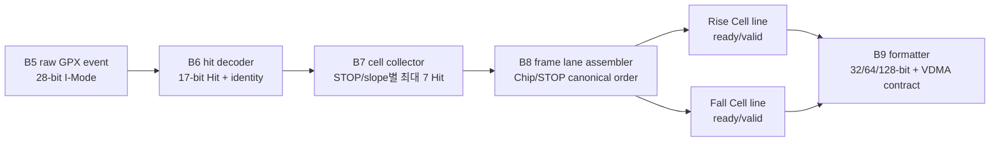
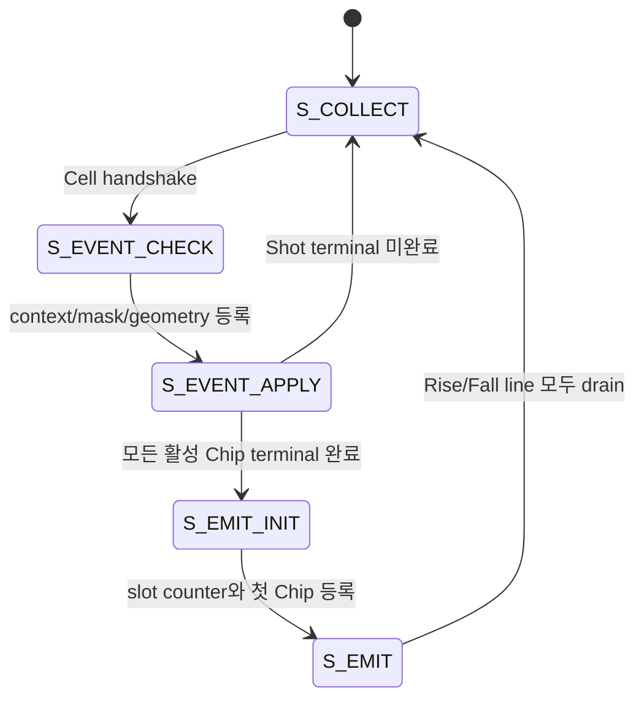

# Checkpoint I3 GPX Frame Lane Assembler

## 1. 목적과 판정

I3/B8은 B7이 만든 `gpx_cell_event_t`를 한 Shot의 논리적 Rise/Fall
라인으로 정렬하는 단계다. 이 단계에서 다음 책임을 확정한다.

1. Cell 입력 순서와 관계없이 논리 Chip 오름차순, STOP 오름차순으로 정렬한다.
2. Rise와 Fall을 서로 독립적인 ready/valid 라인으로 내보낸다.
3. 런타임 slope mask를 Shot 시작 시점에 고정한다.
4. 빠진 Cell을 blank slot으로 보존하고 진단한다.
5. Shot index의 선두 및 중간 누락을 `gap_before`로 보존한다.
6. AXIS 폭, byte repack, line prefix, VDMA padding은 B8에 넣지 않는다.

기능 회귀와 `xc7z020clg484-2` OOC 구현은 Processing 150 MHz와 200 MHz에서
통과했다. 따라서 **I3/B8 자체는 완료**다. 다만 B5부터 B8까지의 통합과
Face 종료 이벤트는 아직 I4 범위이므로 Stage 6 전체 sign-off는 아니다.

## 2. 용어

| 용어 | 이 문서에서의 의미 |
|---|---|
| Hit | GPX I-Mode word의 하위 17-bit 거리 측정값 한 개 |
| Cell | `Shot 1개 x Chip 1개 x STOP 1개 x slope 1개`에 속한 최대 7 Hit 묶음 |
| slot | 한 slope 라인 안에서 Cell 하나가 차지하는 논리적 위치 |
| line | 한 Shot에서 같은 slope에 속한 모든 활성 Cell의 정렬된 묶음 |
| column | Face 안의 기하학적 Shot 위치이며 `shot_index`와 같다 |
| Face | `columns_per_face`개의 기하학적 column으로 구성되는 스캔 면 |
| Frame | 모든 활성 Face의 논리 라인을 B9 이후 포맷터가 전송 형식으로 만든 결과 |

`slot`은 VDMA line 수나 AXIS beat 수가 아니다. Cell을 고정된 순서로 식별하기
위한 B8 내부의 논리 주소다. B9가 Cell을 byte와 beat로 바꿀 때 전송 beat 수가
별도로 결정된다.

## 3. 데이터 흐름과 책임 경계



| 블록 | 소유하는 결정 | 소유하지 않는 결정 |
|---|---|---|
| B6 | 28-bit field 해석, Chip/STOP/slope 유효성 | Return 순서, Cell 배열 |
| B7 | Return 0..6, Cell Hit 수, runtime max-hit 제한 | Frame line, AXIS 폭 |
| B8 | slope별 Cell slot, column gap, blank Cell | byte repack, HSIZE/VSIZE, padding |
| B9 | 전송 word/beat, prefix, SOF/EOL, VDMA geometry | Hit/Cell 의미와 slot 순서 |

v1의 `tdc_gpx_face_assembler.vhd`가 담당하던 slope별 Chip slice 조립 의미는
유지한다. v2에서는 논리적 Frame 순서와 전송 포맷을 분리하여 output width가
32/64/128-bit로 바뀌어도 B8의 Cell 수와 순서가 변하지 않게 했다.

## 4. 입력 계약

### 4.1 Cell 스트림

`i_cell_event`는 B7에서 전달된다. Data Cell뿐 아니라 Chip의 IFIFO1 완료,
drain 완료, timeout terminal 이벤트도 같은 Shot 문맥을 가진다.

| 입력 | 의미 |
|---|---|
| `i_cell_event` | B7의 typed Cell 또는 terminal event |
| `o_cell_ready` | B8이 새 event를 받을 수 있을 때 1 |
| `i_active_version` | 현재 승인된 atomic configuration 버전 |
| `i_active_rise_mask` | 이번 설정에서 Rise line에 포함할 Chip mask |
| `i_active_fall_mask` | 이번 설정에서 Fall line에 포함할 Chip mask |
| `i_columns_per_face` | 한 Face의 전체 기하학적 column 수 |

새 Shot의 첫 event를 받을 때 version, Rise/Fall mask, columns/face를 snapshot한다.
같은 Shot을 수집하는 동안 이 값이나 Shot identity가 바뀌면
`context_mismatch`로 진단한다.

### 4.2 runtime slope mask 보완

I3 검토 중 B6/B7이 build capability mask만 사용하던 불일치를 발견했다.
Falling 비활성 설정에서는 전용 2-Rise/2-Fall build라도 모든 활성 Chip이 Rise를
담당할 수 있으므로, B6와 B7도 B8과 같은 runtime active mask를 사용하도록
수정했다.

```text
Falling ON, dedicated 4-Chip : Rise=0011, Fall=1100
Falling ON, one-Chip dual   : Rise=0001, Fall=0001
Falling OFF, active 4-Chip  : Rise=1111, Fall=0000
```

B6와 B7 entity에는 기존 단독 TB 호환을 위해 build mask가 default 입력으로
남아 있다. production 연결에서는 atomic derived runtime mask를 명시적으로
배선해야 한다.

## 5. 출력 계약

Rise와 Fall 출력은 각각 `gpx_frame_cell_event_t`다.

| 필드 | 의미 |
|---|---|
| `valid` | 현재 event가 유효함 |
| `cell` | B7 Cell payload와 Shot identity |
| `slot_index` | 현재 slope line 안의 0-based Cell 위치 |
| `slot_count` | 이 slope line의 전체 Cell 수 |
| `line_start` | `slot_index=0`인 첫 Cell |
| `line_end` | `slot_index=slot_count-1`인 마지막 Cell |
| `first_column` | `shot_index=0`인 Face 첫 column |
| `last_column` | scheduler가 전달한 `last_in_face` |
| `gap_before` | 현재 column 앞에서 누락된 기하학적 column 수 |
| `slot_blank` | 기대한 Cell이 입력되지 않아 blank로 채웠음 |
| `line_faulted` | Shot/Cell/blank 중 하나라도 fault 상태임 |

`valid=1`이고 해당 lane의 `ready=0`이면 전체 event record를 그대로 유지한다.
Rise stall은 Fall 진행을 막지 않고, Fall stall도 Rise 진행을 막지 않는다.

## 6. canonical slot 계산

한 slope의 slot 수는 다음과 같다.

```text
slot_count = popcount(active_slope_mask) x stops_per_chip
```

정렬 순서는 mask에 포함된 논리 Chip 번호 오름차순, 각 Chip 안에서 STOP 번호
오름차순이다.

| topology | Rise line | Fall line |
|---|---|---|
| 4-Chip dedicated | Chip 0 STOP 0..7, Chip 1 STOP 0..7, 총 16 | Chip 2 STOP 0..7, Chip 3 STOP 0..7, 총 16 |
| 1-Chip dual-edge | Chip 0 STOP 0..7, 총 8 | Chip 0 STOP 0..7, 총 8 |
| 4-Chip Falling OFF | Chip 0..3 각각 STOP 0..7, 총 32 | 생성하지 않음 |

따라서 32 physical STOP 전체가 Rise인 경우에도 채널 정렬은
`Chip0/STOP0 ... Chip3/STOP7`로 결정되며, 입력 도착 순서에 의존하지 않는다.

## 7. 저장 구조

B8은 slope별로 다음 저장소를 가진다.

```text
Rise payload : 32 x 147-bit distributed memory
Fall payload : 32 x 147-bit distributed memory
Rise/Fall presence : slope별 32-bit validity vector
address = chip_index x 8 + stop_index
```

payload RAM은 reset하지 않는다. Shot 시작 시 presence bit만 0으로 만들고,
presence=0인 주소는 RAM의 이전 값 대신 명시적인 blank Cell로 출력한다. 이 방식은
큰 RAM reset fanout을 피하면서 stale payload 노출을 차단한다.

## 8. 순차 처리 단계



긴 context 비교, event 적용, line 초기화, RAM read/output load를 서로 다른 clock
단계에 배치했다. 출력은 등록된 holding register이며, ready가 계속 1이면 첫 load
이후 각 활성 lane에서 매 clock Cell 하나를 전달한다.

## 9. column gap과 Face 종료 계약

현재 B8이 계산할 수 있는 gap은 다음과 같다.

```text
새 Face의 첫 accepted Shot : gap_before = current_shot_index
같은 Face의 다음 Shot      : gap_before = current_shot_index - previous_shot_index - 1
정상 연속 Shot              : gap_before = 0
```

예를 들어 scheduler가 column 0을 busy로 버리고 column 1부터 승인하면 첫 line의
`gap_before=1`이다. column 2 다음에 column 5가 승인되면 column 5 line의
`gap_before=2`다.

그러나 scheduler는 blocked column의 index만 증가시키고 downstream drop event는
만들지 않는다. 따라서 accepted Cell stream만 보는 B8은 다음 두 경우를 알 수 없다.

1. 마지막 accepted Shot 뒤에 Face 끝까지 남은 trailing hole
2. 한 Face의 모든 Shot이 버려져 Cell이 하나도 없는 all-hole Face

이 문제를 Cell 값으로 추측해서는 안 된다. I4에서 scheduler 또는 Processing
경계가 `face_close_event`를 명시적으로 전달해야 한다. 최소 필드는
`active_version`, `face_index`, `columns_per_face`, 마지막 기하학적 index 또는
누락 count다. 이 이벤트가 들어와야 B8이 trailing blank column과 empty Face를
정확히 닫을 수 있다.

## 10. fault 정책

| fault | 조건 | 결과 |
|---|---|---|
| `context_mismatch` | 같은 Shot 중 identity/version/mask/geometry 변경 | event를 진단하고 line fault 표시 |
| `unexpected_cell` | 범위 밖 Chip/STOP 또는 예상하지 않은 event | payload 저장 안 함 |
| `duplicate_cell` | 같은 slope/Chip/STOP Cell이 두 번 도착 | 첫 Cell 유지, fault 표시 |
| `duplicate_terminal` | 같은 Chip terminal이 두 번 도착 | 중복 terminal 진단 |
| `missing_cell` | 모든 Chip terminal 후 기대 Cell이 없음 | 해당 slot blank 출력 |
| `geometry_error` | 0 columns, 범위 밖 shot index, last flag 불일치, 비정상 Face 전환 | line fault 표시 |
| `column_gap` | `gap_before`가 0보다 큼 | gap metadata 유지 |
| `masked_payload_drop` | runtime slope mask 밖 payload 도착 | payload를 버리고 진단 |

각 fault는 1-clock pulse와 명시적 clear 전까지 유지되는 sticky를 제공한다. CSR bit
배정은 I4의 통합 status owner에서 확정한다.

## 11. 검증 결과

### 11.1 기능 회귀

| scenario | 150 MHz | 200 MHz | 핵심 검사 |
|---|---|---|---|
| dedicated 2-Rise/2-Fall | PASS | PASS | out-of-order 입력을 16/16 slot으로 재정렬 |
| one-Chip dual-edge | PASS | PASS | 동일 Chip의 Rise/Fall 8/8 slot 독립성 |
| Falling OFF | PASS | PASS | 4 Chip x 8 STOP = Rise 32, Fall 0 |
| fault + independent stall | PASS | PASS | blank, duplicate, masked payload, output 안정성 |
| linked B6-B7 runtime mask | PASS | PASS | Fall-OFF raw word부터 32 Rise Cell까지 exact compare |

최종 simulation evidence:
`signoff_results/sessions/260805224000_b8_emit_pipe_sim_v2_gpx_frame_lane_assembler`

### 11.2 OOC 구현

대상 device는 `xc7z020clg484-2`다.

| Processing clock | WNS | Total LUT | Logic LUT | LUTRAM | FF | BRAM | DSP | Latch | Blocking DRC |
|---:|---:|---:|---:|---:|---:|---:|---:|---:|---:|
| 150 MHz | +0.687 ns | 714 | 514 | 200 | 1,138 | 0 | 0 | 0 | 0 |
| 200 MHz | +0.195 ns | 722 | 522 | 200 | 1,138 | 0 | 0 | 0 | 0 |

최종 implementation evidence:
`signoff_results/sessions/260805224500_b8_emit_pipe_ooc_v2_gpx_frame_lane_assembler`

Vivado user Tcl Store catalog 경고는 host 설치 환경 경고이며, archived report의
design critical warning/error, latch, blocking DRC 판정과 분리했다. OOC의
`HD.CLK_SRC` 경고는 parent clock placement 전의 일반적인 OOC 경고다.

## 12. I4 진입 조건

I4는 다음 순서로 진행한다.

1. `face_close_event`의 owner와 typed record를 확정한다.
2. B5 acquisition부터 B8까지 production 경로로 직접 연결한다.
3. runtime Rise/Fall mask를 B6, B7, B8에 같은 atomic snapshot으로 배선한다.
4. normal, dedicated, dual-edge, Falling-OFF, timeout, busy-hole을 통합 검증한다.
5. Processing/TDC 150/200 및 200/150 MHz 비동기 조합을 재검증한다.
6. Face close와 trailing/all-hole 보존을 통과한 뒤에만 Checkpoint I를 닫는다.

B9의 32/64/128-bit AXIS, VDMA HSIZE/VSIZE, prefix와 padding은 I4 이후
Checkpoint J에서 적용한다.
