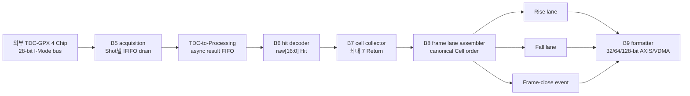
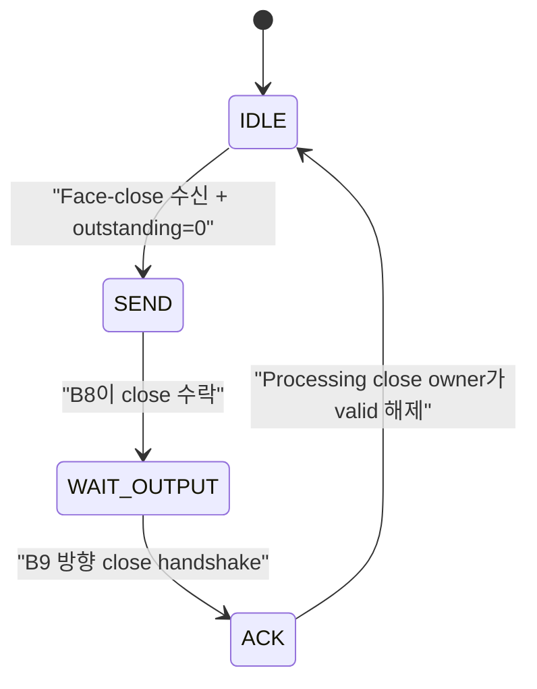

# Checkpoint I4 GPX B5-B8 Integration

## 1. 목적과 판정

I4는 보드 검증 이력이 있는 GPX 물리 버스 B5부터 폭 독립적인 Frame-lane
B8까지를 하나의 production 경로로 연결한다. 이 단계에서 다음 계약을 닫았다.

1. 외부 TDC-GPX I-Mode의 28-bit word를 누락 없이 수신한다.
2. 하위 17-bit Hit를 Return 0..6 순서로 Cell에 보존한다.
3. Rise/Fall Cell을 Chip/STOP 정규 순서로 독립 출력한다.
4. 마지막 Shot 뒤의 trailing hole과 Shot이 하나도 없는 all-hole Face를
   명시적 Face-close event로 표현한다.
5. Face-close가 미처리 Shot 또는 출력 backpressure를 추월하지 못하게 한다.
6. Processing/TDC 150/200 MHz와 200/150 MHz에서 기능, CDC, 구현 타이밍을
   함께 검증한다.

두 비동기 클럭 프로파일의 기능 회귀와 `xc7z020clg484-2` OOC 구현이
통과했다. 따라서 **I4와 Stage 6 B5-B8 통합 경계는 완료**다. B9의
32/64/128-bit AXIS/VDMA 포맷과 full parent 배치는 다음 Checkpoint J의
책임이며 이번 판정에 포함하지 않는다.

## 2. 전체 데이터 흐름

| 단계 | 입력 단위 | 출력 단위 | 소유하는 의미 |
|---|---|---|---|
| B5 | GPX 핀과 Shot request | 28-bit raw event | Chip/IFIFO/read 순서와 물리 bus timing |
| B6 | 28-bit raw event | 17-bit Hit event | I-Mode field 해석과 Hit identity |
| B7 | Hit/terminal event | Cell event | `Shot x Chip x STOP x slope`별 Return 0..6 |
| B8 | Cell/Face-close event | Rise/Fall Cell lane와 Frame-close | canonical slot, blank, gap, Face 종료 |
| B9 | Cell lane와 Frame-close | AXIS byte/beat | 폭, TKEEP/TLAST, HSIZE/VSIZE, padding |

`g_OUTPUT_WIDTH`는 B9의 전송 형식만 바꾼다. Hit 수, Cell 수, canonical
slot 수와 Face 기하학은 32/64/128-bit 폭에 따라 달라지지 않는다.

## 3. 생산 RTL 조립 구조

### 3.1 `lidar_gpx_hit_cell_frame_pipeline`

B6, B7, B8을 한 active configuration으로 묶는다. 세 블록이 동일한
runtime Chip/Rise/Fall mask, 최대 Hit 수와 Face geometry를 사용하므로 서로
다른 설정 version을 해석하는 경로가 없다.

### 3.2 `lidar_gpx_b5_b8_subsystem`

B5 acquisition과 B6-B8 pipeline을 연결하는 I4 production wrapper다. 이
wrapper가 다음 상태를 단독 소유한다.

- Processing에서 수락한 Shot 수
- B8이 완료한 Shot 수
- 아직 완료되지 않은 outstanding Shot 수
- Face-close 보류, 전송, downstream 소비 확인, upstream ACK 순서

Face-close 상태는 다음 순서로만 진행한다.

Face-close가 관찰되는 즉시 새 Shot ready를 내린다. 이미 수락한 Shot이
남아 있으면 모두 B8 `shot_done`까지 배출한 뒤 close를 전달한다. upstream
ACK는 B8이 close를 받았을 때가 아니라 **downstream이 Frame-close 출력을
실제로 소비한 뒤** 발생한다. 따라서 다음 Face의 Shot이 이전 Face 종료보다
앞서 갈 수 없다.

### 3.3 `lidar_face_close_owner`

Processing subsystem이 Face traversal 종료 시점의 다음 정보를 snapshot한다.

- Face index, 회전 방향, physical/simulation source
- active configuration version
- `columns_per_face`

Laser executor가 아직 busy이면 close를 보류하고 scheduler를 막는다. 출력
ready가 0인 동안에는 전체 event를 안정적으로 유지한다. 이 구조 때문에
accepted Shot이 없는 all-hole Face도 Cell 값으로 추측하지 않고 닫을 수 있다.

`face_tracker`는 zero-gap Face 변경이나 Face 내부 방향 반전에서 등록된 한
event에 `exit_event=1`과 `enter_event=1`을 함께 실을 수 있다. close owner는
이 cycle의 이전 traversal을 close queue에 넣고 새 traversal 문맥도 동시에
보관한다. 같은 등록 event의 `exit_event`는 scheduler enable에 즉시 OR
인터락되어, 새 Face의 Shot이 이전 Face close를 한 cycle 추월하지 못한다.
이는 조합 payload 연산이 아니라 정확한 경계 순서를 위한 단일 제어 인터락이다.

## 4. Face-close와 hole 의미

| 상황 | B8 결과 |
|---|---|
| 마지막 column까지 정상 Shot 존재 | `trailing_gap=0`, `all_hole=0` |
| 마지막 accepted Shot 뒤에 N개 column 누락 | `trailing_gap=N`, `column_gap` 진단 |
| Face 전체에서 accepted Shot 없음 | `trailing_gap=columns_per_face`, `all_hole=1` |
| close의 Face/version/direction/source 불일치 | `face_faulted=1`, geometry fault |

`column_gap`은 데이터 손상이 아니라 기하학적 column이 비었다는 진단이다.
blank 위치를 보존해야 B9와 HTML이 실제 스캔 위치를 임의로 압축하지 않는다.

## 5. Chip과 slope 구성

I4 경로는 build capability와 runtime active mask를 분리한다. 검증된 대표
구성은 다음과 같다.

| 구성 | Rise lane | Fall lane |
|---|---|---|
| 전용 4-Chip | Chip 0/1, 16 Cell/Shot | Chip 2/3, 16 Cell/Shot |
| 1-Chip dual-edge | Chip 0, 8 Cell/Shot | Chip 0, 8 Cell/Shot |
| 4-Chip all dual-edge | Chip 0..3, 32 Cell/Shot | Chip 0..3, 32 Cell/Shot |
| Falling OFF | 활성 Chip 전체, 최대 32 Cell/Shot | 출력 없음 |

한 Chip의 Rise/Fall은 별도 slope identity와 별도 Cell 주소 공간으로 처리된다.
네 Chip 모두 dual-edge인 경우에도 각 lane의 정렬은
`Chip 0 STOP 0..7`부터 `Chip 3 STOP 0..7`까지 고정된다. 입력 도착 순서나
TDC/Processing 클럭 비율은 이 순서를 바꾸지 않는다.

## 6. 배선 지연과 파이프라인 판단

### 6.1 배선 지연도 파이프라인으로 줄일 수 있는가

가능하다. 중간 레지스터는 긴 물리 거리를 둘로 나누고 배치기가 각 구간을
가까이 배치할 기준점을 만든다. 다만 다음 두 종류를 구분해야 한다.

1. **feed-forward 경로:** elastic register를 추가해 latency만 늘리고 II=1을
   유지할 수 있다.
2. **상태 feedback 경로:** 현재 값으로 다음 주소/순서를 정하는 경로다.
   무조건 한 단을 추가하면 Cell 순서, valid/ready 또는 처리 간격이 바뀐다.

B8의 기존 최악 경로는 slot 종료 판정이 다음 Chip cursor 계산까지 한 cone으로
연결된 feedback 경로였다. 이를 한 clock 늦추는 대신 slot terminal과
Chip/STOP cursor 갱신을 독립적인 순차 feedback으로 분리했다. latency와
1 Cell/clock 처리율은 그대로다.

B7의 기존 최악 경로는 하나의 6-bit write address가 7개 Hit bank의 119-bit
payload 쪽으로 퍼지는 fanout 212 경로였다. 여기에는 새 pipeline stage보다
**bank-local register replication**이 적합하다. 동일 clock에 capture한 주소를
Hit bank별 7개 레지스터로 복제해 배치 거리를 분할했다. 기능 latency는
늘지 않았고, 합성 결과 42 FF가 증가했다.

### 6.2 적용 전후 결과

| 항목 | 적용 전 | 적용 후 | 해석 |
|---|---:|---:|---|
| Processing 200 / TDC 150 WNS | +0.424 ns | **+0.478 ns** | B7 고팬아웃 경로 제거, +0.054 ns |
| Processing 150 / TDC 200 WNS | +0.397 ns | **+0.366 ns** | 최악 경로가 TDC merge에 있어 배치 편차 범위 |
| top LUT | 5,806 | 5,803 | 증가 없음 |
| top FF | 7,359 | 7,401 | 주소 6-bit x 7 bank = 42 FF 증가 |
| async FIFO | 3 | 3 | CDC 구조 불변 |
| ASYNC_REG | 230 | 230 | CDC 동기화 구조 불변 |

적용 후 B5-B8 OOC의 200 MHz Processing 최악 경로는 B8 event output 제어
경로로 이동했고
4 LUT 단계, route 비중 약 70%다. 여기에 한 단을 더 넣으려면 ready/valid를
보존하는 elastic stage와 B9 지연 계약을 함께 변경해야 한다. 현재 B5-B8 OOC
최소 WNS가 +0.366 ns이고 기능 계약이 모두 통과하므로 I4에서 무리하게
단계를 추가하지 않는다. B9/full-parent 구현에서 **B8-B9 데이터 경로** WNS가
+0.30 ns 아래로 내려가면 1-entry elastic stage를 우선 검토한다. 전체 최악
경로가 다른 블록이면 그 경로를 별도로 분석해야 한다.

이 기준은 물리 `fire_done -> start_tdc` 경로에는 적용하지 않는다. 해당 경로는
이번 I4 데이터 파이프라인과 분리되어 있고 변경되지 않았다.

## 7. 검증 행렬

| 검증 | 150/200 MHz | 200/150 MHz | 확인 내용 |
|---|---|---|---|
| Face-close owner | PASS | PASS | busy 지연, scheduler block, backpressure 안정성 |
| B5-B8 전용 slope GPX model | PASS | PASS | 2-Rise/2-Fall, Rise 16 + Fall 16 Cell |
| B5-B8 4-Chip all-dual model | PASS | PASS | Rise 32 + Fall 32 Cell, 각 7 Return |
| 17-bit Hit 무결성 | PASS | PASS | 두 topology의 모든 Cell/Return exact compare |
| leading/trailing gap | PASS | PASS | 첫 Shot gap과 Face 말단 누락 |
| all-hole Face | PASS | PASS | Shot 0개인 Face의 명시적 close |
| zero-gap Face 변경 | PASS | PASS | 이전 close 우선, 새 traversal 문맥 유지 |
| close backpressure | PASS | PASS | close payload hold와 next-Face 차단 |
| 기존 B8 topology 14종 | PASS | PASS | 1-Chip/4-Chip dual, dedicated, Falling OFF, fault |
| OOC timing | +0.366 ns | +0.478 ns | non-negative WNS |
| CDC/구조 | PASS | PASS | FIFO 3, ASYNC_REG 230, latch 0, Critical CDC 0 |
| Processing owner 회귀 | +0.764 ns | +0.182 ns | Face-close 통합, latch/CDC/저지연 START 계약 통과 |

최종 Processing owner 구현의 최악 경로도 Face-close 인터락이나 B5-B8이 아니다.
150 MHz에서는 `physical_arm`에서 Shot-start register enable까지의 executor
안전 제어 경로가 5 LUT, route 81.0%이고, 200 MHz에서는 fire timeout counter의
decrement/timeout 상태 제어 경로가 5 LUT, route 72.3%다. 둘 다 타이밍은
통과했지만 200 MHz의 +0.182 ns는 넉넉한 parent 마진은 아니다. 물리 START
발생 시점을 늦추는 pipeline은 허용하지 않는다. Stage 7에서는 이 경로를
건드리지 않고, full-parent에서 다시 측정한 뒤 조건 분해나 레지스터 복제로
의미를 보존할 수 있을 때만 별도 최적화한다.

주요 보관 세션:

- `260806_i4_final_order_v2_gpx_b5_b8_subsystem`
- `260806_i4_all_dual_sim_v2_gpx_b5_b8_subsystem`
- `260806_i4_b7_addr_rep_b8_v2_gpx_frame_lane_assembler`
- `260806_i4_b7_addr_rep_ooc_v2_gpx_b5_b8_subsystem`
- `260806_i4_final_direct_transition_v2_processing_subsystem`

Vivado TclStore catalog 손상 경고는 회귀 스크립트가 설치된 앱 경로를 명시하여
우회한다. 설계 CDC/DRC 판정과는 별개의 도구 환경 경고다. OOC에서 발생하는
clock source 위치 경고는 parent 구현의 PS FCLK/XDC 단계에서 다시 닫아야 한다.

## 8. 남은 작업과 다음 단계

다음 작업은 Stage 7 / Checkpoint J의 B9 AXIS/VDMA formatter다.

1. Rise/Fall Cell과 Frame-close를 32/64/128-bit byte stream으로 변환한다.
2. 폭과 무관한 canonical byte 수를 먼저 확정한다.
3. SOF, EOL, TKEEP, TLAST, HSIZE, VSIZE, STRIDE를 한 geometry owner에서 만든다.
4. Shot/Face 경계 backpressure와 abort/recovery를 주입한다.
5. I4의 +0.30 ns OOC guardband를 full B9 및 parent 배치에서 재평가한다.

현재 close owner는 downstream output slot과 wait slot으로 두 개의 Face-close를
보존한다. scheduler가 막힌 동안에도 물리 모터는 계속 회전하므로, stall이 두
Face 전환을 넘으면 `face_close_overflow_sticky`가 설정될 수 있다. 이 경우
데이터가 조용히 정상으로 보이지는 않지만 연속 Frame 복구 정책은 아직 B9가
소유하지 않는다. Stage 7은 최대 허용 stall을 두 슬롯 이내로 제한하거나,
overflow 시 Face abort 후 다음 경계에서 재동기화하는 정책 중 하나를 반드시
확정해야 한다.

I4 완료는 TDC-GPX 데이터가 canonical Cell lane까지 무결하게 도달한다는
판정이다. Ethernet/DDR 시간과 Frame rate의 최종 sign-off는 B9와 HTML 계약이
연결된 뒤 수행한다.
