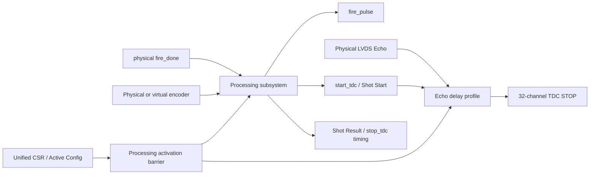

# V2 Checkpoint K0-4 - Processing/Echo 통합

## 1. 판정

K0-4의 Processing 및 Echo 통합 경계는 **완료**이다.

- 물리 모드와 시뮬레이션 모드의 발사 경로가 동시에 활성화되지 않는다.
- 물리 `fire_done`은 기존 저지연 START 경로를 그대로 사용한다.
- 시뮬레이션 모드는 물리 `fire_pulse`를 차단하고 내부 START/Echo만 만든다.
- Processing 설정 활성화는 Rise/Fall VDMA와 Echo profile이 모두 준비된 뒤에만 완료된다.
- `SOFT_RESET`은 RUN/ARM을 해제하지만 CSR Shadow와 Active Config는 보존한다.
- 기준 4개 구현 조합에서 WNS가 모두 양수이고 latch 및 Critical CDC가 없다.

아직 GPX bus acquisition과 Hit/Cell/Frame/AXIS 출력은 K0-5 이후 연결 대상이다.
따라서 이 판정은 전체 LiDAR IP Sign-off가 아니라 K0-4 경계 Sign-off이다.

## 2. 통합 데이터 흐름



### 물리 모드

```text
Encoder A/B/Z
  -> 위치/면/Shot 스케줄러
  -> fire_pulse
  -> 외부 Laser fire_done
  -> 저지연 물리 start_tdc
  -> Shot Start event
  -> 목표거리 window 종료
  -> stop_tdc timing / Shot Result

LVDS Echo P/N
  -> IBUFDS
  -> 채널 순서를 보존한 TDC STOP[31:0]
```

### 시뮬레이션 모드

```text
Virtual Encoder A/B/Z
  -> 공통 1-clock A/B/Z pipeline
  -> 위치/면/Shot 스케줄러
  -> 물리 fire_pulse 차단
  -> 설정된 simulation START delay
  -> 내부 start_tdc / Shot Start event
  -> 공통 elapsed counter와 채널별 delay 비교
  -> synthetic TDC STOP[31:0]
```

외부 `fire_done`은 시뮬레이션 모드에서 START 원인이 될 수 없다. 반대로 물리 모드에서는
synthetic START가 발생하지 않는다.

## 3. 설정 활성화 장벽

Processing Activate ACK는 다음 조건을 모두 만족할 때만 발생한다.

1. Rise VDMA profile 적용 완료;
2. Fall VDMA profile 적용 완료;
3. Echo simulation build이면 Echo profile `ready=1`;
4. Echo profile `busy=0`;
5. Echo profile version이 적용 중인 Active version과 일치.

Echo profile은 32채널 값을 순차 생성하므로 설정 적용 시간이 여러 clock 걸린다. 이 시간은
RUN 중 Shot 처리에 포함되지 않으며 activation barrier가 끝날 때까지 새 설정 공개를 막는다.

## 4. 순차화 및 타이밍 보완

### 4.1 Virtual Encoder 경계

가상 A/B/Z를 같은 레지스터 단계에서 받도록 했다. Z 폭/offset 판정 조합 경로가 위치
디코더까지 이어지지 않으며 A/B/Z 위상 관계는 유지된다.

- 기존 virtual source latency: 1 Processing clock;
- 현재 virtual source latency: 2 Processing clocks;
- `C_POSITION_VIRTUAL_LATENCY_CLKS`와 Shot metadata 보정값도 2로 함께 변경.

### 4.2 Laser timing 설정

Laser가 사용하는 시간 설정은 Executor 입구에서 등록한다. 다섯 시간 필드의 nonzero 판정도
각각 1비트 레지스터로 저장하므로 32비트 비교 트리가 FIRE trigger 경로에 들어가지 않는다.

FIRE, simulation START, STOP pulse counter는 서로 다른 순차 process가 소유한다. Pulse busy는
Lifecycle FSM 앞에서 한 번 더 등록한다. 총 재무장 여유는 기존 계약인 2 clocks를 유지한다.
물리 `fire_done -> start_tdc` 저지연 경로에는 이 파이프라인이 들어가지 않는다.

### 4.3 Echo simulation

기존의 채널별 32비트 down-counter 32개를 다음 구조로 바꿨다.

```text
Shot Start
  -> elapsed counter 1개
  -> active_delay[channel] = elapsed 비교
  -> 해당 채널 STOP pulse
```

모든 채널이 같은 Shot 시간 기준을 사용하므로 기능은 같다. 동일 delay를 가진 여러 채널은 같은
clock에 동시에 pulse를 낼 수 있다. Echo profile 생성은 변환값 register와 마지막-entry flush
단계를 사용해 누산기에서 32채널 테이블까지의 긴 배선 경로를 분할한다.

## 5. 기능 검증

`tb_tdc_gpx_lidar_ctrl_v2_k04`는 다음 항목을 두 clock profile과 두 모드에서 확인한다.

- 물리 LVDS 채널 순서 보존;
- physical encoder에서 fire 발생 순서;
- `fire_done` 전 START 금지;
- raw `fire_done`의 저지연 START;
- simulation에서 물리 fire 차단;
- simulation START 및 synthetic Echo 발생;
- simulation에서 외부 `fire_done` 무시;
- `SOFT_RESET` 후 RUN/ARM 해제 및 Active Config 보존;
- VDMA/Echo version 불일치, Echo busy, 중복 Activate 거부.

최종 통합 증거:

`signoff_results/sessions/260807_k04_signoff_final_v2_k04_integration`

K0-3 무회귀 증거:

`signoff_results/sessions/260807_k04_k03_regression_v2_k03_integration`

## 6. 구현 결과

대상 part는 `xc7z020clg484-2`이다.

| Mode | Processing | TDC | WNS | Latch | Critical CDC | FDPE | IBUFDS |
|---|---:|---:|---:|---:|---:|---:|---:|
| Physical | 150 MHz | 200 MHz | `+0.788 ns` | 0 | 0 | 1 | 32 |
| Physical | 200 MHz | 150 MHz | `+0.167 ns` | 0 | 0 | 1 | 32 |
| Simulation | 150 MHz | 200 MHz | `+0.625 ns` | 0 | 0 | 1 | 32 |
| Simulation | 200 MHz | 150 MHz | `+0.208 ns` | 0 | 0 | 1 | 32 |

`FDPE=1`은 물리 START의 의도된 raw `fire_done` capture 경로이다. `IBUFDS=32`는 현재 Top의
32채널 물리 Echo 입력 계약이 보존됐음을 뜻한다. OOC clock-source warning은 parent clock buffer가
없는 단독 구현 특성으로, L0 parent 구현에서 실제 FCLK와 generated clock 기준으로 다시 닫는다.

추가 단위 증거:

- Motor position: `260807_k04_virtual_pipe_v2_motor_position`
  - 150 MHz `+1.451 ns`, 200 MHz `+0.473 ns`;
- Laser executor: `260807_k04_ready_pipe_v2_laser_executor`
  - 150 MHz `+1.198 ns`, 200 MHz `+0.428 ns`;
- Echo subsystem: `260807_k04_echo_profile_pipe_v2_echo`
  - simulation 150 MHz `+1.571 ns`.

## 7. 다음 Gate

K0-5에서 다음 경로를 연결한다.

```text
Shot Start / Shot Result
  -> GPX acquisition coordinator
  -> external GPX 28-bit raw read
  -> lower 17-bit Hit decode
  -> Cell collection
  -> Face lane assembly
```

그 뒤 K0-6/K1에서 실제 Top 출력으로 만든 캡처를 사용해 다음 두 Sign-off를 수행한다.

1. DDR 캡처 Word와 HTML Golden Vector의 exact 비교;
2. PS DMA cache 동기화 후 H-Line 재구성과 Ethernet payload의 byte-exact 비교.

두 비교는 모두 Sign-off 항목이 될 수 있다. 첫 번째는 PL/DDR ABI를, 두 번째는 DDR/PS/Viewer
경계를 검증하므로 서로 대체하지 않고 각각 독립 Gate로 유지한다.
