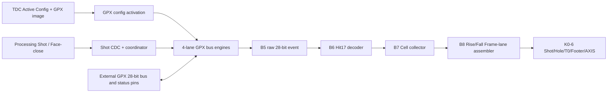

# V2 Checkpoint K0-5 - GPX Acquisition 및 B5-B8 통합

## 1. 판정

K0-5의 GPX 물리 버스와 B5-B8 Hit/Cell/Frame-lane 통합 경계는 **완료**이다.

- Unified Active Config가 TDC clock domain에 원자적으로 적용된 뒤에만 GPX RUN이 열린다.
- 실제 `CSN/RDN/WRN/OEN`, 양방향 28-bit data bus와 GPX 상태 핀이 production block에 연결됐다.
- I-Mode 28-bit raw word의 하위 17-bit Hit가 16 APD, Return 1..7 순서로 보존된다.
- Rise/Fall topology에 따라 Cell과 Frame-lane event가 손실 없이 완성된다.
- Processing/TDC `150/200 MHz`, `200/150 MHz` 기능 회귀와 네 구현 profile이 통과했다.
- 구현 결과는 모두 WNS 양수, latch 0, Critical CDC 0이다.

아직 Rise/Fall 외부 AXI4-Stream 출력은 fail-safe zero이며, B8 event는 Top 내부에서
즉시 소비한다. 따라서 이는 전체 IP 또는 DDR/Viewer Sign-off가 아니라 **K0-5 경계
Sign-off**이다. 외부 AXIS 소유권은 K0-6에서 이전한다.

## 2. 통합 데이터 흐름



### 시간순 처리

1. CSR Commit이 Rise/Fall VDMA profile과 Processing/TDC 설정 적용을 요청한다.
2. GPX register image가 모든 활성 Chip에 물리적으로 기록된다.
3. GPX config ACK가 끝난 뒤에만 TDC RUN level이 열린다.
4. Processing Shot event가 원자적 CDC를 지나 TDC coordinator에 등록된다.
5. 활성 Chip이 동시에 START/측정 lifecycle을 수행한다.
6. 목표거리 window 종료와 GPX `IRFLAG` 이후 IFIFO1/IFIFO2를 끝까지 drain한다.
7. 각 28-bit raw word를 Hit17 event로 해석하고 STOP/Return별 Cell을 완성한다.
8. topology mask에 따라 Rise/Fall Frame-lane 순서를 만든다.
9. 모든 Shot/Cell 완료 뒤 held Face-close를 ACK하고 다음 Face/회전을 연다.

## 3. I-Mode 데이터 수량과 순서

K0-5 Top 통합 TB의 기준 구성은 다음과 같다.

| 항목 | 값 |
|---|---:|
| 활성 GPX Chip | 2 |
| STOP/Chip | 8 |
| 최대 Return/STOP | 7 |
| IFIFO/Chip | 2 |
| 한 IFIFO 담당 STOP | 4 |

한 Chip의 IFIFO별 raw word 수:

```text
4 STOP × 7 Return = 28 raw words / IFIFO
```

한 Chip과 전체 Shot의 raw word 수:

```text
2 IFIFO × 28 = 56 raw words / Chip
2 Chip × 56  = 112 raw words / Shot
```

TB는 112개 raw word를 고유한 17-bit Hit 값으로 채우고 다음을 exact compare한다.

- Chip별 IFIFO1/IFIFO2 각각 28회 read;
- 총 56회 read/Chip 및 112회 read/Shot;
- raw word의 Channel Code, Start Number, Slope와 Hit17 identity;
- 16 APD Cell 슬롯과 Return 1..7 순서;
- B8 완료 전 다음 Shot이 열리지 않는 backpressure/Face-close 장벽.

## 4. 물리 핀 소유권

Top의 public vector 폭은 합성 시 `G_NUM_CHIPS`로 결정된다.

```text
io_tdc_d      = G_NUM_CHIPS × 28 bit, Chip별 tri-state
o_tdc_adr     = G_NUM_CHIPS × 4 bit
CSN/RDN/WRN/OEN/STOPDIS/ALUTRIGGER/PURESN = G_NUM_CHIPS bit
EF1/EF2/LF1/LF2/IRFLAG/ERRFLAG             = G_NUM_CHIPS bit
```

내부 production subsystem은 최대 4개 Chip 배열을 사용한다. 비활성 배열 원소에는 안전한
기본값을 넣지만 public pin은 생성하지 않는다. 활성 Chip의 `OEN/LF/ERRFLAG` 계약은 제거하지
않았으며 실제 외부 배선 또는 parent의 명시적 기본값이 소유한다.

## 5. CDC와 순차 타이밍 보완

### 5.1 RUN level CDC

Processing domain의 RUN은 `lidar_gpx_run_enable_cdc` 2-FF synchronizer를 통해 TDC domain으로
이동한다. TDC config가 아직 유효하지 않으면 동기화된 RUN도 GPX acquisition을 열지 못한다.

### 5.2 Shot 등록 배포

coordinator는 수락한 Shot과 lane mask를 1-entry register에 저장한 뒤 다음 TDC clock에 활성
lane으로 배포한다. 이 단계는 fanout과 배선 경로를 끊는다.

이 변경은 **GPX 내부 제어 시작에 TDC 1 clock을 추가**한다. 외부 레이저의 물리
`fire_done -> start_tdc` 저지연 경로에는 들어가지 않으므로 TDC 측정 기준 시작점은 변하지 않는다.

### 5.3 Event merge와 payload hold

lane mask는 각 ingress register의 ready 판정에 미리 적용한다. 중앙 arbiter는 등록된 valid만
선택하므로 mask-to-wide-payload 조합 경로가 사라진다. Event가 없을 때는 payload 전체를
동기 clear하지 않고 `valid`만 내리며, payload는 다음 유효 event까지 유지한다.

### 5.4 Domain별 FIFO reset busy

비동기 FIFO의 source reset busy와 destination reset busy를 분리했다. Processing 안전 판정은
Processing-domain busy만, TDC 안전 판정은 TDC-domain busy만 사용한다. 두 domain을 OR한
aggregate 신호는 진단용이며 제어 경로에 사용하지 않는다. 이 변경으로 reset-busy의 비동기
직결 경로를 제거했다.

## 6. 기능 검증

### Top K0-5 통합

증거:

`signoff_results/sessions/260807_k05_final_v2_k05_integration`

두 profile에서 다음 PASS marker를 확인했다.

```text
LIDAR_V2_TOP_K05_GPX_B5_B8_PASS proc_mhz=150 tdc_mhz=200
LIDAR_V2_TOP_K05_GPX_B5_B8_PASS proc_mhz=200 tdc_mhz=150
```

검증 항목:

- GPX image 적용 전 물리 RUN 금지;
- 실제 WRN, address, data와 Chip-select pin mapping;
- 2 Chip × 8 STOP × 7 Return의 IFIFO drain;
- Processing RUN level의 TDC-domain 전달;
- 목표거리 STOP과 IRFLAG 기반 drain;
- B5-B8 및 Face-close ACK 뒤 다음 Shot 재개;
- simulation mode에서 물리 `fire_pulse` 차단.

첫 TB 시도에서 WRN count가 맞지 않았던 원인은 RTL이 아니라 scoreboard가 write strobe의
상승 edge를 세던 관찰점 오류였다. 실제 GPX write가 확정되는 하강 edge로 고친 뒤 pin/data
exact compare가 통과했다.

### B5-B8 exact identity

증거:

`signoff_results/sessions/260807_k05_hold_idle_payload_v2_gpx_b5_b8_subsystem`

다음 네 scenario가 모두 통과했다.

| Topology | Processing/TDC |
|---|---|
| dedicated 2-Rise/2-Fall | 150/200 MHz |
| dedicated 2-Rise/2-Fall | 200/150 MHz |
| 4-Chip all dual-edge | 150/200 MHz |
| 4-Chip all dual-edge | 200/150 MHz |

모든 활성 STOP의 Return 1..7 Hit와 Cell slot이 exact identity로 비교됐다.

### CDC gateway

증거:

`signoff_results/sessions/260807_k05_domain_busy_final_v2_gpx_event_gateway`

비동기 150/200, 비동기 200/150, 동기 150/150 profile에서 reset, backpressure와 event identity가
모두 통과했다.

## 7. 구현 결과

대상 part는 `xc7z020clg484-2`이다.

| Mode | Processing | TDC | WNS | Latch | Critical CDC | ASYNC_REG | FDPE | IBUFDS |
|---|---:|---:|---:|---:|---:|---:|---:|---:|
| Physical | 150 MHz | 200 MHz | `+0.177 ns` | 0 | 0 | 382 | 1 | 32 |
| Physical | 200 MHz | 150 MHz | `+0.241 ns` | 0 | 0 | 382 | 1 | 32 |
| Simulation | 150 MHz | 200 MHz | `+0.392 ns` | 0 | 0 | 382 | 1 | 32 |
| Simulation | 200 MHz | 150 MHz | `+0.214 ns` | 0 | 0 | 382 | 1 | 32 |

물리 150/200 MHz 구현 증거:

`signoff_results/sessions/260807_k05_impl_payload_hold_probe_v2_k04_integration`

나머지 구현 증거:

- `260807_k05_impl_physical_200_150_v2_k04_integration`;
- `260807_k05_impl_sim_150_200_v2_k04_integration`;
- `260807_k05_impl_sim_200_150_v2_k04_integration`.

`FDPE=1`은 의도된 물리 START capture이다. `IBUFDS=32`는 simulation source 선택과 별개로
물리 Echo receiver가 build에 포함된 현재 Top 구성 때문이다. OOC clock-source warning은 parent
clock buffer가 없는 단독 구현 특성이며 L0 parent에서 실제 FCLK 기준으로 다시 닫는다.

Top에서는 K0-6 출력 owner가 아직 없어서 일부 B8 payload logic이 최적화될 수 있다. 따라서
Top pin/제어/완료 검증과 별도로 B5-B8 exact 단위 회귀를 보존한다. K0-6에서 payload가 실제
AXIS 출력까지 관찰되면 Top-level exact data compare로 다시 닫는다.

## 8. 다음 Gate

K0-6은 다음 production 경로를 연결한다.

```text
B8 Rise/Fall Cell + Frame-close
  -> T0 기준 Shot Metadata
  -> leading/interior/trailing/all-Hole Line
  -> PACKED17 Cell serialization
  -> ordered Face Footer
  -> 단일 32/64/128-bit AXIS word packer
  -> Top Rise/Fall AXI4-Stream
```

K0-6 출력으로 만든 실제 캡처부터 다음 두 비교를 정식 Sign-off Gate로 실행한다.

1. **PL/DDR ABI Sign-off**: DDR 캡처의 모든 Word, `TKEEP`, `TLAST`, `TUSER`를 HTML Golden
   Vector와 exact compare한다.
2. **DDR/PS/Viewer Sign-off**: DMA buffer ownership과 cache invalidate 이후 portable C decoder가
   만든 Face/H-Line/Ethernet payload를 Golden packet과 byte-exact compare한다.

두 Gate 모두 가능하지만 K0-5만으로는 아직 실행 완료가 아니다. 첫 번째는 K0-6/K1, 두 번째는
parent VDMA와 FreeRTOS/PetaLinux cache API가 존재하는 L0에서 최종 종료한다.
