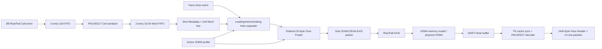

# V2 Checkpoint K0-6/K0-7 - AXIS Frame 출력 통합

## 1. 판정

K0-6의 Shot/Hole/T0/Cell/Footer 출력과 K0-7의 Rise/Fall lane 소유권 및
VDMA profile 연결은 **완료**이다. `tdc_gpx_lidar_ctrl_v2_top`은 더 이상 B8
Cell을 내부에서 폐기하지 않고, 합성 시 선택한 `32/64/128-bit` AXIS 폭으로
Rise/Fall 스트림을 출력한다.

이 판정은 다음 L1 검증을 포함한다.

1. 두 routine clock profile과 세 AXIS 폭에서 Top 기능 회귀;
2. dedicated 2-Rise/2-Fall, one-Chip dual-edge, four-Chip all-dual 구성;
3. Footer 경계의 독립 Rise/Fall backpressure와 최종 완료 순서;
4. `xc7z020clg484-2` OOC route 후 timing, latch, black-box, CDC, DRC;
5. RTL AXIS를 VDMA memory model로 기록한 DDR image와 HTML Golden의
   모든 할당 Word 비교;
6. cache 소유권 전환 후 PS H-Line 재구성과 HTML Ethernet Golden의 모든
   byte 비교.

K0-8의 통합 status/IRQ 조립, K0-9의 그 변경까지 포함한 최종 구현 재검증,
K0-10의 VLNV package 및 L0 실제 VDMA/HP/cache/board 검증은 아직 남아 있다.
따라서 전체 제품 release Sign-off로 확대 해석하지 않는다.

## 2. 실제 데이터 흐름



폭과 무관한 의미 계층은 B8 Cell에서 끝난다. transport 폭은 마지막
`lidar_gpx_axis_word_packer`만 알고 있으며, 32-bit canonical Word의 순서와
내용은 세 AXIS 폭에서 동일하다. 폭에 따른 차이는 Beat 조립, HSIZE 정렬,
STRIDE 및 Footer line 수뿐이다.

## 3. 모듈별 단일 책임

| 모듈 | 입력 | 책임 | 출력 |
|---|---|---|---|
| `lidar_gpx_axis_output_subsystem` | Rise/Fall B8 Cell, Face close | 두 lane 생성, close fork, 양 Footer 완료 결합 | Rise/Fall AXIS, global frame done |
| `lidar_gpx_axis_lane_pipeline` | 한 slope의 Cell/close/profile | 한 lane의 전체 등록 파이프라인 조립 | canonical AXIS lane |
| `lidar_gpx_cell_word_serializer` | 폭 독립 Cell | PACKED17 Cell을 32-bit Word로 직렬화 | Cell Word |
| `lidar_gpx_shot_line_builder` | Cell Word | 16-byte Shot Metadata 뒤에 Cell Word를 순서대로 배치 | real Shot line Word |
| `lidar_gpx_hole_line_expander` | real line, Face close | 빠진 기하학 Shot을 명시적 Hole line으로 생성 | 연속 VDMA line Word |
| `lidar_gpx_face_footer_builder` | line stream, close, profile | 마지막 line 뒤 32-byte Footer와 commit Word 생성 | Footer 포함 line stream |
| `lidar_gpx_axis_word_packer` | canonical 32-bit Word | 합성 폭으로만 Beat 조립, SOF/EOL/TLAST 보존 | AXIS Beat |
| `lidar_gpx_vdma_profile_manager` | 승인된 설정 | HSIZE/VSIZE/STRIDE를 순차 계산하고 ACK 후 활성화 | Rise/Fall active profile |

## 4. 순차 경계와 타이밍 개선

K0-6 구현 중 확인된 긴 조합 경로는 기능을 바꾸지 않고 다음 등록 경계로
분리했다.

| 경계 | 적용 내용 | 제거한 긴 경로 |
|---|---|---|
| B8 -> serializer | 2-entry circular Cell FIFO | wide Cell 이동과 downstream READY fan-in |
| serializer -> Shot | 2-entry circular Word FIFO | serializer enable에서 Footer/AXIS TREADY까지의 cone |
| Shot line | 순차 global Cell Word index | `slot * words + word` 산술 경로 |
| Hole line | 등록 terminal-word flag | Word index 비교에서 FSM 전이까지의 경로 |
| VDMA profile | finalize 산술을 네 상태로 분리 | HSIZE/VSIZE/STRIDE 동시 계산 경로 |
| activation barrier | datapath-idle reduction 등록 | 여러 idle source에서 양 VDMA FSM으로의 fanout |
| laser request | B2/B3 request ingress 등록 | wide request/version check에서 200 MHz lifecycle FSM까지의 경로 |
| simulation delay | 등록 terminal-count flag | 32-bit 비교에서 executor FSM까지의 경로 |
| generic skid | 2-slot circular pointer | wide record shift on pop |

Cell FIFO와 Word FIFO는 깊은 저장소가 아니라 각각 한 clock의 stale READY를
흡수하는 2-entry 경계다. 데이터 pop 시 wide record를 이동하지 않고 read/write
selector만 바꾸므로 timing과 동작 해석이 모두 단순하다.

## 5. Face 종료와 backpressure 계약

1. B8 Cell, serializer Word 또는 Shot builder 데이터가 남아 있으면 Face close를
   받지 않는다.
2. close event는 활성 Rise/Fall lane에 한 번씩만 전달된다.
3. 각 lane은 trailing/all-Hole line을 먼저 완성하고 Footer를 출력한다.
4. Footer 마지막 Beat가 `TVALID && TREADY`로 승인될 때만 lane frame done이다.
5. global frame done은 활성 lane 모두가 완료된 뒤 한 번만 발생한다.
6. 비활성 Fall lane은 AXIS valid와 frame done을 만들지 않는다.
7. backpressure 중 `TDATA/TKEEP/TSTRB/TUSER/TLAST`는 안정적으로 유지된다.

## 6. Processing 고정 지연 계약 갱신

타이밍 분리를 위해 B2/B3 request ingress를 한 번 등록했다. 이 값은 runtime
설정이나 padding이 아니라 RTL과 검증이 공유하는 read-only 구현 사실이다.

| 측정 항목 | 시작 | 끝 | Processing clocks |
|---|---|---|---:|
| B0-to-executor accept | `position_event.valid` | matching request accept | 5 |
| Physical sample-to-fire | 첫 synchronizer가 안정된 물리 A/B를 샘플한 edge | `fire_pulse` 상승 | 9 |
| Virtual source-to-accept | 내부 virtual source A/B/Z 전이 | matching request accept | 7 |
| Public virtual-output-to-accept | `o_virtual_a/b/z` 전이 | matching request accept | 6 |

물리 핀이 샘플 edge 사이에서 바뀌는 비동기 위상 `0..1 clock`은 9 clocks에
포함하지 않는다. Virtual 7 clocks도 simulation START 지연을 포함하지 않는다.
`fire_done`의 raw 저지연 bridge와 최종 physical fire 안전 gate에는 이 일반
파이프라인을 추가하지 않았다.

## 7. 기능 회귀

### 7.1 Top 통합

세션:

```text
signoff_results/sessions/
  260807_k06_top_functional_margin_final_v2_k06_axis_integration
```

두 routine clock profile x 세 AXIS 폭에서 다음을 exact compare했다.

- accepted Beat, TLAST line, SOF 및 Footer 개수;
- `TKEEP/TSTRB` 전 비트 유효;
- Footer 13-clock stall 중 AXIS 안정성;
- Footer 승인 전 Face-close 완료 금지;
- overload Face skip 후 다음 Face의 깨끗한 복구;
- 비활성 Fall lane 무출력.

### 7.2 Rise/Fall topology

세션:

```text
signoff_results/sessions/
  260807_k06_axis_dual_lane_final2_v2_k06_axis_dual_lane
```

`150/200 MHz` x `32/64/128-bit` x 다음 3 topology, 총 18개 조합이 PASS다.

- dedicated 2-Rise/2-Fall;
- one-Chip dual-edge;
- four-Chip all-dual.

Fall Footer에 11-clock 독립 stall을 넣고 양 lane의 Footer Magic, Commit,
TLAST, SOF와 global completion 순서를 검사했다.

## 8. 구현, CDC 및 DRC

대상은 `xc7z020clg484-2`, OOC route 결과는 다음과 같다.

| Processing/TDC MHz | AXIS 폭 | WNS | Latch | Black box | Critical CDC | 예상 밖 blocking DRC |
|---:|---:|---:|---:|---:|---:|---:|
| 150/200 | 32 | `+0.146 ns` | 0 | 0 | 0 | 0 |
| 150/200 | 64 | `+0.253 ns` | 0 | 0 | 0 | 0 |
| 150/200 | 128 | `+0.206 ns` | 0 | 0 | 0 | 0 |
| 200/150 | 32 | `+0.186 ns` | 0 | 0 | 0 | 0 |
| 200/150 | 64 | `+0.117 ns` | 0 | 0 | 0 | 0 |
| 200/150 | 128 | `+0.110 ns` | 0 | 0 | 0 | 0 |

세션:

```text
signoff_results/sessions/
  260807_k06_top_implementation_signoff_v2_k06_top_implementation
```

OOC에서만 결정할 수 없는 `IOSTDTYPE-1`, `NSTD-1`, `UCIO-1`은 parent XDC
항목으로 분류해 보고서에 그대로 보존했다. 그 외 Critical/Error DRC는 0이다.
K0-8 변경 뒤 K0-9에서 같은 6개 조합을 다시 실행해야 최종 Top 구현 판정이 된다.

## 9. DDR와 HTML Golden Word 비교

세션:

```text
signoff_results/sessions/
  260807_k06_rtl_html_golden_signoff_v2_gpx_ddr_golden
```

production lane pipeline의 AXIS를 STRIDE-aware VDMA memory model로 기록하고
HTML `C08-v026` Golden Vector와 모든 할당 Word 및 reserve Word를 비교했다.

| Processing MHz | AXIS 폭 | HSIZE | VSIZE | STRIDE | 비교 byte | reserve Word |
|---:|---:|---:|---:|---:|---:|---:|
| 150/200 공통 | 32 | 24 B | 4 | 36 B | 144 B | 12 |
| 150/200 공통 | 64 | 24 B | 4 | 40 B | 160 B | 16 |
| 150/200 공통 | 128 | 32 B | 3 | 48 B | 144 B | 12 |

표의 `150/200 공통`은 Processing 150 MHz와 200 MHz가 각각 같은 byte image를
만들었다는 의미다. AXIS 폭이 달라도 PS가 해석한 Face/H-Line 의미는 동일하다.

이 검증은 **L1 RTL/모델 DDR sign-off**로 사용한다. 실제 Xilinx VDMA core,
HP port arbitration과 물리 DDR write는 L0 보드 증거다.

## 10. PS Cache, H-Line 및 Ethernet 비교

세션:

```text
signoff_results/sessions/
  260807_k06_ps_hline_signoff_v2_gpx_ps_hline
```

동일 DDR image를 portable C decoder에 넣어 다음을 검사했다.

1. DMA-owned 상태의 decode 거부;
2. cache synchronization 완료 후에만 CPU-owned decode 허용;
3. buffer release 뒤 재접근 거부;
4. 32/64/128-bit DDR 형식에서 같은 Viewer payload 생성;
5. HTML PS Golden과 모든 packet byte 비교;
6. host build와 Cortex-A9 object build.

각 profile의 application payload는 `1478 B`이며, `1440 B Face Header`와
`38 B H-Line` 두 packet으로 분리된다. 32/64/128-bit 결과는 같은 Processing
clock 안에서 동일한 payload hash를 가진다.

이 검증은 **L1 software ABI/cache-state-machine sign-off**다. FreeRTOS 또는
PetaLinux의 실제 DMA cache API, HP-port buffer ownership, NIC driver와 Ethernet
실측은 L0 보드에서 닫는다.

## 11. 다음 단계

다음 코드는 K0-8 통합 status/IRQ 단일 owner다. 새 진단 필드를 임의로 늘리기
전에 기존 32 STAT/4 IRQ ABI에서 owner, clear, sticky, live/read-only 정책을
전수 감사한다. K0-8 기능 회귀 후 K0-9의 6개 구현 조합을 다시 실행하고,
마지막에 K0-10 VLNV package를 만든다.
