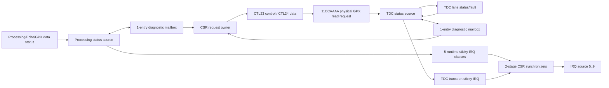

# V2 Checkpoint K0-8 - 상태/IRQ 단일 소유자

## 1. 판정

K0-8은 **완료**이다. Processing, Echo, GPX 데이터 처리, TDC bus controller의
상태를 각 원래 clock domain에서 보존하고, 통합 CSR에는 한 번에 한 개의
32-bit 진단 Word만 전달한다. 기존 32 CTL / 32 STAT / 4 IRQ 주소 틀은 유지하고
`CTL23/24`를 indexed 진단 portal로 사용한다. 실제 외부 GPX Register read
서비스를 추가한 현재 CSR ABI는 `2.6`이다.

다음 항목이 검증됐다.

1. Processing/TDC `150/200 MHz`, `200/150 MHz` 비동기 조합;
2. nonzero 상태와 clear 이후 zero 상태의 exact compare;
3. Processing/TDC 목적지 reset 중 요청의 ERROR 종료와 다음 요청 복구;
4. 5개 runtime IRQ class의 source, pending, W1C 순서;
5. Top의 32/64/128-bit AXIS와 Footer backpressure 무회귀;
6. `xc7z020clg484-2`에서 latch 0, black box 0, Critical CDC 0 및
   `WNS >= +0.100 ns`.

## 2. 구조



큰 진단 record는 CDC를 건너지 않는다. 요청 인덱스는 송신 register에 고정되고,
동기화된 request toggle 뒤에 목적지에서 한 번 capture된다. 응답도 목적지
register에 먼저 고정한 뒤 response toggle을 보낸다. 소프트웨어는 한 번에 한
요청만 발행할 수 있으므로 depth-16 async FIFO 네 개는 불필요했다. 경량
메일박스로 교체하면서 Top의 `ASYNC_REG_COUNT`는 690에서 498로 감소했다.

## 3. CTL23/24 계약

| 주소 | 이름 | 접근 | 의미 |
|---:|---|---|---|
| `0x05C` | DIAG_INDEX | R/W1S | index 선택, capture 시작, 상태 확인 |
| `0x060` | DIAG_DATA | RO | 마지막으로 완료된 원자적 32-bit 응답 |

`DIAG_INDEX` write:

| Bit | 이름 | 의미 |
|---:|---|---|
| 7:0 | INDEX | 조회할 진단 page |
| 8 | CAPTURE | `1`을 쓰면 한 번의 snapshot 요청 |
| 31:9 | Reserved | 반드시 0 |

`DIAG_INDEX` read:

| Bit | 이름 | 의미 |
|---:|---|---|
| 7:0 | INDEX | 마지막으로 선택한 page |
| 8 | BUSY | 요청이 원격 domain 또는 응답 경로에 있음 |
| 9 | VALID | `DIAG_DATA`가 마지막 요청의 완료 결과임 |
| 10 | ERROR | 미지원 index 또는 원격 reset으로 요청 실패 |
| 15:11 | Reserved | 0 |
| 31:16 | SEQUENCE | 완료할 때마다 modulo 65536 증가 |

권장 읽기 순서는 다음과 같다.

1. `DIAG_INDEX = INDEX | 0x100`을 쓴다.
2. `BUSY=0 && VALID=1`이 될 때까지 `DIAG_INDEX`를 읽는다.
3. 요청 전후 `SEQUENCE`가 1 증가했는지 확인한다.
4. `ERROR=0`일 때만 `DIAG_DATA`를 사용한다.

BUSY 중 두 번째 capture는 기존 요청을 덮지 않고 CSR access error로 기록된다.
목적지 reset이 요청과 겹치면 `DATA=0`, `ERROR=1`로 완료되고, reset 해제 후
메일박스 toggle을 다시 맞춘 뒤 다음 요청을 받는다. 한 page는 원자적이지만
여러 page를 순서대로 읽은 결과 전체가 같은 시점이라는 보장은 없다.

## 4. 진단 page 요약

| Index | 소유 domain | 내용 |
|---:|---|---|
| `0x10` | Processing | 전체 live/sticky 요약 |
| `0x11..0x18` | Processing | state/Face/schedule/monitor/laser 누적 count |
| `0x19` | Processing | B0, fire, virtual, synchronizer, re-arm 지연 계약 |
| `0x1A` | Processing | Hit/Cell/Frame 및 GPX event-drop fault |
| `0x1B` | Processing | Echo/VDMA profile ready, enable, version, idle |
| `0x1C..0x1F` | Processing | Rise/Fall HSIZE, VSIZE, STRIDE, Return, slot, Footer |
| `0x20..0x26` | Processing | Echo snapshot flags, count, 합계, channel mask |
| `0x40..0x5F` | Processing | channel 0..31의 rise/fall count |
| `0x80` | TDC | active/terminal mask와 TDC run/config 상태 |
| `0x84..0x87` | TDC | lane 0..3 live pin/controller/shot 상태 |
| `0x88..0x8B` | TDC | lane 0..3 sticky transport fault와 timeout 원인 |
| `0xC0..0xFF` | TDC/physical bus | `11CCAAAA`; Chip CC의 GPX Register AAAA 실제 readback |

합성된 Chip 수보다 큰 lane page는 0을 반환한다. 정의되지 않은 index는
`ERROR=1`을 반환하고 CSR access-error 상태와 IRQ source 4를 세운다.

물리 read 결과는 `DIAG_DATA[31:28]=요청 주소`, `[27:0]=실제 GPX data`다.
이 요청은 DISARM 상태에서만 허용되며 acquisition pause, TDC safe 대기,
한 Register read, acquisition 복구를 RTL이 순서대로 수행한다. timeout 또는
응답 Chip/주소 불일치는 `TDC_SUMMARY[15]`와 GPX_TRANSPORT IRQ에 남는다.

## 5. Runtime IRQ 계약

기존 IRQ source 0..4는 변경하지 않고 5..9를 추가했다.

| Bit | Source | 대표 원인 |
|---:|---|---|
| 5 | PROCESSING_WARNING | 위치/Face/Shot 일정, monitor, laser lifecycle 계약 위반 |
| 6 | LASER_TIMEOUT | fire 명령 뒤 fire_done timeout만 담당 |
| 7 | ECHO_DIAGNOSTIC | window 밖, overlap, profile 미준비, snapshot timeout/abort |
| 8 | GPX_TRANSPORT | event CDC drop, drain/sequence/bus/controller/물리 read fault |
| 9 | GPX_DATA | Raw28/Hit17, Return/Cell/Face 조립 의미 계약 위반 |

runtime source는 원래 domain의 sticky level이다. IRQ pending을 안정적으로
지우는 순서는 다음과 같다.

1. `CTL0.CLEAR_STATUS`로 원래 domain의 원인을 지운다.
2. `IRQ_STATUS`의 해당 source가 0이 될 때까지 기다린다.
3. `IRQ_FLAG` 해당 bit에 W1C한다.

원인이 high인 동안 `IRQ_FLAG`만 W1C하면 level-high source가 다시 pending을
세우는 것이 정상 동작이다.

## 6. 검증 결과

### 6.1 상태, reset, IRQ 기능

세션:

```text
signoff_results/sessions/
  260806_k08_mailbox_reset_final_v2_k08_status_irq
```

두 routine clock profile에서 다음을 exact compare했다.

- Processing flags/count, Echo timeout, GPX data/transport fault;
- TDC lane timeout pulse와 `run_timeout_cause` sticky 보존;
- 미지원 page의 ERROR 응답;
- Processing/TDC reset 중 요청 ERROR 종료와 정상 재조회;
- CLEAR_STATUS가 두 목적지에 도달한 뒤 source level 하강;
- runtime IRQ pending 보존과 후속 W1C.
- scheduler-enabled 물리 read 거부와 bus 무접근;
- DISARM 물리 Reg7 read의 `{주소[3:0], 실제 data[27:0]}` exact compare 및
  acquisition 자동 pause/resume.

### 6.2 통합 CSR

세션:

```text
signoff_results/sessions/
  260806_k08_mailbox_unified_csr_final_v2_unified_csr
```

| Processing/TDC MHz | WNS | Latch | Critical CDC |
|---:|---:|---:|---:|
| 150/200 | `+0.502 ns` | 0 | 0 |
| 200/150 | `+0.287 ns` | 0 | 0 |

### 6.3 통합 Top 기능

세션:

```text
signoff_results/sessions/
  260806_k08_mailbox_top_functional_final_v2_k06_axis_integration
```

두 clock profile x 32/64/128-bit의 6개 조합이 모두 PASS다. Footer에
13 Processing clocks의 backpressure를 주입해도 Beat, SOF, TLAST, Footer와
frame completion이 보존됐다.

### 6.4 통합 Top 구현

| Processing/TDC MHz | 폭 | WNS | Latch | Black box | ASYNC_REG | Critical CDC |
|---:|---:|---:|---:|---:|---:|---:|
| 150/200 | 32 | `+0.207 ns` | 0 | 0 | 498 | 0 |
| 200/150 | 32 | `+0.139 ns` | 0 | 0 | 498 | 0 |

세션:

```text
signoff_results/sessions/
  260806_k08_mailbox_impl_p150_w32_v2_k06_top_implementation
  260806_k08_mailbox_impl_p200_w32_v2_k06_top_implementation
```

OOC에서 parent XDC가 없어서 발생하는 `IOSTDTYPE-1`, `NSTD-1`, `UCIO-1`
계열만 parent 단계로 분류했으며 예상 밖 blocking DRC는 0이다. K0-9는 같은
최종 RTL로 64/128-bit 구현까지 반복한다.

## 7. DDR/HTML 및 PS/Ethernet Sign-off 경계

두 비교는 모두 Sign-off 검증으로 사용할 수 있지만 계층이 다르다.

| 검증 | 현재 판정 | 증명 범위 | 아직 증명하지 않는 것 |
|---|---|---|---|
| RTL AXIS -> VDMA memory model -> DDR vs HTML | L1 완료 | 모든 할당 Word, HSIZE/VSIZE/STRIDE, Footer, reserve 보존 | 실제 VDMA core, HP port, 물리 DDR |
| DDR capture -> cache ownership API -> PS H-Line/Ethernet vs HTML | L1 완료 | decoder ownership guard, H-Line 조립, packet byte | 실제 Cortex-A9 cache invalidate, OS DMA API, Ethernet 실측 |

J9와 J10의 자동 비교는 K0-6/K0-7 Top 데이터 경로에도 연결되어 통과했다.
실제 `AXI VDMA + PS HP + DDR + FreeRTOS/PetaLinux cache API + Ethernet PHY`
체인은 L0 parent/board Sign-off에서 같은 Golden Vector로 다시 확인해야 한다.

## 8. 다음 Gate

K0-8은 닫혔다. 다음 순서는 다음과 같다.

1. K0-9: 최종 RTL의 64/128-bit 두 routine clock profile 구현;
2. K0-10: 새 VLNV package, XGUI, production source manifest 검증;
3. K1: Return, STOP, topology, Face, RPM/각분해능/거리 전체 HTML 행렬;
4. L0: 실제 parent VDMA/HP/cache/Ethernet 및 보드 측정.
