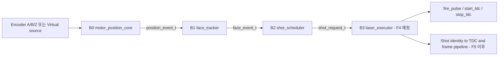
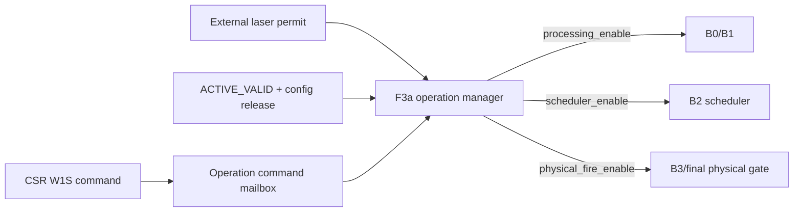
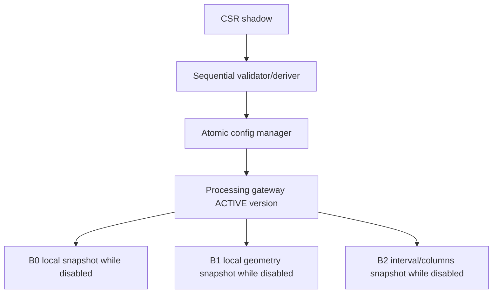
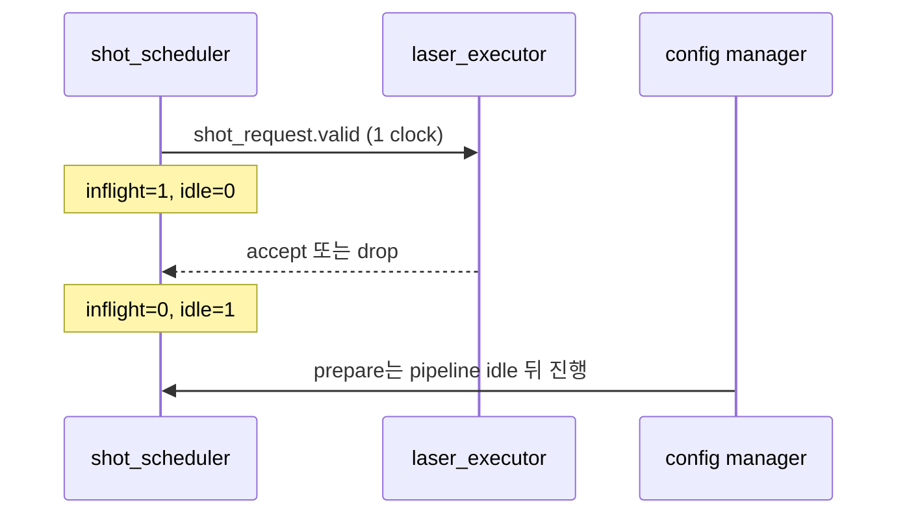

# v2 Processing Pipeline 통합 이해 가이드

## 1. 문서 목적

이 문서는 RTL 파일 순서를 설명하는 목록이 아니다. 신호처리 엔지니어가 다음
질문을 사람의 관점에서 반복 검토할 수 있게 하는 조립도다.

1. 각 모듈은 무엇을 결정하고 무엇을 결정하지 않는가?
2. 한 개 Encoder 위치가 Face, Shot, Laser, TDC identity로 어떻게 변하는가?
3. 설정과 안전 상태가 어느 지점에서 기능 데이터와 결합되는가?
4. 블록을 분리해 시험한 결과가 연결 후에도 같은 의미인가?
5. 아직 구현되지 않은 블록을 이미 검증된 것으로 오해하고 있지 않은가?

문서는 Stage 3가 진행될 때마다 갱신한다. 현재 F1/B0, F2/B1, F3a와 F3b/B2가
구현 및 검증되었고 F4/B3와 F5 전체 연결은 남아 있다.

## 2. 현재 검증 범위

| 영역 | 상태 | 의미 |
|---|---|---|
| Build/runtime/derived config | 완료 | 한 source와 atomic active version |
| Unified CSR 및 operation command | 완료 | RUN/STOP/ARM/DISARM과 permit owner 확정 |
| B0 Motor position | 완료 | physical/virtual 위치 event |
| B1 Face tracker | 완료 | inclusive geometry와 traversal event |
| B2 Shot scheduler | 완료 | angular lattice와 busy-hole identity |
| B3 Laser executor | 미구현 | fire/start/stop 수명주기 검증 전 |
| B0..B3 production integration | 미구현 | F5 전에는 전체 latency/sign-off 아님 |
| TDC acquisition와 formatter | 기존 v1만 존재 | v2 migration 전 |
| VDMA/HTML end-to-end | 미완료 | column hole 정합을 추후 확인해야 함 |

## 3. 두 개의 독립 흐름

시스템을 이해할 때 기능 데이터와 허가 흐름을 섞어 읽지 않는다.

### 3.1 기능 데이터와 identity 흐름



이 흐름의 핵심은 payload와 `valid`가 같은 레코드에서 함께 등록된다는 점이다.
Face index, 위치, 방향, source, latency와 active version을 별도 신호로 다시
동기화하거나 나중에 추측하지 않는다.

### 3.2 운용 허가 흐름



F3a가 RUN, ARM과 permit을 단독 소유한다. B2가 source mode나 config valid를
보고 laser permission을 다시 만들면 안전 소유권이 두 군데가 되므로 금지한다.

## 4. 블록별 역할 카드

### 4.1 `motor_position_core` - B0

| 구분 | 내용 |
|---|---|
| 입력 | physical A/B/Z 또는 내부 virtual A/B/Z, active motor config |
| 출력 | `position_event_t` |
| 소유 | x1/x2/x4 decode, modular position, 실제 방향, Z 적용, source 선택 |
| 비소유 | Face membership, laser permission, shot timing |
| 진단 | illegal transition, virtual Z fault |
| 검증 | P00..P04, 150/200 MHz |

`source_latency_clks`는 보정 지연을 삽입하는 값이 아니다. 입력 source에서 B0
event까지 측정된 read-only metadata다.

### 4.2 `face_tracker` - B1

| 구분 | 내용 |
|---|---|
| 입력 | `position_event_t`, derived lower/upper, Face mask |
| 출력 | `face_event_t` |
| 소유 | inclusive Face membership, enter/exit, Face 선택, overlap |
| 비소유 | shot 간격, 발사 허가, 물리 레이저 |
| 진단 | overlap pulse/sticky/count |
| 검증 | P10..P13, Face 1..5, 150/200 MHz |

Geometry는 방향과 무관하게 `[lower, upper]`로 저장한다. CW/CCW는 traversal
순서만 바꾸며, 방향 반전 시 이전 exit와 새 enter가 한 event에 같이 붙는다.

### 4.3 `lidar_operation_manager` - F3a

| 구분 | 내용 |
|---|---|
| 입력 | RUN/STOP/ARM/DISARM, active config gate, external permit, pipeline idle |
| 출력 | `operation_state_t`, command 결과, safe-to-prepare |
| 소유 | persistent RUN/ARM, permit trip 정책 |
| 비소유 | Face/Shot 위치, fire pulse width, TDC range window |
| 검증 | P40..P46, 50/150/200 MHz 기능, 150/200 MHz route |

RUN은 B0/B1 처리를 열 수 있지만 ARM 전에는 B2 발사를 열지 않는다. 물리 permit
상실은 ARM을 지우며 permit이 돌아와도 명시적 재-ARM 전에는 재개하지 않는다.

### 4.4 `shot_scheduler` - B2

| 구분 | 내용 |
|---|---|
| 입력 | `face_event_t`, derived interval/columns, F3a enable, executor feedback |
| 출력 | `shot_request_t`, overrun, idle |
| 소유 | Face별 angular lattice, geometric column, one-entry request ownership |
| 비소유 | fire/start/stop pulse와 실제 target range 시간 |
| 진단 | due-point overrun pulse/sticky/count |
| 검증 | P20..P25, 150/200 MHz |

B2는 Face 중간 ARM을 새로운 Face entry로 해석하지 않는다. ARM 직후에는 B1의
두 등록 단계에 남은 pre-ARM event도 격리한다. executor busy로 due point를
놓치면 늦게 쏘지 않고 열을 비운다.

### 4.5 `laser_executor` - B3, 다음 단계

아직 v2 RTL로 완료되지 않았다. F4에서 다음 책임을 한 owner로 만든다.

- request accept/drop;
- physical mode `fire_pulse -> fire_done -> start_tdc`;
- simulation mode의 physical fire 완전 차단;
- range window 뒤 `stop_tdc`;
- timeout, stale-high, T0 boundary 우선순위;
- accepted request identity를 shot 완료까지 안정적으로 보존.

## 5. 레코드 필드 계보

| 의미 | B0 `position_event` | B1 `face_event` | B2 `shot_request` | 변경 주체 |
|---|---|---|---|---|
| valid | 위치 update | Face 판정 완료 | due request | 각 경계 producer |
| position | 생성 | 그대로 전달 | 실제 due 위치 | B0만 |
| direction | 생성 | 그대로 전달 | 그대로 전달 | B0만 |
| source mode | 생성 | 그대로 전달 | 그대로 전달 | active config/B0 |
| latency | 측정 metadata | 그대로 전달 | 그대로 전달 | B0만 |
| active version | 생성 시 부착 | 그대로 전달 | 그대로 전달 | config gateway/B0 |
| Face index | 없음 | B1이 결정 | 그대로 전달 | B1만 |
| enter/exit/overlap | 없음 | B1이 결정 | 요청 gate에 사용 | B1만 |
| shot index | 없음 | 없음 | B2가 결정 | B2만 |
| last in Face | 없음 | 없음 | B2가 결정 | B2만 |

같은 의미를 새 이름의 병렬 신호로 복제하지 않는다. 후속 블록이 값을 다시
계산할 필요가 있다면 먼저 owner가 잘못 나뉜 것인지 검토한다.

## 6. 설정이 기능 경로에 들어오는 위치



| 설정 | 직접 소비 블록 | 실시간 연산 여부 |
|---|---|---|
| CPR/decode | B0 및 commit calculator | decode만 실시간, 곱셈은 commit 시점 |
| Face centers/half-width | calculator -> B1 lower/upper | B1은 bounded compare만 수행 |
| optical shot angle | calculator -> B2 interval | B2는 countdown만 수행 |
| Face span | calculator -> B2 columns | B2는 column compare만 수행 |
| source mode | B0, F3a, B2 방어 check | B2가 permission을 만들지 않음 |
| fire/range timing | F4 예정 | B2에서 사용하지 않음 |

이 구조로 runtime commit의 복잡한 division이 shot-critical path에 들어오지 않는다.

## 7. 손으로 따라가는 Shot 예시

조건:

```text
Face lower=10, upper=16
common_half_width=3
face_angular_intervals=6
shot_interval_states=2
columns_per_face=3
```

### 7.1 CW

```text
position:   10  11  12  13  14  15  16
Face:       IN  IN  IN  IN  IN  IN  IN
request:     0   -   1   -   2   -   -
last:        0   -   0   -   1   -   -
```

### 7.2 CCW

```text
position:   16  15  14  13  12  11  10
Face:       IN  IN  IN  IN  IN  IN  IN
request:     0   -   1   -   2   -   -
```

방향이 달라도 Face당 열 수와 시간순 index는 같다. position만 반대로 움직인다.

### 7.3 Busy로 column 0 누락

```text
position:        10       11       12
due column:       0        -        1
executor ready:  0        1        1
request:          -        -        1
overrun:          1        0        0
```

position 11에서 ready가 돌아와도 발사하지 않는다. position 12 요청이 index 1을
유지해야 향후 VDMA가 column 0의 누락을 알 수 있다.

## 8. Handshake와 idle



- `accept`와 `drop`은 동시에 1일 수 없다.
- unresolved 요청은 Face 전환으로 지우지 않는다.
- config loss/reset은 fail-safe로 ownership을 폐기한다.
- 최종 `pipeline_idle`은 B2뿐 아니라 F4, TDC acquisition과 output drain도
  포함해야 한다. 현재 P25는 B2까지의 test-only chain이다.

## 9. 융합 지점별 위험 표

| 융합 지점 | 위험 | 현재 방어 | 남은 검증 |
|---|---|---|---|
| Active config -> B0/B1/B2 | 서로 다른 version 사용 | event version assertion | F5 full chain |
| F3a -> B2 | config valid를 laser permit로 오인 | B2는 `scheduler_enable`만 소비 | F4 final pin gate |
| B0 -> B1 | source/latency 문맥 분리 | typed record 그대로 전달 | F5 pin-to-shot latency |
| B1 -> B2 | mid-Face 또는 stale pre-ARM entry의 ghost shot | 2-clock quarantine 뒤 genuine enter만 session 시작 | 완료 P24/P25 |
| B2 -> B3 | request unresolved/중복 | one-entry inflight와 accept/drop | F4 real executor |
| B2 -> formatter | busy hole 압축 | geometric `shot_index` | frame/VDMA migration |
| Control -> AXIS monitor | tready가 발사를 막음 | AXIS를 B0..B3 제어 경로에서 제외 | F5 monitor tap |
| Physical/simulation | 두 START source 동시 활성 | source metadata와 F3a mutual exclusion | F4 physical/sim assertions |

## 10. 조립 체크리스트

F5 또는 parent에서 블록을 연결할 때 아래 순서를 따른다.

1. 모든 B0..B3 블록을 같은 `proc_aclk/proc_aresetn`에 둔다.
2. Processing gateway의 동일 `active_config/version`을 배포한다.
3. F3a `processing_enable`을 B0/B1에 연결한다.
4. F3a `scheduler_enable`을 B2에만 연결한다.
5. F3a `physical_fire_enable`을 F4 최종 물리 gate에 연결한다.
6. `position_event_t -> face_event_t -> shot_request_t`를 직접 연결한다.
7. B3 ready/accept/drop을 B2에 연결하고 상호 배타 assertion을 유지한다.
8. B2/B3/TDC/output idle을 합쳐 atomic manager safe point를 만든다.
9. AXIS monitor는 event를 복사만 하고 ready를 upstream 제어에 되먹이지 않는다.
10. Face/index/version/source metadata가 acquisition과 formatter까지 유지되는지
    self-checking TB로 확인한다.

## 11. 분해 검토 순서

문제가 생겼을 때 top 전체 waveform부터 보지 않고 다음 순서로 좁힌다.

1. `operation_state`: RUN, ARM, permit, scheduler enable이 맞는가?
2. `active_version`: B0/B1/B2가 같은 version인가?
3. `position_event`: 위치, 방향, source와 latency가 맞는가?
4. `face_event`: inside, enter/exit와 Face index가 맞는가?
5. `shot_request`: due 위치, geometric index와 last가 맞는가?
6. `executor ready/accept/drop`: 누가 요청을 막거나 resolve했는가?
7. `overrun`: 처리율 부족인지 invalid context인지 구분했는가?
8. 후속 shot/TDC identity: 요청의 Face/index/version이 보존되었는가?

추천 waveform 신호는 다음과 같다.

```text
operation_state.scheduler_enable
position_event.valid/position/direction/active_version
face_event.valid/inside/enter_event/exit_event/face_index/overlap
shot_request.valid/position/face_index/shot_index/last_in_face
executor_ready, request_accept, request_drop
scheduler_idle, schedule_overrun_pulse/sticky/count
```

## 12. 검증 추적표

| 질문 | 증거 |
|---|---|
| Encoder 위치 의미가 맞는가? | F1 P00..P04 |
| Face 경계와 방향이 맞는가? | F2 P10..P13 |
| 안전 허가 owner가 하나인가? | F3a P40..P46 |
| 격자와 열 번호가 맞는가? | F3b P20/P21 |
| busy가 늦은 발사를 만들지 않는가? | F3b P22 |
| Face 전환이 이전 요청에 오염되지 않는가? | F3b P23 |
| mid-Face ARM이 ghost shot을 만드는가? | F3b P24/P25 |
| 실제 fire/start/stop이 맞는가? | F4 예정 |
| Encoder pin부터 TDC까지 전체 지연은? | F5 예정 |
| VDMA가 빈 열을 보존하는가? | Stage I/J 예정 |
| HTML과 RTL 결과가 같은가? | Stage K 예정 |

## 13. 현재 인간 검토 판정

현재 구조는 B0 위치, B1 Face, F3a 안전 허가, B2 Shot 격자를 각각 한 owner로
분리했고 typed record로 identity를 전달한다. P25에서 세 블록의 융합도 확인했다.
따라서 F4 개발을 시작할 수 있다.

다만 다음 문장을 아직 사용할 수는 없다.

> "통합 IP가 실제 레이저와 TDC를 완전하게 제어하고 VDMA/HTML까지 정합된다."

그 판정은 F4, F5, TDC/frame/formatter migration과 HTML 비교를 모두 통과한 뒤에
가능하다. 각 다음 체크포인트는 이 문서의 필드 계보, 위험 표와 조립 체크리스트를
갱신해야 완료로 인정한다.
