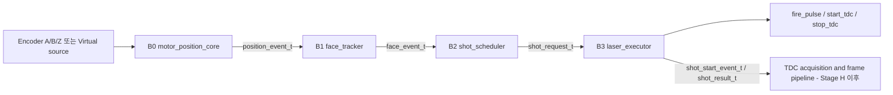
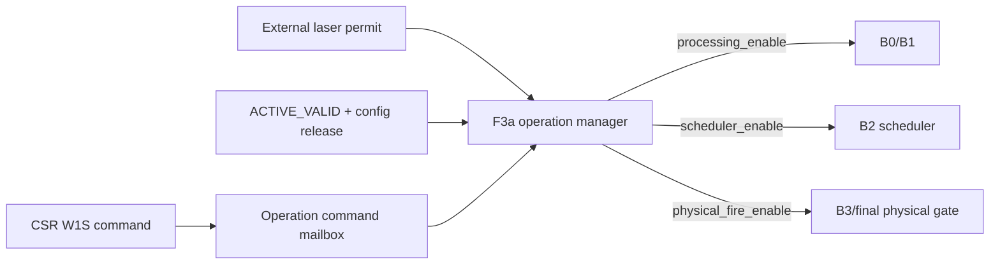
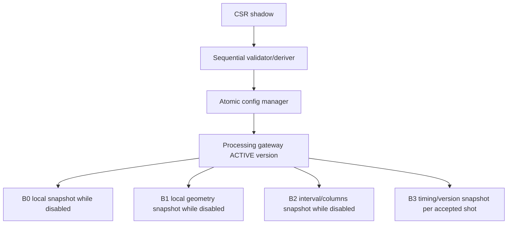
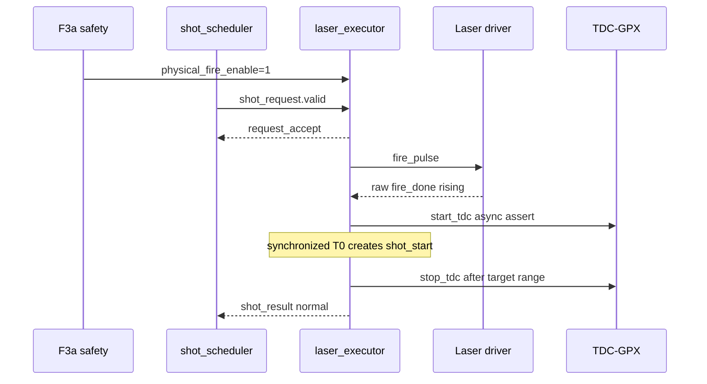
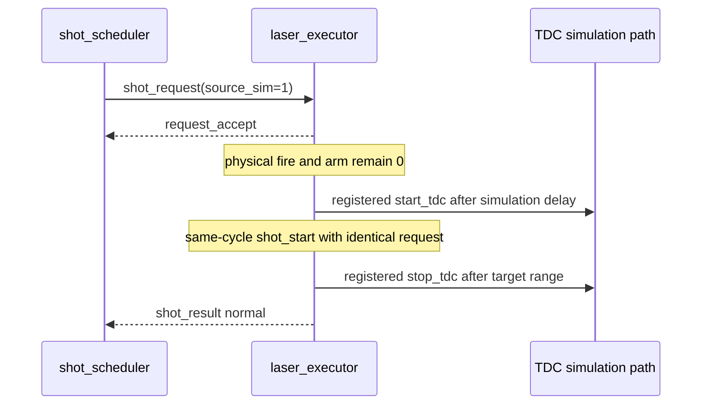
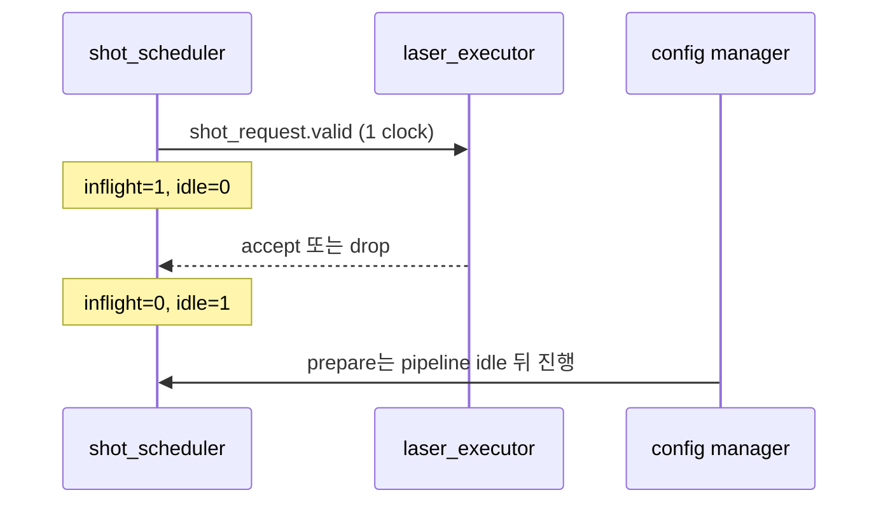
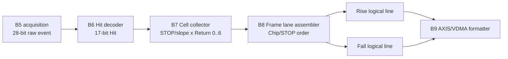

# v2 Processing Pipeline 통합 이해 가이드

## 1. 문서 목적

이 문서는 RTL 파일 순서를 설명하는 목록이 아니다. 신호처리 엔지니어가 다음
질문을 사람의 관점에서 반복 검토할 수 있게 하는 조립도다.

1. 각 모듈은 무엇을 결정하고 무엇을 결정하지 않는가?
2. 한 개 Encoder 위치가 Face, Shot, Laser, TDC identity로 어떻게 변하는가?
3. 설정과 안전 상태가 어느 지점에서 기능 데이터와 결합되는가?
4. 블록을 분리해 시험한 결과가 연결 후에도 같은 의미인가?
5. 아직 구현되지 않은 블록을 이미 검증된 것으로 오해하고 있지 않은가?

문서는 기능 Stage가 진행될 때마다 갱신한다. F1/B0, F2/B1, F3a,
F3b/B2, F4/B3와 F5 production 조립이 모두 구현 및 검증되어 Stage 3는
완료됐다. 다음 migration 경계는 Stage 4 / Checkpoint G Echo frontend다.

## 2. 현재 검증 범위

| 영역 | 상태 | 의미 |
|---|---|---|
| Build/runtime/derived config | 완료 | 한 source와 atomic active version |
| Unified CSR 및 operation command | 완료 | RUN/STOP/ARM/DISARM과 permit owner 확정 |
| B0 Motor position | 완료 | physical/virtual 위치 event |
| B1 Face tracker | 완료 | inclusive geometry와 traversal event |
| B2 Shot scheduler | 완료 | angular lattice와 busy-hole identity |
| B3 Laser executor | 완료 | 물리/가상 fire/start/stop, timeout과 진단 |
| B0..B3 production integration | 완료 | F5 P50..P53, local drain과 monitor 격리 포함 |
| TDC acquisition와 formatter | 기존 v1만 존재 | v2 migration 전 |
| VDMA/HTML end-to-end | 미완료 | column hole 정합을 추후 확인해야 함 |

## 3. 두 개의 독립 흐름

시스템을 이해할 때 기능 데이터와 허가 흐름을 섞어 읽지 않는다.

### 3.1 기능 데이터와 identity 흐름



이 흐름의 핵심은 payload와 `valid`가 같은 레코드에서 함께 등록된다는 점이다.
Face index, 위치, 방향, source, latency와 active version을 별도 신호로 다시
동기화하거나 나중에 추측하지 않는다.

### 3.2 운용 허가 흐름



F3a가 RUN, ARM과 permit을 단독 소유한다. B2가 source mode나 config valid를
보고 laser permission을 다시 만들면 안전 소유권이 두 군데가 되므로 금지한다.

## 4. 블록별 역할 카드

### 4.1 `motor_position_core` - B0

| 구분 | 내용 |
|---|---|
| 입력 | physical A/B/Z 또는 내부 virtual A/B/Z, active motor config |
| 출력 | `position_event_t` |
| 소유 | x1/x2/x4 decode, modular position, 실제 방향, Z 적용, source 선택 |
| 비소유 | Face membership, laser permission, shot timing |
| 진단 | illegal transition, virtual Z fault |
| 검증 | P00..P04, 150/200 MHz |

`source_latency_clks`는 보정 지연을 삽입하는 값이 아니다. 입력 source에서 B0
event까지 측정된 read-only metadata다.

### 4.2 `face_tracker` - B1

| 구분 | 내용 |
|---|---|
| 입력 | `position_event_t`, derived lower/upper, Face mask |
| 출력 | `face_event_t` |
| 소유 | inclusive Face membership, enter/exit, Face 선택, overlap |
| 비소유 | shot 간격, 발사 허가, 물리 레이저 |
| 진단 | overlap pulse/sticky/count |
| 검증 | P10..P13, Face 1..5, 150/200 MHz |

Geometry는 방향과 무관하게 `[lower, upper]`로 저장한다. CW/CCW는 traversal
순서만 바꾸며, 방향 반전 시 이전 exit와 새 enter가 한 event에 같이 붙는다.

### 4.3 `lidar_operation_manager` - F3a

| 구분 | 내용 |
|---|---|
| 입력 | RUN/STOP/ARM/DISARM, active config gate, external permit, pipeline idle |
| 출력 | `operation_state_t`, command 결과, safe-to-prepare |
| 소유 | persistent RUN/ARM, permit trip 정책 |
| 비소유 | Face/Shot 위치, fire pulse width, TDC range window |
| 검증 | P40..P46, 50/150/200 MHz 기능, 150/200 MHz route |

RUN은 B0/B1 처리를 열 수 있지만 ARM 전에는 B2 발사를 열지 않는다. 물리 permit
상실은 ARM을 지우며 permit이 돌아와도 명시적 재-ARM 전에는 재개하지 않는다.

### 4.4 `shot_scheduler` - B2

| 구분 | 내용 |
|---|---|
| 입력 | `face_event_t`, derived interval/columns, F3a enable, executor feedback |
| 출력 | `shot_request_t`, overrun, idle |
| 소유 | Face별 angular lattice, geometric column, one-entry request ownership |
| 비소유 | fire/start/stop pulse와 실제 target range 시간 |
| 진단 | due-point overrun pulse/sticky/count |
| 검증 | P20..P25, 150/200 MHz |

B2는 Face 중간 ARM을 새로운 Face entry로 해석하지 않는다. ARM 직후에는 B1의
두 등록 단계에 남은 pre-ARM event도 격리한다. executor busy로 due point를
놓치면 늦게 쏘지 않고 열을 비운다.

### 4.5 `laser_executor` - B3

| 구분 | 내용 |
|---|---|
| 입력 | `shot_request_t`, active timing/version, F3a operation state, raw `fire_done` |
| 출력 | accept/drop, `fire_pulse`, `start_tdc`, `stop_tdc`, `shot_start_event_t`, `shot_result_t` |
| 소유 | 한 accepted shot의 물리/가상 수명주기, timeout, range window, 고정 re-arm |
| 비소유 | angular due point, Face membership, GPX bus readout, AXIS monitor backpressure |
| 진단 | request drop, timeout, operation abort, unexpected `fire_done` pulse/sticky/count |
| 검증 | P30..P36, P35 real F3a/B1/B2/B3 chain, 150/200 MHz |

내부는 네 개의 독립 책임으로 나뉜다.

| 하위 모듈 | 단일 책임 | 기능 경로에 미치는 영향 |
|---|---|---|
| `laser_executor_core` | request부터 result까지 한 개의 순차 FSM | shot 순서와 타이밍을 결정 |
| `laser_fire_done_bridge` | raw T0의 저지연 START와 동기 event | 유일한 의도적 비동기 assertion 경로 |
| `laser_registered_pulses` | fire, simulation START, STOP 폭 | 등록 pulse와 최종 fire 안전 gate |
| `laser_diagnostics_counter` | sticky와 modulo-2^32 count | 관찰 전용, 발사를 지연하거나 막지 않음 |

물리 START는 raw `fire_done`이 직접 preset하는 캡처 플립플롭에서 상승한다.
설정 폭은 비동기 edge부터 정확히 N clock이라는 뜻이 아니라 **최소 N개의 완전한
Processing clock 주기**를 보장한다. 하강은 clock-aligned이며 raw 입력이 HIGH로
고착돼도 설정 폭 뒤 출력은 닫힌다. 다만 raw LOW가 다시 검증되기 전에는 다음
물리 shot을 허용하지 않는다.

### 4.6 `lidar_processing_subsystem`과 AXIS monitor - F5

| 구분 | 내용 |
|---|---|
| 입력 | 한 source의 `active_config`, 한 source의 `operation_state`, Encoder, raw `fire_done` |
| 출력 | B0..B3 records, fire/start/stop, Processing-local idle, 64-bit monitor AXIS |
| 소유 | B0..B3 조립, aggregate diagnostics, local idle 의미 |
| 비소유 | CSR decode, operation state 생성, TDC acquisition, frame/output drain |
| monitor 정책 | B1 event 관찰만 수행; stalled beat는 안정 유지하고 새 event는 drop/count |
| 검증 | P50..P53, Processing/TDC 150/200과 200/150 MHz |

monitor는 `face_event_t`의 copy이므로 TREADY가 없어도 B0..B3는 계속 동작한다.
`pipeline_idle`에도 monitor pending은 포함하지 않는다. 정확한 monitor bit layout과
최종 구현 수치는 `V2_CHECKPOINT_F5_PROCESSING_SUBSYSTEM.md`를 따른다.

## 5. 레코드 필드 계보

| 의미 | B0 `position_event` | B1 `face_event` | B2 `shot_request` | B3 start/result | 변경 주체 |
|---|---|---|---|---|---|
| valid | 위치 update | Face 판정 완료 | due request | T0/completion event | 각 경계 producer |
| position | 생성 | 그대로 전달 | 실제 due 위치 | 그대로 전달 | B0만 |
| direction | 생성 | 그대로 전달 | 그대로 전달 | 그대로 전달 | B0만 |
| source mode | 생성 | 그대로 전달 | 그대로 전달 | 실행 경로 선택 후 그대로 전달 | active config/B0 |
| latency | 측정 metadata | 그대로 전달 | 그대로 전달 | 그대로 전달 | B0만 |
| active version | 생성 시 부착 | 그대로 전달 | 그대로 전달 | accept부터 result까지 고정 | config gateway/B0 |
| Face index | 없음 | B1이 결정 | 그대로 전달 | 그대로 전달 | B1만 |
| enter/exit/overlap | 없음 | B1이 결정 | 요청 gate에 사용 | 없음 | B1만 |
| shot index | 없음 | 없음 | B2가 결정 | 그대로 전달 | B2만 |
| last in Face | 없음 | 없음 | B2가 결정 | 그대로 전달 | B2만 |
| fire-to-T0 | 없음 | 없음 | 없음 | B3가 측정 | B3만 |
| timeout/abort | 없음 | 없음 | 없음 | result에서 B3가 결정 | B3만 |

같은 의미를 새 이름의 병렬 신호로 복제하지 않는다. 후속 블록이 값을 다시
계산할 필요가 있다면 먼저 owner가 잘못 나뉜 것인지 검토한다.

## 6. 설정이 기능 경로에 들어오는 위치



| 설정 | 직접 소비 블록 | 실시간 연산 여부 |
|---|---|---|
| CPR/decode | B0 및 commit calculator | decode만 실시간, 곱셈은 commit 시점 |
| Face centers/half-width | calculator -> B1 lower/upper | B1은 bounded compare만 수행 |
| optical shot angle | calculator -> B2 interval | B2는 countdown만 수행 |
| Face span | calculator -> B2 columns | B2는 column compare만 수행 |
| source mode | B0, F3a, B2 방어 check | B2가 permission을 만들지 않음 |
| fire/range timing | B3 | accept 시 snapshot하고 B2에서는 사용하지 않음 |

이 구조로 runtime commit의 복잡한 division이 shot-critical path에 들어오지 않는다.

## 7. 손으로 따라가는 Shot 예시

조건:

```text
Face lower=10, upper=16
common_half_width=3
face_angular_intervals=6
shot_interval_states=2
columns_per_face=3
```

### 7.1 CW

```text
position:   10  11  12  13  14  15  16
Face:       IN  IN  IN  IN  IN  IN  IN
request:     0   -   1   -   2   -   -
last:        0   -   0   -   1   -   -
```

### 7.2 CCW

```text
position:   16  15  14  13  12  11  10
Face:       IN  IN  IN  IN  IN  IN  IN
request:     0   -   1   -   2   -   -
```

방향이 달라도 Face당 열 수와 시간순 index는 같다. position만 반대로 움직인다.

### 7.3 Busy로 column 0 누락

```text
position:        10       11       12
due column:       0        -        1
executor ready:  0        1        1
request:          -        -        1
overrun:          1        0        0
```

position 11에서 ready가 돌아와도 발사하지 않는다. position 12 요청이 index 1을
유지해야 향후 VDMA가 column 0의 누락을 알 수 있다.

### 7.4 물리 shot 수명주기



### 7.5 시뮬레이션 shot 수명주기



## 8. Handshake와 idle



- `accept`와 `drop`은 동시에 1일 수 없다.
- unresolved 요청은 Face 전환으로 지우지 않는다.
- config loss/reset은 fail-safe로 ownership을 폐기한다.
- F5 `pipeline_idle = scheduler_idle AND NOT executor_busy`는 Processing-local
  drain이다. monitor pending/stall은 기능 drain이 아니므로 제외한다.
- 전체 시스템 safe point는 Stage H/J에서 이 local idle과 TDC acquisition idle,
  output drain idle을 AND해 완성한다. P52는 monitor가 stalled여도 Processing-local
  safe point가 정상적으로 올라오는 것을 검증했다.

## 9. 융합 지점별 위험 표

| 융합 지점 | 위험 | 현재 방어 | 남은 검증 |
|---|---|---|---|
| Active config -> B0/B1/B2/B3 | 서로 다른 version 사용 | 한 record source와 event identity assertion | 완료 P50/P53 |
| F3a -> B2/B3 | config valid를 laser permit로 오인 | B2는 scheduler gate, B3는 final physical gate만 소비 | 완료 P34/P35 |
| B0 -> B1 | source/latency 문맥 분리 | typed record 그대로 전달 | 완료 P50/P53, 8/5-clock contract |
| B1 -> B2 | mid-Face 또는 stale pre-ARM entry의 ghost shot | 2-clock quarantine 뒤 genuine enter만 session 시작 | 완료 P24/P25 |
| B2 -> B3 | request unresolved/중복 | one-entry inflight와 accept/drop | 완료 P34/P35 |
| raw `fire_done` -> B3 | metastability, stale/stuck HIGH, 무한 START | direct FDPE preset + 2-stage 관찰 + bounded close | 완료 P30/P31/P32/P36, F5 endpoint audit; parent XDC는 Stage L |
| B2 -> formatter | busy hole 압축 | geometric `shot_index` | frame/VDMA migration |
| Control -> AXIS monitor | tready가 발사를 막음 | AXIS를 B0..B3 제어 경로에서 제외 | 완료 P51와 routed fanin audit |
| Physical/simulation | 두 START source 동시 활성 | source metadata, F3a mutual exclusion, B3 assertion | 완료 P33/P35 |

## 10. 조립 체크리스트

F5 production subsystem을 검토하거나 이후 parent에 연결할 때 아래 순서를 따른다.

1. 모든 B0..B3 블록을 같은 `proc_aclk/proc_aresetn`에 둔다.
2. Processing gateway의 동일 `active_config/version`을 배포한다.
3. F3a `processing_enable`을 B0/B1에 연결한다.
4. F3a `scheduler_enable`을 B2에만 연결한다.
5. F3a `physical_fire_enable`을 B3 최종 물리 gate에 연결한다.
6. `position_event_t -> face_event_t -> shot_request_t`를 직접 연결한다.
7. B3 ready/accept/drop을 B2에 연결하고 상호 배타 assertion을 유지한다.
8. F5에서는 B2/B3 local idle을 만들고, Stage H/J에서 TDC/output idle을 합친다.
9. AXIS monitor는 event를 복사만 하고 ready를 upstream 제어에 되먹이지 않는다.
10. F5에서는 Face/index/version/source metadata가 B3 result까지 유지됨을
    확인하고, acquisition과 formatter 연속성은 Stage H/J TB에서 확장한다.
11. raw `fire_done`은 B3 캡처 PRE와 첫 synchronizer D 이외의 기능 cone으로
    분기하지 않도록 합성 구조 감사를 유지한다.

## 11. 분해 검토 순서

문제가 생겼을 때 top 전체 waveform부터 보지 않고 다음 순서로 좁힌다.

1. `operation_state`: RUN, ARM, permit, scheduler enable이 맞는가?
2. `active_version`: B0/B1/B2가 같은 version인가?
3. `position_event`: 위치, 방향, source와 latency가 맞는가?
4. `face_event`: inside, enter/exit와 Face index가 맞는가?
5. `shot_request`: due 위치, geometric index와 last가 맞는가?
6. `executor ready/accept/drop`: 누가 요청을 막거나 resolve했는가?
7. `overrun`: 처리율 부족인지 invalid context인지 구분했는가?
8. `shot_start/result`: 요청의 Face/index/version/source가 보존되었는가?
9. `fire/start/stop`: 물리/가상 source와 설정 폭/timeout/range가 맞는가?
10. 후속 TDC identity: `shot_start.request`와 acquisition 명령이 같은가?

추천 waveform 신호는 다음과 같다.

```text
operation_state.scheduler_enable
position_event.valid/position/direction/active_version
face_event.valid/inside/enter_event/exit_event/face_index/overlap
shot_request.valid/position/face_index/shot_index/last_in_face
executor_ready, request_accept, request_drop
fire_pulse, physical_arm, raw_fire_done, start_tdc, stop_tdc
shot_start.valid/request/fire_to_t0_clks
shot_result.valid/timeout/aborted/request
laser_diagnostics pulse/sticky/count
scheduler_idle, schedule_overrun_pulse/sticky/count
pipeline_idle
mon_axis_tvalid/tready/tdata/tuser/tlast
monitor_drop_pulse/sticky/count
```

## 12. 검증 추적표

| 질문 | 증거 |
|---|---|
| Encoder 위치 의미가 맞는가? | F1 P00..P04 |
| Face 경계와 방향이 맞는가? | F2 P10..P13 |
| 안전 허가 owner가 하나인가? | F3a P40..P46 |
| 격자와 열 번호가 맞는가? | F3b P20/P21 |
| busy가 늦은 발사를 만들지 않는가? | F3b P22 |
| Face 전환이 이전 요청에 오염되지 않는가? | F3b P23 |
| mid-Face ARM이 ghost shot을 만드는가? | F3b P24/P25 |
| 실제 fire/start/stop이 맞는가? | F4 P30..P36 |
| F3a/B1/B2/B3가 같은 shot identity인가? | F4 P35 |
| raw T0 경로가 합성 후에도 직접 preset인가? | F4 structural audit |
| Encoder 첫 sample부터 physical fire까지 지연은? | F5 P50, 8 Processing clocks |
| Virtual transition부터 request accept까지 지연은? | F5 P53, 5 Processing clocks |
| Monitor stall이 제어를 막는가? | F5 P51 및 routed fanin audit |
| STOP 뒤 Processing-local safe point가 정확한가? | F5 P52 |
| START부터 실제 GPX acquisition까지 지연은? | Stage H 예정 |
| VDMA가 빈 열을 보존하는가? | Stage I/J 예정 |
| HTML과 RTL 결과가 같은가? | Stage K 예정 |

## 13. 현재 인간 검토 판정

현재 구조는 B0 위치, B1 Face, F3a 안전 허가, B2 Shot 격자, B3 Laser 수명주기를
각각 한 owner로 분리했고 typed record로 identity를 전달한다. F5 P50..P53에서
물리와 가상 모드, monitor stall, STOP/drain과 B0..B3 production 조립을 확인했다.
따라서 Processing pipeline은 Stage 3 범위에서 완료됐다.

다만 다음 문장을 아직 사용할 수는 없다.

> "통합 IP가 실제 레이저와 TDC를 완전하게 제어하고 VDMA/HTML까지 정합된다."

그 판정은 TDC/frame/formatter migration과 HTML 비교를 모두 통과한 뒤에
가능하다. 각 다음 체크포인트는 이 문서의 필드 계보, 위험 표와 조립 체크리스트를
갱신해야 완료로 인정한다.

## 14. Stage 6 B5-B8 확장 흐름

Processing의 Shot identity는 GPX acquisition 이후에도 새로 계산하지 않고 typed
record로 이어진다.



| 경계 | 현재 상태 | 핵심 보장 |
|---|---|---|
| B5 | 완료 | 외부 GPX 28-bit raw word와 Shot/Chip identity |
| B6 | 완료 | I-Mode field와 17-bit Hit 보존, runtime slope mask 검사 |
| B7 | 완료 | STOP/slope별 최대 7 Return, 폭 독립 Cell |
| B8 | I3 완료 | 논리 Chip/STOP 정렬, Rise/Fall 독립 backpressure, blank Cell |
| B9 | 미완료 | 32/64/128-bit repack, prefix, HSIZE/VSIZE, SOF/EOL |

B8의 `slot`은 AXIS beat나 VDMA line이 아니라 Cell의 논리 순번이다. 한 slope의
slot 수는 `popcount(active_slope_mask) x stops_per_chip`이며, output width가
변해도 이 값은 변하지 않는다.

현재 B8은 accepted Shot 사이의 선두 및 중간 column hole을 `gap_before`로
보존한다. 그러나 scheduler가 버린 마지막 column이나 모든 column이 버려진
Face는 Cell stream만으로 알 수 없다. I4에서 별도의 `face_close_event`를
Processing 경계에서 전달한 뒤 B5-B8 통합을 닫아야 한다. 자세한 구조와 검증은
`V2_CHECKPOINT_I3_GPX_FRAME_LANE_ASSEMBLER.md`를 따른다.
