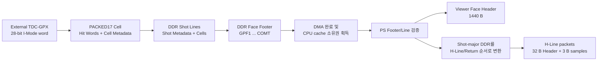
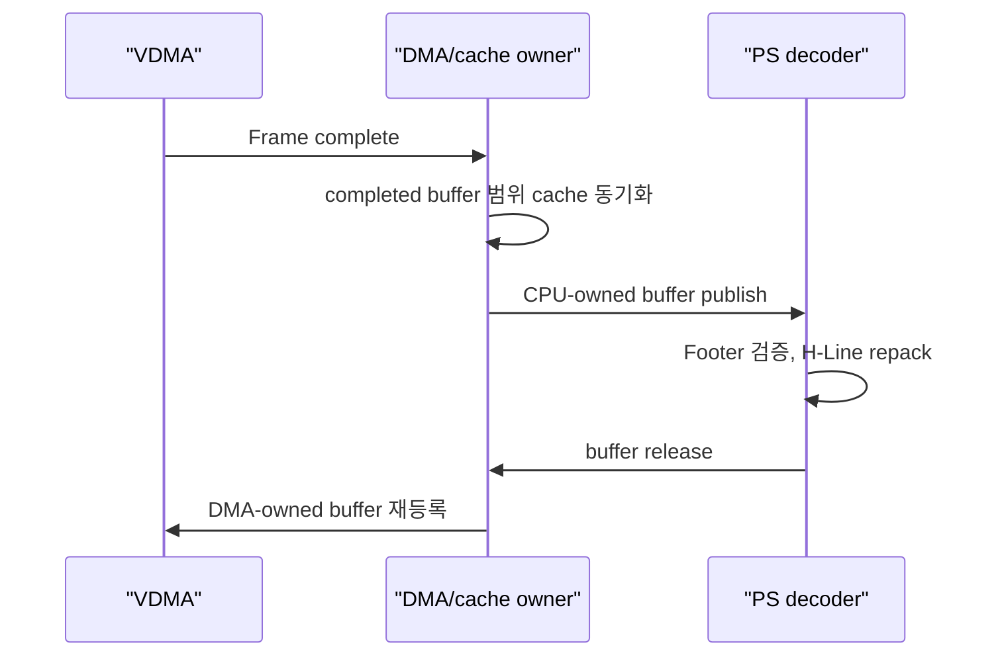

# V2 PS H-Line / Ethernet ABI 계약

## 1. 목적과 용어

이 문서는 VDMA가 DDR에 기록한 `PACKED17` Face 프레임을 처리 시스템
(Processing System, PS)이 읽어 Viewer용 Ethernet application payload로
변환하는 규칙을 정의한다.

서로 다른 메타데이터를 다음처럼 구분한다.

| 구조 | 위치 | 개수 | 목적 |
|---|---|---:|---|
| Cell Metadata | DDR Shot Line의 각 Cell 끝 | Cell마다 1 Word | Return별 Hit[16]/Valid와 Chip, STOP, fault 표현 |
| Shot Metadata | DDR의 각 Shot Line 앞 | Shot마다 16 B | TDC 측정 시작 기준 시각(T0), Shot 번호, 위치, Hole/fault 표현 |
| Face Footer | DDR Face 프레임 끝 | Face/lane마다 32 B | Face가 완전히 끝났음을 `COMT`로 확정하고 실제 형상 검증 |
| Viewer Face Header | Ethernet 첫 payload | Face/lane마다 1440 B | Viewer가 뒤의 H-Line을 독립적으로 해석할 공통 정보 제공 |
| H-Line Header | 각 H-Line payload 앞 | packet마다 32 B | Face, slope, Cell, Return, Shot 구간과 packet 순서 식별 |

PL은 Face 시작 시점에 아직 알 수 없는 완료 상태를 꾸며내지 않는다. 따라서
DDR에는 **Face Header가 아니라 Face Footer**를 쓴다. PS는 Footer의 완료 정보를
검증한 뒤 Active Config snapshot과 합쳐 **Viewer Face Header**를 만든다.

## 2. 전체 데이터 흐름



DDR 입력 폭 32/64/128-bit는 합성 시 결정되는 **전송 형식**이다. PS는 Footer의
폭 코드, HSIZE, VSIZE와 고정 STRIDE를 검증한 뒤 이를 제거한다. 따라서 같은
Face 의미라면 Viewer payload는 원래 AXIS 폭과 무관하게 동일해야 한다.

## 3. Viewer Face Header

첫 Ethernet application payload는 항상 정확히 1440 B이다. 의미가 정의된
영역은 처음 64 B이고, 나머지 1376 B는 버전 1에서 0으로 예약한다. UDP/TCP/IP
Header는 이 1440 B에 포함되지 않는다. 모든 다중 바이트 정수는 little-endian이다.

| Byte | 크기 | 필드 | 의미 |
|---:|---:|---|---|
| 0 | 4 | `MAGIC` | ASCII `LFH1` |
| 4 | 2 | `ABI_VERSION` | `1` |
| 6 | 2 | `DEFINED_BYTES` | `64` |
| 8 | 4 | `FACE_FRAME_ID` | 수락된 Face마다 증가하는 32-bit ID |
| 12 | 2 | `ACTIVE_CONFIG_VERSION` | 이 Face가 사용한 설정 version |
| 14 | 1 | `FACE_INDEX` | `0..4` |
| 15 | 1 | `FACE_COUNT` | 합성 시 결정된 활성 면 수 |
| 16 | 1 | `SLOPE` | `1=Rise`, `0=Fall` |
| 17 | 1 | `DIRECTION` | `1=CCW`, `0=CW` |
| 18 | 1 | `SOURCE` | `1=simulation`, `0=physical` |
| 19 | 1 | `VISIBLE_RETURNS` | Viewer에 전시하는 Return 수 `1..7` |
| 20 | 1 | `LANE_CHIP_MASK` | 해당 slope lane의 활성 Chip mask |
| 21 | 1 | `STOPS_PER_CHIP` | Chip당 활성 STOP 수 |
| 22 | 1 | `CELL_WORDS` | `ceil(Returns/2)+1` |
| 23 | 1 | `SAMPLE_BYTES` | 버전 1은 `3` |
| 24 | 2 | `CELL_SLOTS` | Shot마다 존재하는 Cell 수 |
| 26 | 2 | `PLANNED_SHOTS` | Face의 기하학적 Shot 수 |
| 28 | 2 | `COMPLETED_LINES` | 실제 Shot/Hole Line 수 |
| 30 | 2 | `HLINE_STREAMS` | `CELL_SLOTS x VISIBLE_RETURNS` |
| 32 | 4 | `T0_TICK_HZ` | TDC 측정 시작 기준 시각(T0) tick 주파수 |
| 36 | 4 | `BIN_RESOLUTION_PS` | TDC 거리 code 1 LSB의 시간 분해능, ps |
| 40 | 4 | `TOTAL_STATES` | Encoder decoded states/revolution |
| 44 | 2 | `FACE_LOWER` | Face lower state, inclusive |
| 46 | 2 | `FACE_CENTER` | Face center state |
| 48 | 2 | `FACE_UPPER` | Face upper state, exclusive |
| 50 | 2 | `FOOTER_STATUS` | DDR Footer W6 `[31:16]`을 우측 정렬 |
| 52 | 4 | `FIRST_T0_LO` | 첫 유효 Shot의 T0 `[31:0]` |
| 56 | 4 | `FIRST_T0_HI` | 첫 유효 Shot의 T0 `[63:32]` |
| 60 | 2 | `HLINE_PACKETS` | 이어지는 H-Line packet 총수 |
| 62 | 2 | `HEADER_FLAGS` | bit0 T0 anchor valid, bit1 external sync valid, bit2 Hole 포함, bit3 fault 포함 |
| 64 | 1376 | Reserved | 전부 `0` |

HSIZE, VSIZE, STRIDE와 원래 AXIS 폭은 Viewer 의미가 아니라 PS 내부 DDR 해석
정보이므로 이 Header에 반복하지 않는다. 이것이 32/64/128-bit 입력에서 최종
Viewer payload가 같아지는 이유다.

## 4. H-Line의 정의

H-Line 하나는 다음 tuple로 식별한다.

```text
(Face Frame ID, Face index, slope, Cell slot, Return index)
```

해당 H-Line의 표본은 기하학적 Shot index 0부터 마지막 Shot까지 순서대로
배치한다. 따라서 DDR에서는 Shot 하나 안에 여러 Cell/Return이 있는
`Shot-major` 형식이지만, Ethernet에서는 한 Cell/Return의 모든 Shot을 모은
`H-Line-major` 형식이 된다. Hole도 한 표본 자리를 차지하므로 뒤의 수평 위치가
앞당겨지지 않는다.

최종 Viewer의 전역 H-Line 번호는 단순히 slope 수를 곱해 만들지 않는다. Active
Config version이 가진 APD 배선표로 `(slope, Cell slot)`을 논리 APD H-Line에
매핑한다. 이 규칙은 전용 2-Rise/2-Fall과 한 Chip dual-edge를 모두 수용한다.

## 5. H-Line Header

H-Line packet은 최대 1440 B이며, 32 B Header 뒤에 3 B 표본을 연속 배치한다.

| Byte | 크기 | 필드 | 의미 |
|---:|---:|---|---|
| 0 | 4 | `MAGIC` | ASCII `LHL1` |
| 4 | 4 | `FACE_FRAME_ID` | Face Header와 동일 |
| 8 | 2 | `ACTIVE_CONFIG_VERSION` | Face Header와 동일 |
| 10 | 1 | `FACE_INDEX` | `0..4` |
| 11 | 1 | `FLAGS` | bit0 Rise, bit1 CCW, bit2 simulation, bit3 Hole 포함, bit4 fault 포함, bit5 해당 H-Line의 마지막 packet |
| 12 | 2 | `HLINE_LOCAL_INDEX` | 버전 1은 Cell slot과 동일 |
| 14 | 1 | `CELL_SLOT` | slope lane 내부 Cell 순서 |
| 15 | 1 | `RETURN_INDEX` | `0..VISIBLE_RETURNS-1` |
| 16 | 2 | `FIRST_SHOT` | 이 packet의 첫 Shot index |
| 18 | 2 | `SAMPLE_COUNT` | 이 packet에 담긴 표본 수 |
| 20 | 2 | `PACKET_INDEX` | 해당 H-Line 내부 packet 번호, 0부터 시작 |
| 22 | 2 | `PACKET_COUNT` | 해당 H-Line의 전체 packet 수 |
| 24 | 2 | `VALID_COUNT` | 이 packet의 valid 표본 수 |
| 26 | 2 | `SAMPLE_PAYLOAD_BYTES` | `SAMPLE_COUNT x 3` |
| 28 | 1 | `SAMPLE_BYTES` | `3` |
| 29 | 1 | `VISIBLE_RETURNS` | 설정된 Return 수 |
| 30 | 2 | `PLANNED_SHOTS` | Face의 전체 Shot 수 |

```text
samples_per_packet = floor((1440 - 32) / 3) = 469
packet_count        = ceil(planned_shots / 469)
```

예를 들어 1800 Shot의 H-Line 하나는 `469 + 469 + 469 + 393` 표본의 네
packet으로 나뉜다. 마지막 packet은 실제 byte까지만 전송하며 Ethernet padding을
application payload로 계산하지 않는다.

## 6. 3바이트 표본

각 표본은 unsigned 24-bit little-endian이다.

| Bit | 의미 |
|---:|---|
| `[16:0]` | TDC-GPX 거리 Hit code |
| `[17]` | Valid Return |
| `[18]` | 기하학적 Hole |
| `[19]` | Cell 또는 Shot fault |
| `[20]` | Shot timeout |
| `[21]` | Shot abort |
| `[23:22]` | Reserved, `0` |

거리 code가 0이어도 Valid가 1일 수 있으므로, Viewer는 값이 0인지가 아니라
bit17로 유효성을 판단한다. 설정된 Return 수보다 많이 들어온 1..7 범위의 Hit를
PS가 숨기는 것은 의도적인 필터이며 fault가 아니다. 물리 8번째 Return과 내부
손실은 Cell Metadata의 fault를 통해 bit19로 전파한다.

## 7. DMA와 CPU cache 소유권

참조 디코더는 cache API를 직접 호출하지 않는다. 운영체제마다 올바른 API가
다르기 때문이다. 대신 다음 순서를 강제한다.



| 환경 | 보수적 적용 원칙 |
|---|---|
| FreeRTOS / bare-metal | DMA 완료 확인 후 해당 buffer 범위만 `Xil_DCacheInvalidateRange`, 메모리 barrier, CPU 처리, release 후 다음 DMA 등록 |
| PetaLinux | DMA API로 할당/매핑하고 `dma_sync_single_for_cpu()`와 `dma_sync_single_for_device()` 또는 coherent buffer 사용; cached physical address 직접 접근 금지 |

참조 코드의 `lidar_ps_publish_cpu_owned(..., true)`에서 `true`는 **플랫폼 cache
동기화가 이미 완료되었다는 증명 입력**이다. 이 값 자체가 cache를 invalidate하지
않는다. DMA-owned 상태, 동기화 완료가 없는 상태, DMA에 release한 뒤의 decode는
모두 오류로 거부된다.

## 8. Sign-off 경계

| 항목 | 자동 Sign-off | 실제 보드 필요 |
|---|---|---|
| HTML Golden과 DDR 모든 Word 비교 | J9 완료 | 실제 VDMA core 확인은 L0 |
| DDR Footer/Shot/Cell 해석 | J10 완료 | 동일 parser를 보드 buffer에 적용 |
| 32/64/128-bit 입력의 Viewer payload 동일성 | J10 완료 | 선택한 실제 폭으로 재확인 |
| Face Header/H-Line packet byte 비교 | J10 완료 | NIC/UDP 송신 후 수신 capture 비교 |
| DMA/CPU 소유권 순서 위반 검출 | J10 host test 완료 | 실제 cache invalidate 효과는 L0 |
| 처리시간, cache miss, Ethernet 지속 전송 margin | 계산 모델만으로 확정 불가 | L0 보드 계측 필수 |

J10은 **캐시 동기화 이후 디코더가 만들어야 할 결과**를 완전히 고정한다. 그러나
실제 Zynq-7000 cache line이 올바르게 invalidate되었는지는 PC test가 증명할 수
없으므로, 그 부분만 Stage 9 L0 보드 Sign-off로 남긴다. 그 전에 K0/K1에서
v2 합성 top과 전체 RTL/HTML 경로를 닫아야 한다.
