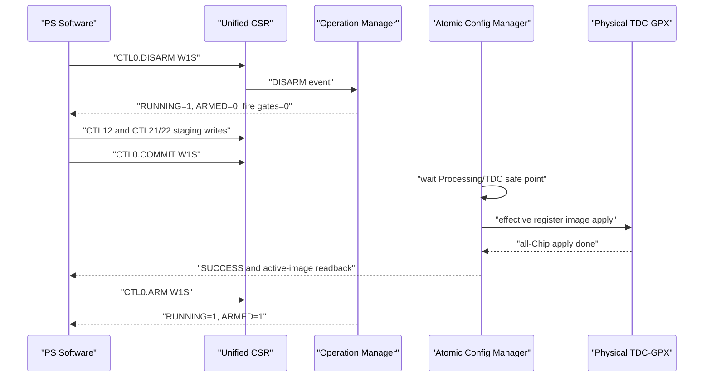

# V2 Runtime GPX 재설정 및 Shot 시간 계약 검증

## 1. 목적

이 문서는 다음 두 운용 질문을 하나의 RTL 계약으로 닫는다.

1. LiDAR가 RUN 중일 때 물리 레이저 발사를 안전하게 끄고 TDC-GPX
   레지스터를 다시 설정할 수 있는가?
2. 모터 속도와 요청 광학각이 정한 Shot 후보 시점까지 필요한 처리가 끝나지
   않았을 때 잘못된 각도에서 늦게 발사하지 않는가?

## 2. 확정된 설정 소유권

| 물리 의미 | RTL/CSR 이름 | 소유 형태 | 적용 규칙 |
|---|---|---|---|
| 요청 목표 왕복시간 | `CTL12.TARGET_RANGE` | Runtime source | 5 ns 단위, software가 쓰는 유일한 원본 |
| GPX 기준 Timer | `Reg7.MTimer[27:15]` | Derived | `ceil(TARGET_RANGE/5)`, 40 MHz/25 ns 단위 |
| 실효 목표 왕복시간 | `effective_target_range_5ns` | Derived | `Reg7.MTimer * 5`, Laser와 GPX가 함께 사용 |
| GPX board capture 보정 | `CTL19.TDC_CAPTURE_ADJUST` | Runtime calibration | 실효 왕복시간에 signed 5 ns 단위로 더함 |
| 요청 광학 Shot 간격 | `CTL15.SHOT_INTERVAL` | Runtime source | 후보점 각도 격자의 유일한 원본 |

`CTL22.GPX_IMAGE_DATA`로 Reg7을 쓸 때 MTimer 이외의 bit는 보존한다.
MTimer는 CTL12에서 자동 파생해 덮어쓰므로 동일한 시간을 두 CSR에 따로
입력하는 오류가 없다. `VIEW_ACTIVE=1` readback은 실제 적용된 MTimer를 담는다.

기본값은 다음과 같다.

```text
요청 TARGET_RANGE       = 288 x 5 ns = 1,440 ns
Reg7.MTimer             = ceil(288 / 5) = 58
실효 목표 왕복시간      = 58 x 25 ns = 1,450 ns
```

13-bit MTimer의 최대값은 8,191이다. 따라서 요청 목표 왕복시간 최대값은
40,955개의 5 ns tick, 즉 204.775 us이며 초과 COMMIT은 `0x33`으로 거부된다.

## 3. RUN 중 안전한 GPX 재설정



`DISARM`은 RUN과 Encoder/Face 위치 추적을 유지하면서 scheduler,
`fire_pulse`, simulation Shot 허가를 모두 닫는다. COMMIT도 설정 전환 중
scheduler를 일시 차단하지만, 물리 레이저 안전 절차는 DISARM을 먼저 사용한다.

## 4. 요청 광학각 후보점의 hard deadline

Shot 후보점은 모터 위치가 요청 광학간격에 도달한 바로 그 위치다. 후보점에서
다음 조건을 모두 만족할 때만 Shot request를 발행한다.

```text
laser_executor_ready
  = 이전 fire_done/T0 처리 완료
  + 실효 목표 왕복시간 완료
  + stop_tdc 및 2 Processing-clock re-arm 완료

gpx_acquisition_ready
  = 활성 GPX Lane의 이전 Shot Drain/merge 완료
  + Shot CDC 수용 가능
  + 누적된 후단 backpressure가 수용 한계를 막지 않음
```

어느 하나라도 준비되지 않으면 해당 column을 Hole로 남기고
`schedule_overrun`을 기록한다. 준비될 때까지 기다린 뒤 다른 각도에서 늦게
발사하지 않는다.

Cell 조립, AXIS 및 DDR 전송은 처리량을 확보하기 위한 파이프라인이므로 매 Shot
전에 전체가 idle일 필요는 없다. 다만 평균 처리량이 부족해 backpressure가
GPX 획득 경계까지 전파되면 `gpx_acquisition_ready=0`이 되어 같은 hard
deadline 정책으로 오류가 검출된다.

이 검사는 물리 모터 속도, 실제 fire_done 응답 및 외부 AXIS backpressure가
Runtime에 변할 수 있으므로 COMMIT 시의 정적 시간 합산보다 후보점의 실제
ready 상태가 정확하다.

## 5. Software 관측 위치

| 목적 | 위치 |
|---|---|
| 레이저 OFF 확인 | `STAT3.ARMED[17]=0`, `SCHEDULER_ENABLE[21]=0`, `PHYSICAL_FIRE_ENABLE[22]=0`, `SIMULATION_ENABLE[23]=0` |
| GPX COMMIT 완료 | `STAT2.BUSY[0]=0`, `DONE_STICKY[1]=1`, `SUCCESS_STICKY[2]=1`, `ERROR_STICKY[3]=0` |
| 실제 Reg7 확인 | `CTL21.VIEW_ACTIVE=1`, index 7 선택 후 CTL22 읽기 |
| 후보점 시간 부족 | 진단 index `0x10`의 bit 5 `schedule_overrun` |
| 누적 누락 후보점 | 진단 index `0x13`의 32-bit count |
| 시간 계약 오류 IRQ | IRQ source 5 `PROCESSING_WARNING` (기존 ABI 이름 유지) |

IRQ source 이름은 하위 호환성을 위해 `PROCESSING_WARNING`으로 유지한다. 그러나
`schedule_overrun=1`은 요청 광학각 후보점 안에 레이저 수명주기와 GPX 획득 준비가
끝나지 못한 **Shot 시간 계약 오류**다. 소프트웨어는 이를 단순 안내 경고로
무시하지 않고 운용 속도, 요청 광학간격 또는 목표 왕복시간을 재조정해야 한다.

## 6. 검증 결과

| 회귀 | 범위 | 결과 |
|---|---|---|
| Config package | MTimer 올림, 기본값, 최대/초과, capture 보정 | PASS |
| Operation | RUN/STOP/ARM/DISARM, permit, reset authority | PASS |
| Shot scheduler P26 | GPX busy 후보점 skip, no late retry, overrun count | PASS |
| GPX acquisition | 실제 coordinator ready CDC, 두 비동기 클럭 조합 | PASS, Critical CDC 0 |
| Unified CSR | `RUN -> ARM -> DISARM -> GPX COMMIT -> ARM` | PASS |
| K0-5 Top | Processing부터 물리 GPX B5-B8/AXIS 연결 | PASS |
| K0-10 IP package | source/XGUI/doc 동기화와 3개 package OOC profile | PASS |

주요 구현 결과:

- GPX acquisition `proc=150/TDC=200 MHz`: WNS `+0.305 ns`
- GPX acquisition `proc=200/TDC=150 MHz`: WNS `+0.510 ns`, WHS `+0.078 ns`
- Unified CSR 최종 구현: WNS `+0.379 ns`, WHS `+0.097 ns`

RTL 및 패키지 단계 계약은 닫혔다. 실제 PCB의 fire_done 분포, GPX reference
clock 오차 및 장기 AXIS/VDMA backpressure에 대한 최종 운용 한계는 보드에서
`PROC_OVERRUN_COUNT`와 물리 계측을 함께 기록해 확정해야 한다.
