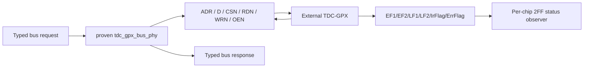

# Stage 5 H0 GPX Bus and Acquisition Oracle

## 1. 범위

이 문서는 Stage 5 / Checkpoint H가 보존해야 할 v1 B5 계약을 동결한다.
범위는 외부 TDC-GPX bus transaction, IFIFO1/2 drain 순서, 28-bit I-Mode
word와 chip/IFIFO identity까지다. 17-bit Hit decode는 Stage 6 / B6이며 이
단계에서 재해석하지 않는다.

첫 구현 원칙은 명확하다. `tdc_gpx_bus_phy`의 pin timing FSM과
`tdc_gpx_chip_run`의 정상 drain 알고리즘을 동시에 다시 쓰지 않는다. H1은
물리 FSM에 typed record 경계만 추가하고 pin/cycle equivalence를 증명한다.

## 2. Frozen v1 Sources

| Source | SHA-256 |
|---|---|
| `tdc_gpx_bus_phy.vhd` | `ACEED5665F70C3284A22E2739457ABF10FF4B3898334F311B44CD14AF67E6240` |
| `tdc_gpx_chip_run.vhd` | `19798BCB5DE069DE468891F9DF5D6A4F0AC79B0AE0CCE368D8F41128F2720C04` |
| `tdc_gpx_chip_ctrl.vhd` | `5772F8EF07059E3A007ECE2370CE1C3F30D8E0F369EADA373AF1340A11924A3A` |
| `tdc_gpx_config_ctrl.vhd` | `B239C049946400DC1604243332293A00A9A10FE2A707804E96C22D7BB318D7A2` |
| `tdc_gpx_pkg.vhd` | `B9E8C10ABF3404B962ED03588E7607D47C7512C8676402FA2CA9503C291ECACE` |
| `tdc_gpx_cfg_pkg.vhd` | `3B9AC1CE5A77795E1FFFF2B9A595C148C5135B5444378C5FE69C373CFFA91124` |

Generated IP-repository copies are not oracle sources.

## 3. Physical Bus Ownership

각 chip은 독립적인 28-bit bidirectional D bus와 ADR/CSN/RDN/WRN/OEN을 가진다.



물리 FSM이 단독으로 소유하는 항목은 다음과 같다.

- request 한 번만 accept하는 held-valid/rearm 규칙;
- read/write address와 data snapshot;
- write data drive와 read Hi-Z;
- WRITE-to-READ, READ-to-WRITE turnaround;
- RDN/WRN low/high phase와 read IOB capture;
- response valid hold under backpressure;
- dynamic OEN 또는 pull-up/not-connected OEN 정책.

H1 wrapper는 이 신호의 cycle 또는 pin 값을 변경하면 안 된다.

## 4. Bus Request and Response Contract

### 4.1 Request

| Field | Width | 의미 |
|---|---:|---|
| `valid` | 1 | 연속 high 구간은 non-burst request 하나 |
| `write` | 1 | 0=READ, 1=WRITE |
| `address` | 4 | GPX register 0..15 |
| `write_data` | 28 | WRITE data |
| `oen_permanent` | 1 | drain 동안 dynamic OEN 유지 요청 |
| `burst` | 1 | IFIFO back-to-back READ 지속 조건 |

non-burst requester는 response가 수락된 뒤 `valid`를 적어도 한 TDC clock low로
내려 다음 request를 rearm한다. Burst 종료는 live `burst=0`으로 요청한다.

### 4.2 Response

| Field | Width | 의미 |
|---|---:|---|
| `valid` | 1 | response available; ready 전까지 payload 안정 |
| `write_ack` | 1 | 0=READ response, 1=WRITE acknowledge |
| `address` | 4 | request 때 snapshot한 address |
| `read_data` | 28 | READ data; WRITE ack에서는 0 |

v1 AXIS 내부 표현의 `TKEEP=1111`, TDATA `[27:0]`, TUSER `[4:0]`은 wrapper
밖으로 새로 노출하지 않고 위 record로 한 번만 해석한다.

## 5. Read Timing Contract

TDC clock period를 `Tclk`, divider를 `DIV`, transaction ticks를 `TICKS`라 하면
read data capture는 RDN low 이후 다음 TDC clock 수를 사용한다.

```text
capture_clocks = (TICKS - 3) * DIV + 1
capture_time   = capture_clocks * Tclk
```

현재 board-safe 최소 capture window는 25 ns다. FSM은 요청값이 작으면
`fn_bus_min_ticks_for_capture()`로 4..7 범위에서 자동 clamp한다. 예를 들어
200 MHz에서는 DIV=1/TICKS=7 또는 DIV=2/TICKS=5가 25 ns 기준을 만족한다.

v2 CSR `BUS_TICKS` field는 6 bit지만 물리 FSM input은 3 bit다. H0에서 발견한
이 폭 차이는 상위 bit 절단으로 처리하지 않는다. Commit validator가
`BUS_TICKS=1..7`, `BUS_CLK_DIV=1..63`만 승인하고, 물리 FSM의 최소치 clamp는
마지막 안전망으로 그대로 유지한다.

## 6. Status Pin Semantics

| Pin | 동기화 후 의미 | 정상 drain 권한 |
|---|---|---|
| EF1/EF2 | 1이면 해당 IFIFO empty | 최종 정상 empty 판정 권한 |
| LF1/LF2 | 1이면 configured Fill 이상 loaded | burst 기회 판단만 수행 |
| IrFlag | configured measurement timer 완료 | capture에서 drain으로 전환 |
| ErrFlag | chip error summary | 진단/recovery 입력 |

Echo pulse count는 IFIFO occupancy가 아니며 EF를 대신할 수 없다. LF도 empty를
증명하지 않으므로 drain 완료 권한이 없다.

## 7. Acquisition Ordering

정상 Shot의 per-chip 순서는 다음과 같다.

1. `ST_ARMED`에서 `shot_start`를 받으면 capture/range window를 연다.
2. synchronized IrFlag rising edge까지 STOP capture를 유지한다.
3. Reg6 Fill, EF/LF를 snapshot하고 IFIFO1을 먼저 평가한다.
4. IFIFO1 data는 GPX Reg8, IFIFO2 data는 Reg9에서 읽는다.
5. LF/Fill이 허용하면 bounded burst, 아니면 single EF read를 사용한다.
6. IFIFO1이 완료되면 intermediate control beat를 보낸다.
7. IFIFO2까지 완료되면 final drain-done control beat를 보낸다.
8. ALU trigger/recovery 후 다음 Shot을 arm한다.

Output cap은 software/format capacity 경계이지 physical empty 증거가 아니다.
cap에 도달했는데 EF가 empty가 아니면 남은 physical FIFO를 purge하고 faulted
drain-done을 보낸다.

## 8. B5 Raw Word Contract

외부 I-Mode word는 28 bit 그대로 보존한다.

```text
27          26 25                         18 17 16               0
+--------------+-----------------------------+--+------------------+
|   ChaCode    |          StartNum           |Sl|      Hit         |
+--------------+-----------------------------+--+------------------+
```

| Field | Width | B5 판정 |
|---|---:|---|
| ChaCode | 2 | bit-exact 보존 |
| StartNum | 8 | bit-exact 보존; 현재 single-shot profile은 0 기대 |
| Slope | 1 | bit-exact 보존 |
| Hit | 17 | bit-exact 보존; 거리 해석은 B6 |

B5 identity는 `chip_index`, `ififo_id`, `raw_28`, `shot identity`, control/data
구분이다. 동일 IFIFO 안의 word 순서를 바꾸지 않으며 IFIFO1 completion이
IFIFO2 final completion보다 먼저 나타난다.

## 9. Timeout and Backpressure Contract

- bus response는 consumer ready가 low여도 payload를 안정적으로 유지한다.
- raw-path backpressure는 bounded FIFO credit 안에서 bus drain을 늦출 수 있다.
- `i_bus_rsp_pending`은 response가 PHY/skid에 도달했음을 뜻하며 같은 READ를
  재발행하지 않게 한다.
- range+drain watchdog, pending-stuck watchdog, drain-cap fault는 서로 다른
  원인으로 관측한다.
- final drain-done handshake와 내부 drain completion은 다른 시점이다.

## 10. H0 Evidence and Exit

Vivado 2025.2.1에서 `tb_tdc_gpx_bus_phy_c01_contract`를 현재 oracle source로
재실행해 PASS했다. 확인 항목은 illegal timing clamp, 25 ns burst initiation,
두 OEN mode, registered response-pending 및 burst backpressure 무손실이다.

H0 exit 후 H1은 다음만 허용한다.

1. `lidar_gpx_pkg` typed records 추가;
2. `lidar_gpx_bus_engine`에서 proven PHY를 그대로 instantiate;
3. direct v1 PHY와 pin/response lockstep 비교;
4. `BUS_TICKS > 7` commit rejection 검증.

Chip drain FSM migration과 TDC-to-Processing CDC는 H1 equivalence가 통과한 뒤
H2에서 진행한다.
