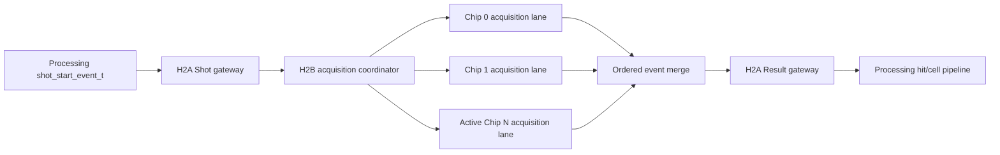

# Stage 5 H2B GPX Acquisition Plan

## 1. 목적

H2B는 검증된 v1 GPX 수집 알고리즘을 새로 작성하지 않고, v2의 typed
Shot/Result 계약 사이에 배치하는 단계다. 변경 범위는 설정 변환, Shot 문맥
보존, raw event 변환 및 다중 Chip 조정으로 제한한다.



각 acquisition lane 내부는 다음의 검증된 구현을 재사용한다.

- `tdc_gpx_chip_ctrl`: 초기화, Run/Shot 명령, raw FIFO 및 진단
- `tdc_gpx_chip_run`: IFIFO1 -> IFIFO2 drain 순서, timeout 및 purge
- `lidar_gpx_bus_engine`: H1에서 v1 PHY와 cycle/pin 동등성이 확인된 wrapper

## 2. 단계별 작업

### H2B-0: 폭과 단위 계약 고정

v2의 capture-window 계산 결과는 32 bit지만, 검증된 GPX drain watchdog은
16 bit다. 따라서 `capture_window_tdc_clks`가 65,535를 넘으면 값을 자르지
않고 COMMIT을 `CFG_RUNTIME_CAPTURE_WINDOW`로 거부한다.

이 검사는 설정 적용 경로에서만 순차 multiplier를 사용하므로 200 MHz Shot
처리 경로에 산술 연산을 추가하지 않는다.

### H2B-1: 단일 Chip typed acquisition lane

1. v2 active configuration과 16-word GPX register image를 v1 controller 입력으로
   변환한다.
2. 해당 Chip의 rising/falling STOP 역할과 build-time STOP 수를 Reg2/Reg3에
   반영한다.
3. Shot이 승인될 때 Shot context와 Chip-local sequence를 원자적으로 보존한다.
4. v1 raw stream을 `DATA`, `IFIFO1_DONE`, `DRAIN_DONE`, `TIMEOUT` event로
   변환한다.
5. output backpressure 동안 event의 모든 field를 안정적으로 유지한다.

### H2B-2A: 다중 Chip coordinator

1. runtime active Chip mask에 포함된 lane에만 Shot을 전달한다.
2. 한 Shot은 활성 lane 전체가 수락할 수 있을 때만 원자적으로 승인한다.
3. Chip identity를 잃지 않고 결과를 deterministic order로 merge한다.
4. 모든 활성 lane의 terminal event가 확인되어야 다음 Shot을 받을 수 있다.
5. 비활성 Chip의 pin 출력과 event는 정지 상태를 유지한다.

H2B-2A는 완료되었다. 상세 결과는
`V2_CHECKPOINT_H2B2A_GPX_COORDINATOR.md`에 기록한다.

### H2B-2B: GPX image portal과 activation 완료

1. 16-entry GPX register image는 16개 CSR word를 직접 점유하지 않고 indexed
   command/data 두 word로 접근한다.
2. 준비된 image snapshot은 한 configuration transaction의 일부로 고정한다.
3. 같은 image를 build-time present Chip 전체에 적용한다.
4. TDC-domain ACTIVATE ACK는 모든 물리 Chip의 programming 완료 후에만
   configuration manager로 반환한다.
5. programming timeout과 lane fault를 configuration 실패 진단으로 전달한다.

### H3: B5 비교와 종료 조건

다음 identity를 v1 oracle과 exact compare한다.

```text
Shot context + Chip + IFIFO + raw 28-bit word + event kind + sequence
```

정상 drain뿐 아니라 IFIFO status 변화, timeout, Hit cap, output backpressure 및
150/200 MHz와 200/150 MHz 비동기 조합을 포함한다.

## 3. H2B-0 검증 결과

| 항목 | 150 MHz | 200 MHz |
|---|---:|---:|
| 기능 회귀 | PASS | PASS |
| 65,535 clocks 경계 | ACCEPT | ACCEPT |
| 65,536 clocks | REJECT | REJECT |
| 구현 후 WNS | +1.152 ns | +0.124 ns |
| Latch | 0 | 0 |

증적:

- `signoff_results/sessions/260805_stage5_h2b_capture_width_r2_pkg_v2_config_pkg`
- `signoff_results/sessions/260805_stage5_h2b_capture_width_r2_calc_v2_commit_calculator`

## 4. Echo 비회귀 계약

H2B는 Echo frontend의 build option과 compact simulation delay를 변경하지
않는다.

| 설정 | 의미 |
|---|---|
| `enable_echo_receiver=false` | Echo receiver와 synthetic STOP 생성 경로를 합성에서 제거 |
| `enable_echo_receiver=true`, `enable_echo_simulation=false` | physical LVDS-to-STOP만 사용 |
| `enable_echo_receiver=true`, `enable_echo_simulation=true` | physical 경로와 synthetic test source 사용 |
| receiver false, simulation true | build validation에서 거부 |

32채널 simulation 지연은 채널별 CSR table을 만들지 않고 두 값만 사용한다.

```text
channel_delay[0] = CHANNEL_0_DELAY
channel_delay[n] = CHANNEL_0_DELAY + n * CHANNEL_STEP, n = 1..31
```

현재 unified CSR의 CTL20 한 word가 두 값을 소유한다. H2B/H3에서 채널별
delay register를 추가하지 않는다.

H2B-2B의 GPX image portal은 CTL20을 변경하거나 Echo delay word를 재사용하지
않는다.

## 5. 구현 금지 사항

- `tdc_gpx_chip_run`의 drain 순서 또는 PHY timing FSM을 같은 단계에서 재작성
- 32-bit capture-window를 16 bit로 묵시적 truncate
- Echo rising/falling count를 GPX IFIFO occupancy로 해석
- `max_hits_per_stop`과 GPX raw drain cap을 같은 설정으로 간주
- 활성 Chip별 GPX register image를 서로 다른 Shot 경계에서 적용
- 32채널 개별 delay CSR 추가
