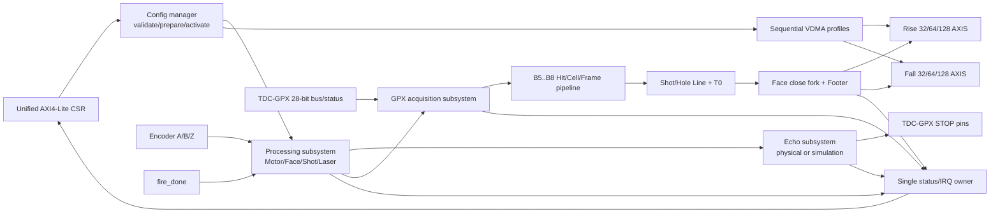
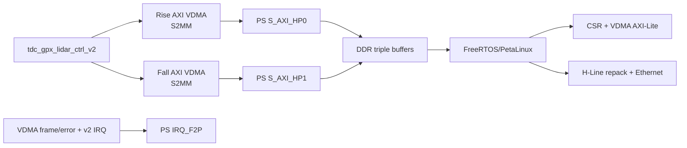

# V2 Stage 8 K0 통합 Top 계획 및 Parent 준비도 감사

## 1. 결론

J10 다음에 바로 parent 보드 검증으로 이동하면 안 된다. 현재 v2에는 검증된
subsystem과 formatter가 존재하지만, 이들을 하나의 합성용 entity로 조립한 v2
top이 아직 없다. 현재 parent의 활성 Block Design은 v1 IP를 사용하고 VDMA도
없으므로, 지금 보드를 실행하면 v2가 아닌 v1의 `TREADY=1` 종단만 검증하게 된다.

올바른 순서는 다음과 같다.

```text
J10 완료
  -> K0: 합성 가능한 v2 top 조립
  -> K1: 전체 RTL/HTML 운용 행렬 비교
  -> L0: parent VDMA/HP/cache/Ethernet 및 실제 보드 Sign-off
```

## 2. 2026-08-07 Parent 읽기 전용 감사 결과

감사 대상:

`C:/Projects/my_sp/ALINX/Logic/project_4`

활성 설계:

- part: `xc7z020clg484-2`;
- synthesis top: `design_1_lidar_ctrl_wrapper`;
- Block Design: `design_1_lidar_ctrl.bd`;
- 통합 IP: `victek.co.kr:my_ip:tdc_gpx_lidar_ctrl:1.0`.

확인 결과:

| 항목 | 현재 상태 | 판정 |
|---|---|---|
| v2 합성 top | 없음 | K0 선행 필요 |
| Parent IP | v1 VLNV `1.0` | v2 보드 증거로 사용 불가 |
| AXI VDMA | 없음 | DDR 캡처 불가 |
| PS `S_AXI_HP0..3` | 모두 `0`, 비활성 | PL-to-DDR 경로 없음 |
| Rise/Fall AXIS | Data consumer 없음 | 출력 데이터 저장 불가 |
| Rise/Fall `TREADY` | `axis_ready_c` 상수에 연결 | 데이터가 버려져도 upstream은 진행 |
| VDMA frame IRQ | 없음 | DMA 완료/오류 소유권 전환 불가 |
| PS application | v2 decoder를 실행하는 app 없음 | cache 및 Ethernet 실측 불가 |

Parent 저장소에는 이 작업과 무관한 수정이 존재하므로 이번 감사에서는 어떤
파일도 변경하지 않았다. K0/K1이 끝난 뒤 L0 전용 branch와 새 BD 이름으로
작업해야 한다.

## 3. K0 목표 Top

새 entity의 권장 이름은 `tdc_gpx_lidar_ctrl_v2_top`이다. v1 entity와 VLNV를
덮어쓰지 않는다.



### 3.1 K0-1 단일 소유권 표

다음 표는 통합 top에서 허용되는 생성자와 소비자를 고정한다. `tdc_gpx_lidar_ctrl_v2_top`
자체는 이 신호들의 상태를 새로 만들지 않고, flattening과 구조 연결만 담당한다.

| 계약 | 단일 생성자 | 소비자 | Domain / 전달 규칙 |
|---|---|---|---|
| Build Config | top의 scalar generic으로 만든 `C_BUILD_CONFIG` | 모든 v2 subsystem | 합성 시 불변, CDC 대상 아님 |
| CSR Shadow와 Commit | `lidar_csr_bank` | `lidar_config_manager` | CSR |
| Candidate/Active Config version | `lidar_config_manager` | Processing/TDC config gateway | coherent bundled-data mailbox |
| Processing Active Config | Processing `lidar_config_gateway` | Processing, Echo, B5-B8, VDMA profile owner | Processing, 한 version만 사용 |
| TDC Active Config | TDC `lidar_config_gateway` | GPX acquisition | TDC, register image 적용 ACK 후 enable |
| RUN/ARM/permit state | `lidar_operation_manager` | Processing scheduler/laser 및 GPX run gate | Processing |
| Position/Face/Shot request | `lidar_processing_subsystem` 내부 B0/B1/B2 | B3 laser executor | Processing, registered event |
| `fire_pulse`, `start_tdc`, `stop_tdc` | `laser_executor` | 외부 Laser/GPX와 B5 gateway | 저지연 물리 START 경로는 변경 금지 |
| Physical/synthetic STOP | `lidar_echo_subsystem` | 외부 GPX STOP pin | Echo build enable에 따른 generate |
| GPX register image | CSR image transaction + TDC activation | GPX acquisition | TDC apply ready/done/fault ACK |
| Raw 28-bit GPX event | `lidar_gpx_acquisition_subsystem` | B6 Hit decoder | TDC-to-Processing named gateway |
| Hit/Cell/Frame Cell | B6/B7/B8 | Rise/Fall lane serializer | Processing ready/valid |
| Processing Face close | `lidar_face_close_owner` | B5-B8 ordered-close owner | 모든 accepted Shot 완료 전 진행 금지 |
| B8 Frame close | `lidar_gpx_frame_lane_assembler` | registered Rise/Fall close fork | 두 활성 lane이 각각 수락해야 완료 |
| VDMA Pending/Active profile | 신규 `lidar_gpx_vdma_profile_transaction` | lane formatter와 외부 VDMA programmer | Processing, config activation과 동일 transaction |
| Rise/Fall AXIS | 각 lane의 유일한 AXIS packer | 외부 S2MM VDMA | 독립 backpressure, lane 간 ready 공유 금지 |
| Diagnostics와 IRQ cause | 신규 통합 status owner | unified CSR bank | 각 domain snapshot 후 CSR에서 단일 조립 |

### 3.2 Face 종료와 backpressure 순서

Face 종료는 다음 한 방향으로만 이동한다.

```text
face_tracker
  -> lidar_face_close_owner
  -> lidar_gpx_b5_b8_subsystem order owner
  -> B8 gpx_frame_close_event_t
  -> registered Rise/Fall fork
  -> lane별 Hole expander
  -> lane별 Footer
  -> lane별 AXIS packer frame_done
```

비활성 lane은 fork에서 즉시 완료한 것으로 취급한다. 활성 lane의 `TREADY` 정지는
해당 lane의 Footer 완료와 Face-close ACK를 지연시키며, 다른 lane의 payload를
삭제하거나 대신 수락하지 않는다. Processing의 다음 Face는 두 활성 lane의 종료가
확정되기 전 시작하지 않는다.

### 3.3 K0-1에서 확인된 구현 공백

기존 subsystem을 단순히 top에서 배선하는 것만으로는 다음 세 계약이 닫히지 않는다.

1. **VDMA profile activation owner**: 현재 Processing config gateway는 Activate를
   즉시 ACK한다. HSIZE/VSIZE/STRIDE programming ACK까지 같은 atomic transaction에
   포함하도록 Processing gateway의 deferred Activate 경계를 열어야 한다.
2. **CSR command CDC**: `CLEAR_STATUS`와 `SOFT_RESET`은 CSR-domain 1-cycle pulse다.
   이를 Processing/TDC에 직접 연결하지 않고, 수신 확인과 overflow 진단이 있는
   named command gateway로 전달해야 한다.
3. **통합 status owner**: 현재 32 STAT는 config/active readback에 사용된다. 실시간
   Processing/Echo/GPX/Formatter fault를 임의로 OR하여 빈 bit에 넣지 않고, status
   snapshot과 원인 우선순위를 정의한 뒤 CSR map version을 올려야 한다.

따라서 K0-2 shell 이후 구현 순서는 `profile transaction -> command CDC -> status
owner`를 먼저 닫고 기능 subsystem을 연결하는 것으로 고정한다. 이 공백을 top의
조합 pulse나 상수 ACK로 우회하지 않는다.

## 4. Top 외부 계약

### 4.1 Clock과 reset

| Domain | 외부 clock | 주요 소유 블록 |
|---|---|---|
| CSR | `s_axi_csr_aclk` | CSR bank와 command ingress |
| Processing/AXIS | `proc_aclk` | Motor, Face, Laser, Cell/Frame, AXIS |
| TDC bus | `i_tdc_clk` | 물리 GPX bus와 acquisition lane |

각 reset은 해당 domain에서 동기 해제한다. CDC는 기존에 검증된 named gateway만
사용한다. K0 top에서 임의의 toggle synchronizer를 추가하지 않는다.

### 4.2 Build generic

합성 전에 결정할 값만 generic으로 유지한다.

- 출력 AXIS 폭 `32/64/128`;
- 최대 4 Chip의 present/rise/fall-capable mask;
- Chip당 최대 STOP 수와 물리 Return capacity 7;
- Echo frontend 합성 enable;
- mirror Face 수 `1..5`;
- Processing/TDC clock 명목 주파수와 허용 조합.

Runtime 활성 Chip, Falling enable, STOP 수, visible Return, Face window, Shot
간격과 거리 시간은 unified CSR의 Active Config에서 공급한다.

### 4.3 출력

Rise/Fall은 독립 AXI4-Stream master이다. Falling build 또는 runtime lane이
비활성일 때는 해당 stream을 조용한 idle로 유지하되, v2 top entity의 고정 포트
계약은 유지한다. IP-XACT에서 build option에 따라 Block Design 표시를 숨길 수
있지만 RTL entity 포트 자체를 generic으로 변경하지 않는다.

VDMA profile은 lane별로 다음 값을 제공하고 ACK를 받아야 한다.

- active HSIZE;
- active VSIZE;
- fixed maximum STRIDE;
- profile request/version;
- VDMA programmed ACK;
- Face buffer ownership ID.

ACK 전에는 다음 Face를 시작하지 않는다.

## 5. K0 단계별 구현 순서

각 단계는 독립 회귀와 커밋 후 다음 단계로 이동한다.

| 순서 | 작업 | 통과 조건 |
|---:|---|---|
| K0-1 | top port, generic, record ownership 표 작성 | **완료**: 모든 신호 owner/consumer와 미구현 경계가 확정 |
| K0-2 | 빈 top shell과 package compile order 생성 | **완료**: production compile order와 150/200, 200/150 MHz elaboration PASS |
| K0-3 | 원자적 unified CSR/config/VDMA profile과 command CDC 연결 | **완료**: 80개 production 소스, 양 lane ACK barrier, active version/IRQ exact compare PASS |
| K0-4 | Processing + Echo 연결 | **완료**: 물리/시뮬레이션 2 clock profile 기능·구현 PASS, fire/start/stop 상호배타 및 Echo 활성화 장벽 검증 |
| K0-5 | GPX acquisition + B5..B8 연결 | **완료**: physical GPX pin/config/RUN, raw28/Hit17, 16 APD, Return7 identity와 CDC/구현 PASS |
| K0-6 | Shot/Hole/T0 + Footer + width packer 연결 | **완료**: 2 clock profile x 3 폭 Top 기능, DDR/HTML 모든 Word, PS/Ethernet 모든 byte PASS |
| K0-7 | Rise/Fall lane 및 VDMA profile ACK 연결 | **완료**: dedicated 2R/2F, one-Chip dual-edge, four-Chip all-dual 및 독립 Footer stall PASS |
| K0-8 | status/IRQ 단일 owner 조립 | U/X 없는 exact nonzero/zero status 검사 |
| K0-9 | 합성/구현 | black box 0, latch 0, blocking DRC 0, WNS >= +0.1 ns |
| K0-10 | 새 VLNV package | `tdc_gpx_lidar_ctrl_v2:2.0`, v1과 병존 |

K0의 functional/implementation 회귀 profile은 사용자 정책대로 Processing/TDC
`150/200 MHz`와 `200/150 MHz` 두 조합만 사용한다. 이전의 SYNC/극단 비동기
전용 감사 결과는 CDC 구조 근거로 보존하되 이후 통합 회귀 매트릭스에는 반복해서
추가하지 않는다.

## 6. K1 전체 RTL/HTML 정렬

K0 top이 만든 실제 metric과 캡처만 HTML에 넣는다. HTML이 독립 상수로 PASS를
만들면 안 된다.

필수 sweep:

- AXIS 폭 32/64/128;
- Return 1..7;
- STOP 1..8;
- Rise-only, dedicated 2-Rise/2-Fall, one-Chip dual-edge, four-Chip all-dual;
- Face 수 1..5;
- Processing/TDC clock 관계;
- RPM, 수평 광학 분해능, 목표거리;
- Hole, timeout, abort, VDMA profile ACK 지연과 output backpressure.

판정은 Shot 예산, TDC drain, AXIS/DDR byte, Face rest, PS repack과 Ethernet
payload를 시간순으로 분리한다. 계산값과 실측값을 같은 열에 두되 출처를 명시한다.

## 7. L0 Parent 구조

K0/K1 이후에만 parent를 수정한다. 권장 구조는 기존 BD를 덮어쓰지 않는
`design_1_lidar_ctrl_v2`이다.



최대 dual-slope 동시 운용은 S2MM channel 두 개가 필요하므로 VDMA 두 개를
권장한다. Zynq-7000 HP port는 64-bit이므로 128-bit stream build는 width
conversion과 실제 throughput을 별도로 확인한다. Rise/Fall buffer는 최소
triple buffering으로 DMA-owned, ready-for-CPU, CPU-owned 상태를 분리한다.

## 8. L0 보드 Sign-off 항목

1. laser-disabled simulation frame을 DDR에 기록한다.
2. VDMA frame-done 후 완료 buffer 범위만 cache invalidate한다.
3. J10 C decoder로 H-Line packet을 만들고 Golden과 byte compare한다.
4. buffer를 DMA에 release한 뒤 다음 frame에서 stale data가 없는지 확인한다.
5. VDMA error, delayed CPU, Ethernet stall과 ring wrap을 주입한다.
6. FreeRTOS/PetaLinux 각각의 cache API 경로를 분리 기록한다.
7. 실제 Ethernet 수신 capture의 packet ID, Hole, Return, byte 수를 비교한다.
8. PS 처리시간과 Ethernet 전송시간의 worst case를 HTML margin에 실측값으로 넣는다.
9. 마지막에만 physical laser와 TDC-GPX 측정을 활성화한다.

## 9. 현재 Gate 판정

- J10: 완료.
- K0-1: 완료. 단일 소유권 표와 구현 공백을 확정했다.
- K0-2: 완료. public Top 셸, production compile order와 두 routine clock profile을 닫았다.
- K0-3: 완료. Rise/Fall VDMA ACK가 모두 끝난 뒤에만 Active version을 공개하며,
  `CLEAR_STATUS`/`SOFT_RESET`은 acknowledged CDC로 두 목적지에 전달된다.
- K0-4: 완료. Processing/Echo 및 설정 활성화 장벽을 통합했다.
- K0-5: 완료. GPX 물리 bus/config/RUN과 B5-B8 Hit/Cell/Frame-lane 경로를 통합했다.
- K0-6/K0-7: 완료. Rise/Fall AXIS 출력, Footer 완료, 32/64/128-bit 구현과
  DDR/HTML 및 PS/Ethernet L1 비교를 닫았다.
- K0-8 이후: 미구현, 다음 작업.
- K1: K0 이후.
- L0: 현재 parent에 VDMA/HP/software가 없어 실행 불가.

따라서 현재는 데이터 경로 L1 Sign-off까지 완료됐지만 통합 IP 또는 전체 시스템
release Sign-off는 아니다. 다음 코드는 parent BD 수정이 아니라
`tdc_gpx_lidar_ctrl_v2_top`의 모든 live/sticky status와 IRQ를 단일 owner 아래에
조립하는 K0-8이다.
