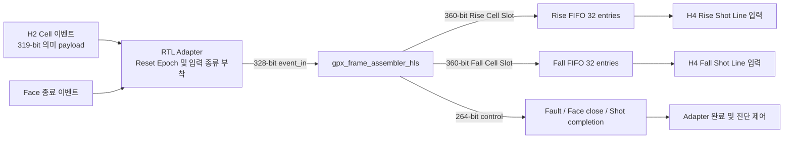

# V3 H3 GPX Cell-to-Frame 체크포인트 결과

> 현재 ABI 3.2의 전체 H0~H4 Header, Bit Map과 재검증 수치는
> [`V3_H0_H4_HEADER_CONTRACT_KO.md`](V3_H0_H4_HEADER_CONTRACT_KO.md)를 기준으로 한다.
> 이 문서의 수치는 H3 최초 체크포인트 이력으로 유지한다.

## 1. 판정

**H3 기능 및 단독 구현 PASS**다. V3 HLS `gpx_frame_assembler_hls`와 RTL
Adapter는 H2 Cell을 Shot 단위로 수집한 뒤, Rise/Fall Lane별 논리 Chip 및 STOP
오름차순으로 정렬한다. 다음 계약을 확인했다.

- 1~4 Chip, Chip당 1~8 STOP 구성
- 전용 Rise/Fall Chip, 한 Chip 양 Edge, Fall 비활성, 네 Chip 전체 양 Edge
- Runtime 직렬화(전시) Return 슬롯 수 1~7이 섞인 Cell payload의 무손실 전달
- 누락 Cell의 blank Cell 대체와 Line fault 전파
- Shot column gap, Face trailing gap, all-hole Face 계산
- Rise/Fall 독립 Backpressure와 외부 소비 완료 기준 `shot_done`
- Abort 중 보류 출력 제거와 Reset Epoch 변경 뒤 주소 재사용
- 150 MHz와 200 MHz Processing clock의 실제 OOC 배치·배선

이 판정은 **Cell-to-Frame 경계**만 닫는다. H4의 PACKED17 Word, Shot Line
Metadata, Face Footer, 32/64-bit AXI4-Stream Beat와 VDMA 계약은 아직
Sign-off하지 않는다.

## 2. 용어와 역할

| 용어 | H3에서의 정확한 의미 |
|---|---|
| Shot | 레이저 발사 후보점 하나에 속한 모든 활성 Chip/STOP/slope Cell 묶음 |
| Lane | Rise 또는 Fall Cell을 독립적으로 운반하는 논리 출력 경로 |
| Cell | Shot 하나 x Chip 하나 x STOP 하나 x slope 하나 |
| Cell Slot | 한 Lane 안에서 Cell이 차지하는 정렬 순번. VDMA Line 수가 아님 |
| Shot Line | 한 Shot의 한 slope에 속한 모든 Cell Slot 묶음. H4가 Word로 직렬화함 |
| Face | 같은 다면 미러 면에 속한 Shot column의 집합 |

Lane별 Cell Slot 수는 다음 식으로 고정된다.

```text
Rise Cell Slot 수 = popcount(Rise 활성 Chip mask) x STOP/Chip
Fall Cell Slot 수 = popcount(Fall 활성 Chip mask) x STOP/Chip
```

한 Chip에서 Rise/Fall이 모두 활성인 경우 같은 Chip/STOP이 각 Lane에 한 번씩
존재한다. 최대 구성은 Rise 32 Slot과 Fall 32 Slot이며, 두 값은 서로 독립이다.

## 3. 데이터 흐름



H2 Cell 도착 순서는 정렬 순서일 필요가 없다. H3는 Cell을
`Chip x STOP x slope` 주소에 저장하고, 활성 Chip의 오름차순과 STOP의
오름차순으로 다시 출력한다.

```text
예: Rise mask=0101, STOP/Chip=3

입력 가능 순서 : Chip2/STOP2, Chip0/STOP1, Chip2/STOP0, ...
Rise 출력 Slot : C0S0, C0S1, C0S2, C2S0, C2S1, C2S2
Slot index     :   0,    1,    2,    3,    4,    5
```

## 4. 고정 Bit 계약

`hls/common/include/lidar_v3_hls_contract.hpp`는 전체 계약의 진입점이고, H3의
실제 Bit 위치는 `lidar_v3_h3_frame_contract.hpp`가 소유한다. VHDL Adapter는
`pkg/lidar_v3_hls_contract_pkg.vhd`의 같은 값 상수를 사용한다.

### 4.1 HLS 입력 328 bit

| Bit | Cell 입력일 때 | Face 종료 입력일 때 |
|---|---|---|
| `[318:0]` | H2 Cell payload | `[68:0]`만 Face 종료 identity로 사용 |
| `[319]` | `0`: Cell | `1`: Face 종료 |
| `[327:320]` | Reset Epoch | Reset Epoch |

Face 종료 identity `[68:0]`은 다음과 같다.

| Bit | 의미 |
|---|---|
| `[31:0]` | Face Frame ID |
| `[34:32]` | Face index |
| `[35]` | 방향: `0=CW`, `1=CCW` |
| `[36]` | Simulation source |
| `[52:37]` | Active configuration version |
| `[68:53]` | Face당 예정 Shot column 수 |

### 4.2 Lane 출력 360 bit

| Bit | 의미 |
|---|---|
| `[318:0]` | H2 Cell payload 전체 |
| `[324:319]` | Lane 내부 Cell Slot index |
| `[330:325]` | 해당 Lane의 전체 Cell Slot 수 |
| `[331]` | Shot Line의 첫 Cell Slot |
| `[332]` | Shot Line의 마지막 Cell Slot |
| `[333]` | Face의 첫 Shot column |
| `[334]` | Face의 마지막 Shot column |
| `[350:335]` | 이 Shot 앞에서 누락된 Shot column 수. 첫 Slot에만 유효 |
| `[351]` | 누락 Cell을 대신 만든 blank Cell |
| `[352]` | 이 Shot Line에 오류 또는 blank가 있음 |
| `[359:353]` | 예약, 항상 0 |

`slot_blank=1`인 Cell은 Hit 수가 0이고 `error_fill=1`, `faulted=1`이다.
정렬 위치를 없애지 않고 빈 Cell로 유지하므로 PS/Viewer의 채널 위치가 밀리지
않는다.

### 4.3 Control 출력 264 bit

승인된 입력 이벤트 하나마다 Control 결과 하나가 반드시 나온다.

| Bit | 의미 |
|---|---|
| `[7:0]` | H3 오류 pulse bitmap |
| `[8]` | Face 종료 결과 포함 |
| `[95:9]` | 87-bit Face 종료 결과 |
| `[96]` | HLS가 한 Shot의 Lane Cell 생성을 완료함 |
| `[258:97]` | 완료 Shot의 162-bit context |
| `[263:259]` | 예약, 항상 0 |

Face 종료 결과는 입력 identity 69 bit에 다음 세 필드를 추가한다.

| Bit | 의미 |
|---|---|
| `[84:69]` | 마지막 정상 Shot 뒤의 trailing gap 수 |
| `[85]` | 해당 Face에 Shot이 하나도 없었음 |
| `[86]` | Face identity/version/geometry 불일치 |

### 4.4 H3 오류 bitmap

| Bit | 이름 | 의미 |
|---:|---|---|
| 0 | `context_mismatch` | 열린 Shot 도중 Shot identity 또는 Active 설정이 변경됨 |
| 1 | `unexpected_cell` | 비활성 Chip 또는 범위 밖 Chip/STOP Cell |
| 2 | `duplicate_cell` | 같은 Shot/Chip/STOP/slope Cell이 두 번 도착함 |
| 3 | `duplicate_terminal` | 같은 Chip의 Drain/Timeout 종료가 두 번 도착함 |
| 4 | `missing_cell` | Shot 종료 시 필요한 Cell이 도착하지 않음 |
| 5 | `geometry_error` | Face/column/version/last-column 계약 불일치 |
| 6 | `column_gap` | Face 안에서 누락 Shot column이 있음 |
| 7 | `masked_payload_drop` | 비활성 slope로 Hit가 든 Cell이 들어옴 |

Adapter는 pulse와 sticky를 모두 제공한다. `i_clear_sticky=1`은 sticky만 지우며,
같은 Clock에 새 오류가 들어오면 새 오류가 다시 기록된다.

## 5. Shot 완료와 Backpressure 계약

HLS의 Control bit 96은 **계산 완료**다. 외부 `o_shot_done`은 다음 조건까지
만족한 뒤에만 한 Clock pulse로 발생한다.

```text
필요한 Rise Lane의 line_end가 valid/ready로 소비됨
AND
필요한 Fall Lane의 line_end가 valid/ready로 소비됨
```

따라서 Fall 소비자가 정지해도 Rise FIFO는 독립적으로 수용하고 출력한다.
`shot_done`만 두 Lane의 실제 소비 완료를 기다린다. Fall 비활성 구성에서는 Rise
Line 완료만 필요하다.

Rise/Fall FIFO는 각각 `360 bit x 32 entries`다. 32는 최대
`4 Chip x 8 STOP`의 한 slope Shot 전체를 저장할 수 있는 깊이다. 입력/출력
Skid register를 명시하여 Backpressure 동안 payload가 바뀌지 않게 한다.

## 6. Abort와 Reset Epoch

Abort 상승 Edge마다 Adapter의 8-bit Reset Epoch가 증가한다. Abort 중에는 다음
순서로 복구한다.

1. Rise/Fall FIFO를 Flush한다.
2. 진행 중 HLS 호출과 보류 Control을 외부에 노출하지 않고 Drain한다.
3. 열린 Shot, Lane 완료 대기와 Face close 보류 상태를 지운다.
4. 다음 입력이 새 Reset Epoch를 HLS에 전달한다.
5. HLS는 이전 Shot과 Face history를 지운 뒤 새 입력을 처리한다.

`ap_done`과 다음 입력 handshake가 같은 Clock에 겹칠 수 있으므로 Adapter는 완료
상태를 먼저 지우고 새 입력 상태를 나중에 세트한다. 이 순서로 새 호출의
in-flight 정보가 소실되지 않는다.

## 7. 검증 행렬

| Profile | Chip | STOP/Chip | Rise mask | Fall mask | Rise/Fall Slot |
|---|---:|---:|---:|---:|---:|
| dedicated | 4 | 8 | `0011` | `1100` | 16 / 16 |
| one_chip_dual | 1 | 8 | `0001` | `0001` | 8 / 8 |
| fall_off | 3 | 6 | `0111` | `0000` | 18 / 0 |
| reduced_faults | 3 | 6 | `0011` | `0100` | 12 / 6 |
| all_dual | 4 | 8 | `1111` | `1111` | 32 / 32 |

### 7.1 HLS CSim 및 C/RTL Co-simulation

다섯 Profile 모두 CSim과 생성 Verilog Co-simulation을 통과했다.

- 역순으로 도착하는 Cell의 canonical 정렬
- 누락 Cell blank-fill
- Cell/terminal 중복과 비활성 slope payload
- Shot column gap, trailing gap, all-hole Face
- Reset Epoch 변경 뒤 같은 저장 주소 재사용
- 예약 Bit 0 유지

### 7.2 V2/HLS 차등 회귀

다섯 Profile을 150 MHz와 200 MHz에서 실행한 총 10개 시나리오가 PASS했다.
Runtime 직렬화(전시) Return 슬롯 수 1~7이 Cell마다 섞인 payload 전체를 비교했다.

- Rise/Fall Cell record와 출력 순서 완전 비교
- Rise/Fall 독립 Backpressure 중 payload 고정
- Shot/Face 완료 context와 gap 정보
- 여덟 오류 각각의 양성 주입과 pulse/sticky 완전 비교
- 출력이 보류된 상태의 Abort와 주소 재사용

Pipeline latency 차이는 허용하지만, 관측 가능한 이벤트 값과 순서는 모두 같아야
한다.

### 7.3 H1/H2 소급 무회귀

공통 HLS 계약 헤더 변경 뒤 H1과 H2를 전체 재생성했다.

| 단계 | 전체 HLS | V2 차등 | 150 MHz WNS | 200 MHz WNS |
|---|---|---|---:|---:|
| H1 Raw28-to-Hit17 | PASS | 8개 PASS | `+1.952 ns` | `+0.768 ns` |
| H2 Hit-to-Cell | PASS | 8개 PASS | `+0.342 ns` | `+0.172 ns` |

두 단계 모두 래치 0개, 차단 DRC 0건이다.

## 8. 성능 및 구현 결과

### 8.1 HLS 합성

| 항목 | 결과 |
|---|---:|
| 내부 HLS 스케줄 목표 | 4.000 ns |
| HLS 추정 Clock | 4.456 ns |
| 함수 latency | 6~67 clocks |
| 다음 호출 interval | 7~68 clocks |
| Cell 방출 Loop | II=1, 최대 41 clocks |
| HLS 추정 LUT / FF | 4,964 / 6,000 |
| BRAM / DSP | 0 / 0 |

외부 제품 Processing clock은 150 또는 200 MHz다. 내부 HLS 목표를 250 MHz로
설정한 이유는 7-series에서 넓은 Frame Cell 상태의 배선 여유를 확보하기
위해서다. HLS 추정치만으로 통과 판정하지 않고 아래 실제 배치·배선을 사용한다.

### 8.2 xc7z020clg484-2 OOC 배치·배선

| Processing clock | WNS | Latch | 차단 DRC |
|---:|---:|---:|---:|
| 150 MHz | `+0.331 ns` | 0 | 0 |
| 200 MHz | `+0.160 ns` | 0 | 0 |

200 MHz 최대 구성의 Adapter 전체는 5,592 LUT, 10,656 FF, BRAM 0, DSP 0이다.
HLS 본체는 3,676 LUT와 7,364 FF이며, 두 360-bit Lane FIFO가 각각 약 616 LUT와
1,422~1,424 FF를 사용한다.

200 MHz 최악 경로는 Fall AXIS register slice 내부의 1-LUT 경로다. Data path
4.631 ns 중 배선이 4.043 ns(87.3%)다. WNS는 양수지만 여유가 작으므로 H5 통합
배치에서 재검증해야 하며, 이 OOC 수치를 V3 전체 Timing Sign-off로 사용하지
않는다.

## 9. 타이밍 개선 이력

초기 200 MHz 구현은 `WNS -1.385 ns`였다.

1. 162-bit Shot context 직접 비교가 21단 CARRY4 경로가 되어 32-bit XOR 청크
   비교로 바꿨다. 모든 162 bit의 정확 비교 계약은 유지했다.
2. 세 곳의 조건부 Control AXIS 쓰기를 이벤트당 한 번의 단일 출력 지점으로
   합쳐 264-bit 출력 CE의 고팬아웃 MUX를 제거했다.
3. HLS 내부 스케줄 목표를 4 ns로 강화하여 상태 갱신을 더 짧은 단계로 나눴다.

최종 200 MHz 결과는 `WNS +0.160 ns`다.

### 9.1 최종 재현 결과 위치

```text
HLS C/RTL CoSim reports:
  .work/v3_hls_frame_assembler_component/reports/profiles/

V2/HLS 150/200 MHz 차등 회귀:
  .work/v3_gpx_frame_assembler_diff/260810_h3_faultcov_final/

현재 생성 HLS RTL의 150/200 MHz OOC 구현:
  .work/v3_gpx_frame_assembler_impl/260810_h3_faultcov_final_impl/
```

이 경로는 재현 증거용 로컬 산출물이며 Git 추적 대상이 아니다. 추적되는 원본은
HLS 소스, RTL Adapter, 테스트벤치, 실행 스크립트와 이 결과 문서다.

## 10. 남은 제한과 H4 인계

- H3 Slot은 VDMA HSIZE/VSIZE나 DDR Line이 아니다.
- H3는 PACKED17, Shot Line Metadata, Face Footer를 만들지 않는다.
- H3 전체 함수는 가변 출력 때문에 호출 II=1이 아니다. H5에서 상위 FIFO 최대
  점유율과 실제 Shot 처리 여유를 측정해야 한다.
- OOC Harness에는 Parent 배치 혼잡과 외부 I/O delay가 없다.
- H4는 H3의 Rise/Fall `gpx_frame_cell_event_t`와 Face close 이벤트를 입력으로
  받아 canonical 32-bit Word를 만들고, V2 Word Golden과 정확 비교해야 한다.
- 최종 32/64-bit Beat 결합은 RTL packer가 담당하며 H4/H5에서 각각 기능과
  통합 처리율을 검증한다.
