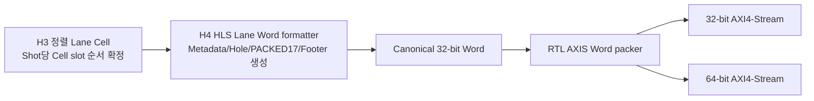

# V3 H4 GPX Lane-to-Word 체크포인트 결과

## 1. 판정

V3 H4 `gpx_lane_word_formatter_hls` 컴포넌트와 RTL Adapter는 **체크포인트
PASS**다. H3에서 정렬된 Rise/Fall Cell을 다음 DDR 계약으로 변환하는 기능이 V2와
최종 AXI4-Stream Beat 단위까지 일치했다.

- Shot Line Metadata: 4 Word, 16 byte
- PACKED17 Cell: `ceil(Runtime 직렬화 Return 슬롯 수/2)` Hit Word와 Cell Metadata
- Hole Shot Line: 계획된 HSIZE 전체를 0/Metadata로 명시적으로 생성
- Face Footer: 8 Word, 32 byte
- 최종 출력 폭: 합성 시 32-bit 또는 64-bit

이 판정은 H4와 최종 RTL AXIS Word packer 경계를 닫는다. H5 혼합 Top, VDMA,
Parent 프로젝트, PS cache 동기화와 Ethernet 결과 전체 Sign-off는 아니다.

## 2. H4의 역할



H4가 데이터의 의미와 Line/Frame 경계를 소유한다. 최종 RTL AXIS Word packer는
32-bit Word를 합성 시 선택한 32/64-bit Beat로만 묶으며 PACKED17의 의미를 바꾸지
않는다.

## 3. Return 수의 세 계약

| 구분 | 범위 | 결정 시점 | H4에서의 사용 |
|---|---:|---|---|
| 합성 물리 최대 Return 수 | 7 | 합성 전 | 배열과 검증 상한 |
| Runtime 직렬화 Return 슬롯 수 | 1~7 | COMMIT 후 Face 경계 | Cell마다 확보할 PACKED17 슬롯 수 |
| 실제 유효 Return 수 | 0~Runtime 슬롯 수 | Shot 측정 결과 | valid bitmap과 실제 Hit 데이터 수 |

Runtime 직렬화 Return 슬롯 수보다 더 많은 물리 Hit도 외부 TDC-GPX EF 완료까지
Drain한다. 이 초과분은 의도적인 전시 필터이므로 fault가 아니다. 합성 물리 최대를
넘는 8번째 이상 Return만 `return_overflow`다.

Cell Metadata의 `timeout_cause`는 TDC-GPX IFIFO Drain timeout이다. V2 Shot
Metadata/Footer에 예약된 레이저 Shot timeout/abort Bit는 H3에 원인 Event가 없어
현재 항상 0이며, 서로 다른 물리 원인을 임의로 연결하지 않는다.

## 4. Geometry 계산 계약

```text
Cell당 Word 수
  = ceil(Runtime 직렬화 Return 슬롯 수 / 2) + 1 Metadata Word

Shot 원본 Word 수
  = 4 Shot Metadata Word
  + Shot당 Cell 슬롯 수 × Cell당 Word 수

HSIZE Word 수
  = 32-bit 출력: Shot 원본 Word 수
  = 64-bit 출력: Shot 원본 Word 수를 짝수 Word로 올림 정렬

HSIZE byte = HSIZE Word 수 × 4
Footer Line 수 = ceil(8 Footer Word / HSIZE Word 수), 결과 범위 1~2
VSIZE Line 수 = 계획 Shot Line 수 + Footer Line 수
```

Profile은 상위 RTL이 COMMIT 후 Face 안전 경계에서 한 번 계산하고 등록한다. H4는
Streaming 중 가변 나눗셈을 하지 않고 Profile의 상호 일관성을 검사한다.

## 5. 구현 파일

| 파일 | 역할 |
|---|---|
| `hls/common/include/lidar_v3_h4_word_contract.hpp` | H4 입력/Profile/출력/제어 Bit ABI 소유 |
| `hls/gpx_lane_word_formatter/src/gpx_lane_word_formatter_hls.cpp` | Metadata, PACKED17, Hole, Footer 알고리즘 |
| `rtl/bridges/lidar_gpx_lane_word_formatter_hls_adapter.vhd` | V2 record와 H4 packed ABI 변환, abort/reset epoch |
| V2 `lidar_gpx_axis_word_packer.vhd` | Canonical Word를 32/64-bit AXI4-Stream Beat로 조립 |
| `tb/tb_lidar_gpx_lane_word_formatter_hls_diff.vhd` | V2 전체 Lane pipeline과 최종 Beat 직접 비교 |
| `tb/lidar_gpx_lane_word_formatter_hls_impl.vhd` | Rise/Fall 동시 OOC 배치·배선 래퍼 |

전체 Bit 위치는 `V3_H0_H4_HEADER_CONTRACT_KO.md`가 단일 기준 문서다.

## 6. HLS 검증

### 6.1 CSim 및 C/RTL CoSim

| Profile | 핵심 조건 | 결과 |
|---|---|---|
| `return_sweep` | Runtime 직렬화 Return 슬롯 1~7, Hit[16], 홀수 슬롯 마지막 절반 0 | PASS |
| `multi_cell` | 여러 Cell slot의 Word index와 Line 종료 | PASS |
| `holes_footer_32` | leading/interior/trailing Hole, 32-bit Footer | PASS |
| `all_hole_footer_64` | 전체 Face 누락, 64-bit 정렬, Footer commit | PASS |
| `reset_faults` | reset epoch, 7개 Formatter fault의 exact bitmap, fault Bit 7 예약 0, TDC Drain timeout과 V2 Shot timeout/abort Bit 비혼용 | PASS |

각 Profile은 CSim과 생성 RTL CoSim을 모두 통과했다.

### 6.2 C synthesis

| 항목 | 결과 |
|---|---:|
| 목표 clock | 5.000 ns, 200 MHz |
| HLS 추정 지연 | 4.387 ns, 약 227.9 MHz |
| BRAM/DSP/URAM | 0/0/0 |
| HLS 추정 FF/LUT | 7,070 / 4,373 |
| Word 방출 내부 loop | II=1 |

가변 divider와 DSP multiplier는 제거했다. Cell Word 수 계산은 shift/add, 출력 폭
정렬은 32/64-bit 두 분기로 고정한다.

## 7. V2 직접 비교

비교 기준은 V2의 다음 전체 경로다.

```text
Cell serializer
 -> Shot Metadata builder
 -> Hole Line expander
 -> Face Footer builder
 -> AXIS Word packer
```

V3 H4 경로도 같은 최종 AXI4-Stream의 `TDATA`, `TKEEP`, `TSTRB`, `TUSER(SOF)`,
`TLAST`를 Beat 단위로 비교했다. 두 경로의 내부 latency 차이는 허용하고, 양쪽
Beat가 모두 준비된 시점에만 비교한다.

| Processing clock | 출력 폭 | Cell 슬롯 | Runtime 직렬화(전시) Return 슬롯 | Lane | 결과 |
|---:|---:|---:|---:|---|---|
| 150 MHz | 32 | 1 | 1 | Rise | PASS |
| 200 MHz | 32 | 32 | 7 | Rise | PASS |
| 150 MHz | 64 | 16 | 3 | Fall | PASS |
| 200 MHz | 64 | 32 | 7 | Rise | PASS |

각 Profile은 다음 조건도 함께 포함한다.

- 실제 유효 Return 수가 Runtime 직렬화 슬롯 수보다 작은 Cell
- leading/interior/trailing Hole과 전체 Face Hole
- Cell fault, Hit[16], Footer commit
- AXI backpressure 동안 payload와 경계 안정
- Line 중간 abort 뒤 reset epoch 변경과 stale Word 제거

## 8. xc7z020 배치·배선

4개 TDC-GPX 칩, 칩당 8 STOP, 최대 7 Return, Rise/Fall 두 H4 경로와 두 최종
AXIS Word packer를 동시에 넣은 OOC Top을 `xc7z020clg484-2`에 배치·배선했다.

| Processing clock | 출력 폭 | WNS | Latch | Blocking DRC | 결과 |
|---:|---:|---:|---:|---:|---|
| 150 MHz | 32-bit | +0.215 ns | 0 | 0 | PASS |
| 200 MHz | 32-bit | +0.114 ns | 0 | 0 | PASS |
| 150 MHz | 64-bit | +0.130 ns | 0 | 0 | PASS |
| 200 MHz | 64-bit | +0.166 ns | 0 | 0 | PASS |

200 MHz/64-bit OOC Top의 배치 후 사용량은 LUT 3,811, FF 8,543, BRAM 0,
DSP 0이다. 이 수치는 Rise/Fall 두 경로와 두 AXIS packer를 포함한다.

200 MHz 최악 경로는 HLS 입력 register slice 내부의 1 LUT 경로다. 지연 중 배선
비중은 32-bit에서 약 88.6%, 64-bit에서 약 89.7%다. 논리 깊이는 낮지만 WNS가
`+0.114 ns`까지 작으므로 Parent 전체 배치·배선에서는 혼잡과 물리 배치를 다시
확인해야 한다. OOC 양수 WNS를 Parent Sign-off로 확대 해석하지 않는다.

최종 결과의 실행 식별자는 다음과 같다.

| 검증 | 최종 결과 위치 |
|---|---|
| H4 V2 직접 비교 | `.work/v3_gpx_lane_word_formatter_diff/260810191631` |
| H4 OOC 배치·배선 | `.work/v3_gpx_lane_word_formatter_impl/260810185802` |

HLS CSim/C synthesis/C/RTL CoSim은
`.work/v3_hls_lane_word_formatter_component` 아래의 최신 생성 RTL과 보고서를
사용했다. 위 `.work/` 결과는 재현 가능한 로컬 산출물이므로 Git에는 넣지 않는다.

## 9. 재현 명령

```powershell
# H4 CSim, C synthesis, 다섯 Profile C/RTL CoSim
./system_integration/v3/scripts/run_v3_hls_lane_word_formatter.ps1 -Step all

# V2 전체 Lane pipeline과 최종 Beat 직접 비교
./system_integration/v3/scripts/run_v3_gpx_lane_word_formatter_diff.ps1 `
    -SkipHlsSynthesis

# Rise/Fall 동시 32/64-bit, 150/200 MHz OOC 배치·배선
./system_integration/v3/scripts/run_v3_gpx_lane_word_formatter_impl.ps1 `
    -SkipHlsSynthesis
```

검증 결과는 `.work/`에 생성하며 Git에는 넣지 않는다.

## 10. 남은 작업

1. H5 혼합 Top에서 H1~H4와 유지 RTL을 연결한다.
2. Face 경계 Runtime Profile 적용, abort, Reset, Rise/Fall 독립 backpressure를
   통합 검증한다.
3. VDMA와 연결한 DDR Word Golden 및 PS decoder 결과를 비교한다.
4. Parent 전체에서 150/200 MHz 타이밍, CDC, DRC를 다시 Sign-off한다.
