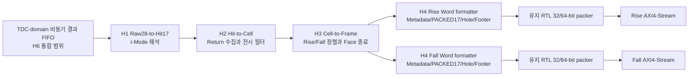

# V3 H5 혼합 RTL/HLS 데이터 Top 체크포인트 결과

## 1. 판정

V3 H5 `lidar_gpx_hls_mixed_data_top`은 **체크포인트 PASS**다. TDC-domain
비동기 결과 FIFO 이후의 TDC-GPX I-Mode Raw 28-bit 사건부터 Rise/Fall
AXI4-Stream 출력까지 H1~H4 HLS와 유지 RTL packer를 하나의 Processing-domain
경로로 연결했고, V2 Golden과 최종 Beat 단위로 일치했다.

이 판정은 H5 데이터 처리 경계만 닫는다. TDC-GPX 물리 버스와 IFIFO Drain,
상위 비동기 FIFO 점유율, AXI4-Lite CSR/COMMIT/IRQ, VDMA/DDR, PS cache 및
Ethernet, Parent 프로젝트와 보드 동작 전체 Sign-off는 아니다.

## 2. H5 경계와 데이터 흐름



| 단계 | 입력 | 출력 | 소유하는 의미 |
|---|---|---|---|
| H1 | TDC-GPX I-Mode Raw 28-bit 사건 | Hit17 사건 | 하위 17-bit 거리 Hit, Chip/STOP/slope와 제어 사건 |
| H2 | Hit17 사건 | Cell 사건 | 한 STOP 채널의 Return, 실제 유효 Return 수, Runtime 직렬화 Return 슬롯 필터, 오류 분류 |
| H3 | Cell 및 Face-close 사건 | 정렬된 Rise/Fall Cell과 Frame-close | Shot 내 Cell slot 순서, 누락 Shot, Rise/Fall 독립 흐름 |
| H4 | 정렬 Cell과 Frame-close | canonical 32-bit Word | Shot Metadata, PACKED17 Cell, Hole Line, Face Footer |
| 유지 RTL | canonical 32-bit Word | 32/64-bit AXI Beat | 합성 시 선택한 폭으로 결합, `TKEEP/TSTRB/TUSER/TLAST` 생성 |

H5는 동일 Processing clock에서만 동작한다. CDC, XPM async FIFO, Reset
synchronizer와 TDC-GPX 물리 I/O는 H5 안에 넣지 않는다.

## 3. 유지한 운용 계약

1. 외부 TDC-GPX I-Mode word는 28 bit이며 하위 17 bit가 거리 Hit다.
2. 물리 IFIFO는 Runtime 직렬화(전시) Return 슬롯 수와 무관하게 EF 완료까지
   Drain한다. H5 입력은 이 Drain 결과 FIFO의 출력이다.
3. Runtime 직렬화 Return 슬롯 수 1~7을 넘는 물리 Hit는 의도적인 전시
   필터이며 fault가 아니다. 8번째 이상의 물리 Return만 `return_overflow`다.
4. 최대 4개 Chip 모두가 Rising/Falling 양 Edge를 처리하는 구성과
   Rise 2 Chip/Fall 2 Chip 전용 구성을 모두 보존한다.
5. H4 출력 의미는 AXI 폭과 무관한 canonical 32-bit Word다. 최종 출력 폭은
   합성 시 32 또는 64 bit로 고정하며 V3에서 128 bit는 지원하지 않는다.
6. Face 완료는 활성화된 Rise/Fall lane의 마지막 Face Footer Beat가 각각
   `TREADY`로 승인된 뒤에만 보고한다.
7. H5는 레이저 실행 경로를 변경하지 않는다. 물리 `fire_done` 승인으로 만드는
   측정 시작 기준시점 (T0)은 H5 입력 Metadata에 이미 확정되어 들어온다.

## 4. 구현 구조와 타이밍 보완

### 4.1 통합 유휴 상태

H1은 승인된 Raw 사건 수와 HLS 결과 수의 차이를 8-bit inflight counter로
관리한다. Hit으로 방출되지 않는 제어 사건도 HLS 처리가 끝나기 전에는 idle로
판정하지 않는다. H2~H4도 HLS 호출, 입력 skid, 출력 보류, abort stale-output
Drain이 모두 끝난 경우에만 idle을 보고한다.

H5의 `o_idle`은 H1~H4, Rise/Fall Word formatter, Face-close fork와 최종 RTL
packer가 모두 idle일 때만 1이다.

### 4.2 Stage 사이 등록 경계

초기 H5 구현에서는 H3 출력에서 H4 입력까지의 넓은 payload와 abort 복구
`ready`가 긴 배선 경로를 만들었다. 다음 경계에 2-slot registered skid를 넣었다.

- H1 Hit 출력 -> H2 HLS 입력
- H2 Cell/Face-close 출력 -> H3 HLS 입력
- H3 Rise/Fall 정렬 출력 -> 각 H4 HLS 입력

skid는 처리율 1 Event/clock을 유지하고 abort 시 보류 payload도 함께 폐기한다.
H2~H4의 입력 허용 창은 register로 관리하여 `flush_active`가 상위 Stage의
`ready`까지 한 Cycle 조합 경로로 역전파되지 않게 했다. stale-output Drain 종료
후 입력은 한 Cycle 뒤 다시 열린다.

### 4.3 자원 변화

첫 H5 통합 구현과 최종 200 MHz OOC 결과를 비교하면 다음과 같다.

| 출력 폭 | 구현 | LUT | FF | LUTRAM | BRAM/DSP |
|---:|---|---:|---:|---:|---:|
| 32-bit | 등록 경계 전 | 10,543 | 19,964 | 950 | 0/0 |
| 32-bit | 최종 | 11,185 | 22,460 | 950 | 0/0 |
| 64-bit | 등록 경계 전 | 10,603 | 20,164 | 950 | 0/0 |
| 64-bit | 최종 | 11,248 | 22,658 | 950 | 0/0 |

64-bit 기준으로 LUT 645개와 FF 2,494개가 증가했다. 이는 넓은 H2/H3/H4
계약을 두 슬롯씩 등록한 비용이다. xc7z020 Parent에서 다른 IP와 함께 배치할 때
자원과 혼잡을 다시 확인해야 한다.

## 5. V2 Golden 직접 비교

동일한 Raw 28-bit 사건을 V2 전체 데이터 경로와 V3 H5에 동시에 입력하고 최종
Rise/Fall AXI4-Stream의 `TDATA`, `TKEEP`, `TSTRB`, `TUSER(0)=SOF`, `TLAST`를
Beat 단위로 비교했다. 두 경로의 latency 차이는 허용하고, 먼저 도착한 경로를
정지시킨 뒤 양쪽 Beat가 준비됐을 때만 동시에 승인했다.

| Processing clock | 출력 폭 | Chip slope 구성 | Runtime 직렬화 Return 슬롯 | 결과 |
|---:|---:|---|---:|---|
| 150 MHz | 32-bit | Rise 2/Fall 2 전용 | 1 | PASS |
| 200 MHz | 64-bit | Rise 2/Fall 2 전용 | 3 | PASS |
| 150 MHz | 32-bit | 4 Chip 모두 양 Edge | 7 | PASS |
| 200 MHz | 64-bit | 4 Chip 모두 양 Edge | 7 | PASS |
| 200 MHz | 32-bit | 4 Chip Rising, Falling 합성 제거 | 7 | PASS |

모든 Profile에서 물리 Return 사건은 7개까지 입력했다. 다음 조건도 함께
검증했다.

- Rise/Fall 출력에 서로 다른 주기의 backpressure 적용
- backpressure 동안 AXI payload와 종료 경계 안정
- 실제 유효 Return 수와 Runtime 직렬화 Return 슬롯 수의 차이
- Shot Metadata, PACKED17 Hit[16], Cell Metadata, Hole과 Face Footer
- 완성되지 않은 Shot 중간 abort, stale 데이터 제거, 다음 Face 정상 복구
- H1 inflight 최대값 4와 통합 idle 복귀

단위 및 통합 회귀 결과 위치는 다음과 같다.

| 검증 | 최종 결과 위치 |
|---|---|
| H1 V2 차등 | `.work/v3_gpx_hit_decoder_diff/260811002828` |
| H2 V2 차등 | `.work/v3_gpx_cell_collector_diff/260810235907` |
| H3 V2 차등 | `.work/v3_gpx_frame_assembler_diff/260811000137` |
| H4 V2 차등 | `.work/v3_gpx_lane_word_formatter_diff/260811000251` |
| H5 V2 종단 차등 | `.work/v3_hls_mixed_top_diff/260811003453` |

## 6. xc7z020 배치·배선

4 Chip, Chip당 8 STOP, 물리 최대 7 Return, Rise/Fall 두 경로를 동시에 넣은
OOC Top을 `xc7z020clg484-2`에 배치·배선했다.

| Processing clock | 출력 폭 | WNS | WHS | Latch | Blocking DRC | Routing 오류 net | 결과 |
|---:|---:|---:|---:|---:|---:|---:|---|
| 150 MHz | 32-bit | +0.080 ns | +0.006 ns | 0 | 0 | 0 | PASS |
| 200 MHz | 32-bit | +0.044 ns | +0.003 ns | 0 | 0 | 0 | PASS |
| 150 MHz | 64-bit | +0.094 ns | +0.033 ns | 0 | 0 | 0 | PASS |
| 200 MHz | 64-bit | +0.025 ns | +0.034 ns | 0 | 0 | 0 | PASS |

최종 구현 결과는 `.work/v3_hls_mixed_top_impl/260811000658`이다.

200 MHz/32-bit 최악 setup 경로는 H3 Rise FIFO 출력에서 H4 Rise 입력 skid까지며
3 LUT, data path 4.587 ns, 배선 비중 약 81.0%다. 200 MHz/64-bit 최악 경로는
H2 HLS 출력 register slice 내부의 enable 경로이며 5 LUT, data path 4.668 ns,
배선 비중 약 77.5%다. 이전의 H2 `flush_active`에서 H1 입력 `ready`로 이어지던
역방향 최악 경로는 제거됐다.

모든 수치는 양수지만 최소 setup 여유는 +0.025 ns, 최소 hold 여유는 +0.003 ns로
작다. 따라서 H5 OOC timing은 통과했으나 충분한 물리 여유가 확보됐다고 확대
해석하지 않는다. Parent 배치·배선에서는 혼잡, clock tree, 실제 I/O와 다른 IP를
포함해 다시 Sign-off해야 한다.

## 7. 재현 명령

```powershell
# H1 idle/inflight 계측 포함 단위 차등
./system_integration/v3/scripts/run_v3_gpx_hit_decoder_diff.ps1 `
    -SkipHlsSynthesis

# H2/H3/H4 Stage 회귀
./system_integration/v3/scripts/run_v3_gpx_cell_collector_diff.ps1 `
    -SkipHlsSynthesis
./system_integration/v3/scripts/run_v3_gpx_frame_assembler_diff.ps1 `
    -SkipHlsSynthesis
./system_integration/v3/scripts/run_v3_gpx_lane_word_formatter_diff.ps1 `
    -SkipHlsSynthesis

# H1~H4와 유지 RTL packer의 V2 종단 차등
./system_integration/v3/scripts/run_v3_hls_mixed_top_diff.ps1 `
    -SkipHlsSynthesis

# 150/200 MHz x 32/64-bit OOC 합성·배치·배선
./system_integration/v3/scripts/run_v3_hls_mixed_top_impl.ps1 `
    -SkipHlsSynthesis
```

## 8. H6로 넘기는 항목

1. TDC-domain 비동기 결과 FIFO를 H5 앞에 연결하고 최대 점유율과 Shot 처리
   여유를 실측한다. H5는 FIFO 뒤에서 시작하므로 이 수치를 자체 측정할 수 없다.
2. TDC-GPX 버스 PHY/IFIFO Drain과 H5 사이 CDC를 4:1, 1:4 및 1:1 clock
   조합에서 다시 검증한다.
3. AXI4-Lite CSR, Shadow/Active, COMMIT, IRQ와 Runtime Profile의 Face 안전
   경계 적용을 통합한다.
4. VDMA HSIZE/VSIZE/STRIDE와 DDR Golden Word를 비교하고 PS cache 동기화 후
   H-Line/Ethernet 결과를 확인한다.
5. 4 Chip Parent 전체의 150/200 MHz timing, CDC, DRC, bitstream을 확인한다.
6. 물리 `fire_done` 승인부터 측정 시작 기준시점 (T0), 레이저·모터·Echo
   LVDS 경로와 보드 동작은 별도 Sign-off한다.
