# V3 H6-B2 Runtime VDMA·DDR·PS 체크포인트

## 1. 판정

V3 H6-B2의 **보드 독립 검증 범위는 PASS**다. 다음 계약을 실제 V3 HLS 생성 RTL과
통합 Top으로 확인했다.

- Runtime 직렬화(전시) Return 수를 `7 -> 3 -> 7`로 바꿀 때 VDMA 적용 승인을
  받기 전에는 Active 설정과 출력 geometry가 바뀌지 않는다.
- 외부 TDC-GPX IFIFO는 Runtime 직렬화(전시) Return 수와 무관하게 물리 7 Return을
  `EF1/EF2` empty까지 모두 Drain한다.
- 32-bit와 64-bit AXI4-Stream 결과를 DDR 주소별 32-bit Word로 비교했을 때 기존
  V2 및 실행형 HTML Golden과 일치한다.
- Zynq-7000 Cortex-A9용 PS 참조 디코더가 컴파일되고, DDR 영상에서 Face Header와
  H-Line Ethernet payload를 Golden과 바이트 단위로 동일하게 만든다.
- DMA 소유 버퍼 접근, 캐시 동기화 완료 전 CPU 소유권 전환, DMA 반환 뒤 재접근을
  참조 소프트웨어가 거부한다.

실제 AXI VDMA Register 쓰기, 물리 DDR DMA, FreeRTOS/PetaLinux 캐시 API 호출 및
Ethernet 송신은 보드가 있어야 검증할 수 있으므로 H6-B4 보드 증거로 남긴다.

## 2. 데이터와 제어 흐름

```mermaid
flowchart LR
    CTL16["CTL16 Runtime 직렬화 Return 수"]
    COMMIT["Shadow snapshot과 COMMIT"]
    PENDING["CTL25~29 Pending VDMA profile"]
    SW["PS가 실제 VDMA HSIZE/VSIZE/STRIDE 설정"]
    ACK["CTL25 Rise/Fall ACK W1S"]
    ACTIVE["Active Version과 Active source 갱신"]
    DRAIN["TDC-GPX EF1/EF2 전체 IFIFO Drain"]
    HLS["H1~H4 HLS, Runtime Return 직렬화"]
    AXIS["RTL 32/64-bit AXI4-Stream packer"]
    DDR["VDMA DDR Frame"]
    CACHE["DMA 완료 후 cache invalidate, CPU 소유"]
    PACKET["Face Header와 H-Line Ethernet payload"]

    CTL16 --> COMMIT --> PENDING --> SW --> ACK --> ACTIVE
    ACTIVE --> DRAIN --> HLS --> AXIS --> DDR --> CACHE --> PACKET
```



`CTL25` ACK는 “요청을 읽었다”는 뜻이 아니다. PS가 해당 Lane의 실제 VDMA 설정을
완료했다는 승인이다. Rise와 Fall이 둘 다 Pending이면 두 ACK가 모두 끝나야 통합
COMMIT이 성공한다.

## 3. Runtime VDMA 원자성 시험

시험 파일은 `tb_tdc_gpx_lidar_ctrl_v3_h6b.vhd`이며 실행기는
`run_v3_h6b_integrated_top_diff.ps1`이다.

### 3.1 순서

1. 7 Return Profile을 Active로 만든다.
2. 레이저 발사와 TDC 수집을 STOP/DISARM 상태로 둔다.
3. `CTL16[19:17]`에 3 Return을 쓰고 COMMIT한다.
4. `CTL25~29`에서 Pending geometry를 읽지만 ACK를 지연한다.
5. 지연 구간에 Transaction BUSY 유지, Active Version 불변, Active Return 7 유지,
   AXI 데이터 미발생을 확인한다.
6. Rise ACK만 주고 Fall Pending 및 Transaction BUSY가 유지되는지 확인한다.
7. Fall ACK 뒤에만 Active Version과 Active Return 3이 적용되는지 확인한다.
8. 7 Return으로 복구 COMMIT한 뒤 실제 4-Chip 수집을 실행한다.

비활성 Fall Lane도 `enable=0`인 VDMA Profile을 적용 완료했다는 ACK가 필요하다. 이를
생략하면 이전 Fall geometry가 남았는지 확인할 방법이 없어 통합 COMMIT을 완료하지
않는다.

### 3.2 결과

| Processing/TDC clock | AXIS 폭 | 변경 | 3 Return HSIZE | VSIZE | 고정 STRIDE | 결과 |
|---|---:|---|---:|---:|---:|---|
| 150/200 MHz | 32 bit | 7 -> 3 -> 7 | 400 B | 2 Line | 656 B | PASS |
| 200/150 MHz | 64 bit | 7 -> 3 -> 7 | 400 B | 2 Line | 656 B | PASS |

`STRIDE=656 B`는 이 합성 구성의 최대 7 Return Line을 수용하도록 고정한다. Runtime에
3 Return으로 줄면 `HSIZE`만 400 B로 줄고 남은 예약 영역은 다음 Line의 시작 주소를
안정적으로 유지한다.

증거:
`.work/v3_h6b_integrated_top_diff/260811_h6b2_runtime_vdma_final`

## 4. DDR Golden 시험

시험 파일은 `tb_lidar_v3_h6b2_ddr_golden.vhd`이며 실행기는
`run_v3_h6b2_ddr_golden.ps1`이다. 이 시험은 통합 4-Chip 부하 수치를 재현하는 시험이
아니라, 한 개 Cell Slot과 한 개 전시 Return으로 DDR ABI의 모든 Line 종류를 작게
검사하는 독립 Golden 시험이다.

```text
DDR Frame
  Line 0: 실제 Shot Metadata + PACKED17 Cell
  Line 1: 누락 Shot을 나타내는 Hole Line
  Line 2..: Face Footer

각 Line 주소 = Frame 시작 주소 + Line 번호 × STRIDE
유효 쓰기     = 각 Line의 처음 HSIZE byte
예약 영역     = STRIDE - HSIZE, 초기값 0xA5A5A5A5 유지
```

| Processing clock | AXIS 폭 | HSIZE | VSIZE | STRIDE | 비교 Word | 예약 Word | 결과 |
|---|---:|---:|---:|---:|---:|---:|---|
| 150 MHz | 32 bit | 24 B | 4 Line | 36 B | 36 | 12 | PASS |
| 200 MHz | 64 bit | 24 B | 4 Line | 40 B | 40 | 16 | PASS |

HLS `emitted_line_count`는 Face 누계가 아니라 입력 이벤트 하나가 방출한 Line 수다.
TB는 실제 Shot 이벤트의 1 Line과 Face 종료 이벤트의 Hole/Footer Line 수를 누적해
최종 `VSIZE`와 비교한다. AXI Frame 완료는 별도로 `frame_done`, `TLAST`, SOF 및 DDR
캡처 Line 수로 확인한다.

증거: `.work/v3_h6b2_ddr_golden/260811_h6b2_end_to_end_final_ddr`

## 5. PS H-Line과 Ethernet 시험

실행기는 `run_v3_h6b2_ps_hline.ps1`이다. V3가 PACKED17 ABI를 유지하므로 검증된 V2
PS 참조 디코더를 변경하지 않고 사용한다.

### 5.1 캐시 및 버퍼 소유권 순서

```text
VDMA가 DDR 쓰기 완료
    -> 버퍼는 DMA 소유
    -> FreeRTOS/PetaLinux DMA cache invalidate 완료
    -> CPU 소유로 게시
    -> Footer commit 및 geometry 검증
    -> Face Header/H-Line 생성
    -> CPU 쓰기가 있었다면 cache flush
    -> DMA 소유로 반환
```

호스트 시험은 다음 오용을 의도적으로 시도하고 모두 거부되는지 확인한다.

- DMA 소유 상태에서 디코딩
- 캐시 동기화 완료 표시 없이 CPU 소유로 전환
- CPU가 DMA로 반환한 뒤 다시 디코딩
- 손상된 Face Footer commit
- 지원하지 않는 16-bit 전송 폭

### 5.2 결과

| Processing clock | 입력 폭 | Face Header payload | H-Line payload | 패킷 수 | 결과 |
|---|---:|---:|---:|---:|---|
| 150 MHz | 32 bit | 1440 B | 38 B | 2 | PASS |
| 200 MHz | 64 bit | 1440 B | 38 B | 2 | PASS |

H-Line payload는 32 B H-Line Header와 두 개의 3 B 거리 Sample로 구성된다. 하나는
실제 값이고 하나는 Hole Sample이다. 출력 폭은 DDR 운반 폭일 뿐 Viewer payload의
의미를 바꾸지 않는다.

같은 소스는 `-mcpu=cortex-a9 -marm -ffreestanding` 조건으로도 경고 없이
컴파일했다. 이는 Cortex-A9 명령 호환성을 확인하지만 실제 보드 cache invalidate
실행을 대신하지는 않는다.

증거: `.work/v3_h6b2_ps_hline/260811_h6b2_end_to_end_final`

## 6. 재현 순서

```powershell
# 1. Runtime Return/VDMA ACK 원자성 + 4-Chip 통합 수집
powershell.exe -NoProfile -ExecutionPolicy Bypass -File `
  ./system_integration/v3/scripts/run_v3_h6b_integrated_top_diff.ps1 `
  -SkipHlsSynthesis

# 2. V3 HLS RTL -> 32/64-bit AXIS -> DDR Word Golden
powershell.exe -NoProfile -ExecutionPolicy Bypass -File `
  ./system_integration/v3/scripts/run_v3_h6b2_ddr_golden.ps1 `
  -SkipHlsSynthesis

# 3. 위 DDR 시험을 다시 실행한 뒤 PS cache/H-Line/Ethernet까지 연속 검증
powershell.exe -NoProfile -ExecutionPolicy Bypass -File `
  ./system_integration/v3/scripts/run_v3_h6b2_ps_hline.ps1 `
  -SkipHlsSynthesis
```

PASS marker:

- `LIDAR_V3_H6B2_VDMA_PROFILE_ATOMIC_PASS`
- `LIDAR_V3_H6B2_DDR_GOLDEN_PASS`
- `LIDAR_V3_H6B2_PS_HLINE_ETHERNET_PASS`

## 7. 변경 시 필수 재검증

| 변경 대상 | 반드시 다시 실행할 시험 |
|---|---|
| Runtime Return 또는 CTL16 | Runtime VDMA 원자성 + DDR + PS |
| CTL25~29, VDMA profile manager | Runtime VDMA 원자성 + DDR |
| H4 Word/Footer 또는 AXIS packer | H4 차등 + DDR + PS |
| HSIZE/VSIZE/STRIDE 함수 | Runtime VDMA 원자성 + DDR + PS |
| PACKED17, Shot Metadata, Face Footer ABI | H0~H4 계약 + DDR + PS + HTML Golden |
| PS cache 소유권 API | PS 시험 + 실제 FreeRTOS/PetaLinux 보드 시험 |

## 8. 남은 H6-B4 보드 증거

- PS가 실제 AXI VDMA를 STOP하고 `HSIZE/VSIZE/STRIDE`와 Frame 주소를 갱신한 뒤
  Lane별 ACK를 쓰는 순서
- 실제 DDR 캡처와 Golden 비교
- FreeRTOS 또는 PetaLinux DMA cache invalidate/flush API 실호출
- Ethernet MAC/PHY를 통한 실제 패킷 송신
- Parent bitstream, XDC, IOB, TDC-GPX/모터/레이저/Echo LVDS 물리 시험
- IFIFO Drain 도중 Processing abort와 TDC-GPX soft reset을 함께 발생시키는 복구 시험

따라서 H6-B2 PASS는 보드 없이 가능한 데이터 및 소프트웨어 계약의 종료이며,
통합 IP 전체의 물리 보드 Sign-off 선언은 아니다.
