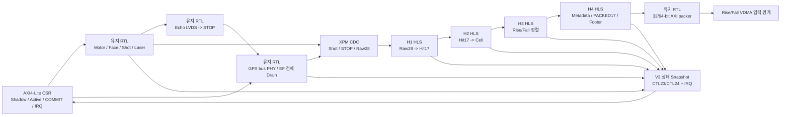

# V3 H6-B1 통합 Top 체크포인트 결과

## 1. 판정

`tdc_gpx_lidar_ctrl_v3_top`의 **H6-B1 통합 제어·데이터 경계는 체크포인트
PASS**다. V2에서 검증한 AXI4-Lite CSR, Shadow/Active, COMMIT, IRQ, 모터·레이저,
Echo와 TDC-GPX 물리 제어 계층을 유지하고, IFIFO Drain 이후 B5-B8 데이터 경로만
V3 H1~H4 HLS와 유지 RTL AXI packer로 교체했다.

이번 판정은 다음 범위를 닫는다.

- 4 Chip의 TDC-GPX Reg7 Shadow/Active/물리 Register 적용
- 잘못된 레이저 목표 왕복시간에 대한 COMMIT 거부와 이전 Active 값 보존
- 4 Chip x 8 STOP x 물리 최대 7 Return의 IFIFO 전체 Drain
- H1~H4 HLS 처리, Hole/Face Footer와 32/64-bit AXI4-Stream 출력
- Face Footer backpressure 중 데이터와 COMMIT 안전 조건 보존
- H4 formatter fault의 진단 요약·상세 bitmap과 `GPX_DATA` IRQ 분류
- `xc7z020clg484-2`의 두 제품 clock 조합 OOC 합성·배치·배선

이 H6-B1 판정 당시 Runtime VDMA, DDR와 PS 종단은 닫히지 않았다. 이후 보드 없이
가능한 H6-B2 범위는
[`V3_H6B2_RUNTIME_VDMA_DDR_PS_SIGNOFF_KO.md`](V3_H6B2_RUNTIME_VDMA_DDR_PS_SIGNOFF_KO.md)에서
PASS했으며, 실제 VDMA/DDR/cache API/Ethernet과 보드 I/O는 H6-B4로 남는다.

## 2. 통합 구조

측정 시작 기준시점 (T0)은 물리 모드에서 동기화된 `fire_done`을 승인하고
`start_tdc`를 발생시키는 사건이다. V3 HLS 경계는 그 이후의 데이터 처리만
소유하므로 레이저 발사와 측정 시작 저지연 경로를 바꾸지 않는다.

## 3. V2와 V3의 소유권

| 기능 | 소유 구현 | H6-B1 원칙 |
|---|---|---|
| AXI4-Lite CSR와 IRQ bank | V2 유지 RTL | 주소와 접근 속성 유지 |
| Shadow/Active와 COMMIT | V2 유지 RTL | Snapshot 원자성, 실패 시 Active 보존 |
| 모터 위치·Face·Shot·레이저 실행 | V2 유지 RTL | 사건 순서와 안전 조건 유지 |
| Echo LVDS와 TDC-GPX bus/EF Drain | V2 유지 RTL | 물리 Return을 EF 완료까지 모두 읽음 |
| Raw28부터 canonical Word | V3 H1~H4 HLS | V2 DDR ABI와 의미·순서 유지 |
| 32/64-bit AXI4-Stream 변환 | 유지 RTL | 합성 시 선택한 폭으로만 pack |
| HLS 신규 fault 상태 | V3 상태 fork | V2 진단 index를 이동하지 않고 확장 |

## 4. COMMIT 안전 유휴 계약

H6-B1에서 유휴 상태를 하나의 신호로 뭉개지 않고 두 의미로 분리했다.

| 상태 | 참이 되는 조건 | 사용하는 이유 |
|---|---|---|
| Processing idle | 승인된 Shot 수가 0, Face-close 상태기계가 유휴, H1~H3에 보류 데이터 없음 | 새 Active 설정이 Shot/Face 처리 중간에 적용되지 않게 함 |
| AXIS output idle | H4와 32/64-bit packer에 보류 Word/Beat 없음 | Footer 또는 stalled Beat가 남은 동안 설정 전환 금지 |
| Processing safe | 기존 처리 pipeline, Echo, 위 두 idle, GPX CDC reset 정상 조건이 모두 참 | COMMIT의 Processing-domain Activate 허용 |

Face Footer가 아직 `TREADY`로 승인되지 않았으면 AXIS output idle은 0이다. 또한
H1~H3가 비었더라도 Face-close 상태기계가 진행 중이면 Processing idle은 0이다.
따라서 stalled Footer 중 COMMIT이 안전하다고 오판하지 않는다.

## 5. H4 formatter 진단과 IRQ

V2의 기존 진단 ABI는 이동하지 않았다. V3에서 필요한 항목만 Processing 진단
소유 범위에 추가했다.

### 5.1 요약 진단 0x1A

| Bit | 이름 | 의미 |
|---:|---|---|
| 19 | Rise formatter fault any | Rise H4 fault bitmap 중 하나 이상이 1 |
| 20 | Fall formatter fault any | Fall H4 fault bitmap 중 하나 이상이 1 |

### 5.2 상세 진단 0x27

| Bit | 의미 |
|---:|---|
| 7:0 | Rise formatter fault bitmap |
| 15:8 | Fall formatter fault bitmap |
| 31:16 | 예약, 0 |

각 8-bit bitmap의 의미는 다음과 같다.

| Bit | H4 fault 의미 |
|---:|---|
| 0 | Active lane profile 오류 |
| 1 | Rise/Fall slope 역할 오류 |
| 2 | HSIZE/VSIZE/slot geometry 오류 |
| 3 | Shot/Line 순서 오류 |
| 4 | Runtime 직렬화 Return 슬롯 오류 |
| 5 | Face-close/Footer 계약 오류 |
| 6 | 예약 입력 Bit가 1로 유입됨 |
| 7 | 예약 출력 Bit가 0이 아님 |

PS는 `CTL23[7:0]`에 진단 index를 넣고 `CTL23[8]` CAPTURE를 W1S로 쓴다.
`CTL23[8]` BUSY가 0, `[9]` VALID가 1, `[10]` ERROR가 0인지 확인한 뒤
Read-only `CTL24`에서 32-bit snapshot을 읽는다. formatter fault는 CSR IRQ bank의
`IRQ_FLAG[9] GPX_DATA` 원인이며, 다른 IRQ 분류를 오염시키지 않는다.

상태를 지울 때는 `CTL0.CLEAR_STATUS`로 원인 sticky를 먼저 지우고,
`IRQ_FLAG[9]`를 W1C로 지운다. 원인이 남은 채 IRQ pending만 지우면 다시
level-high로 잡힌다.

## 6. 기능 시뮬레이션

통합 시험은 4 Chip 모두 Rising, Chip당 8 STOP, STOP당 물리 최대 7 Return으로
수행한다. 각 Chip의 IFIFO1/IFIFO2를 EF 완료까지 Drain하고 13 Processing clock의
Footer backpressure를 주입한다. Falling 전용 2 Chip/2 Chip과 4 Chip 모두
Rising/Falling 가능한 topology는 H6-A 5-profile 차분 회귀가 별도로 보유한다.

| Processing/TDC clock | 출력 폭 | HSIZE | VSIZE | STRIDE | 첫 Frame Beat | 결과 |
|---|---:|---:|---:|---:|---:|---|
| 150/200 MHz | 32 bit | 656 B | 2 Line | 656 B | 328 | PASS |
| 200/150 MHz | 64 bit | 656 B | 2 Line | 656 B | 164 | PASS |

`HSIZE`가 같은 이유는 DDR Line의 byte 계약이 출력 Beat 폭과 독립적이기 때문이다.
64-bit에서는 한 Beat가 8 B이므로 32-bit의 절반인 164 Beat로 같은 656 B Line을
전달한다.

관측 latency는 다음과 같다. 모두 Processing clock 수이며 레이저 목표 왕복시간
입력만 5 ns tick 단위다.

| Processing/TDC | Shot->start_tdc | start_tdc->stop_tdc | stop_tdc->첫 Line | Shot->첫 Line |
|---|---:|---:|---:|---:|
| 150/200 MHz | 0 | 42 | 4177 | 4219 |
| 200/150 MHz | 0 | 55 | 4192 | 4247 |

`Shot->start_tdc=0`은 이 시험이 가상 Encoder/Echo simulation mode를 사용하기
때문이다. 물리 `fire_done` latency를 뜻하지 않는다.

증거: `.work/v3_h6b_integrated_top_diff/260811_h6b_integrated_precommit2`

## 7. formatter fault 주입 시험

정상 0, Rise `0x15`, Rise/Fall `0x15/0xA2`, CLEAR_STATUS 순으로 주입했다.

| 입력 | 0x1A 기대값 | 0x27 기대값 | IRQ |
|---|---:|---:|---|
| 정상 | `0x00000000` | `0x00000000` | 없음 |
| Rise `0x15` | `0x00080000` | `0x00000015` | GPX_DATA만 1 |
| Rise `0x15`, Fall `0xA2` | `0x00180000` | `0x0000A215` | GPX_DATA만 1 |
| CLEAR_STATUS 뒤 | `0x00000000` | `0x00000000` | 0 |

단위 fault 주입은 V3 Processing status source의 분류와 Bit map을 exact compare하고,
통합 Top 시험은 같은 0x1A/0x27이 CSR indexed portal을 통해 정상 0으로 읽히는
경로를 확인한다.

증거: `.work/v3_h6b_formatter_status/260811_h6b_formatter_status_precommit`

## 8. xc7z020 OOC 배치·배선

대상은 4 Chip, Chip당 8 STOP, 최대 7 Return, 기본 2 Rise/2 Fall capability다.
Parent XDC와 package pin이 없는 OOC 시험이므로 GPX I/O register 368개의 IOB
요구만 임시 해제했다. RTL의 IOB 의도는 제거하지 않았으며 실제 Parent 구현에서는
핀 배치와 함께 다시 검증해야 한다. 원본 DRC 보고서에는 이 조건 때문에
`NSTD-1`과 `UCIO-1`이 남지만, 스크립트는 이 두 Parent XDC 전용 항목만 예외로
분류하며 그 밖의 Critical Warning/Error는 0개여야 PASS한다.

| Processing/TDC | 폭 | CSR WNS | PROC WNS | TDC WNS | WHS | Latch/Black box/Blocking DRC |
|---|---:|---:|---:|---:|---:|---:|
| 150/200 MHz | 32 bit | +0.954 ns | +0.196 ns | +0.226 ns | +0.033 ns | 0/0/0 |
| 200/150 MHz | 64 bit | +0.881 ns | +0.060 ns | +0.780 ns | +0.016 ns | 0/0/0 |

64-bit 프로파일의 자원 사용량은 LUT 22,531, FF 44,169, RAMB36 5,
RAMB18 1이다. 32-bit 프로파일은 LUT 22,302, FF 43,993, RAMB36 5,
RAMB18 1이다.

200 MHz 최악 Processing 경로는 H2 result output skid의 registered `ready`에서
통합 설정의 `datapath_idle` register까지다. 5 LUT, 총 4.866 ns이며 배선 지연이
3.962 ns로 81.4%다. `+0.060 ns`는 양수지만 매우 작다. 따라서 H6-B1 OOC
체크포인트는 통과하되 Parent 혼잡·실제 I/O·보드 clock을 포함한 최종 타이밍
Sign-off 근거로 확대 해석하지 않는다.

증거:

- `.work/v3_h6b_integrated_top_impl/260811_h6b_impl_first`
- `.work/v3_h6b_integrated_top_impl/260811_h6b_impl_second`

## 9. 후속 H6-B2와 최종 Sign-off 조건

1. Runtime 직렬화 Return 또는 Shot geometry 변경 시 다음 Face 경계에서
   HSIZE/VSIZE/STRIDE를 VDMA Register와 원자적으로 갱신한다.
2. VDMA Frame buffer handoff 중 이전 geometry와 새 geometry가 섞이지 않는지
   확인한다.
3. 실제 DDR dump를 H4 Golden Word와 비교한다.
4. FreeRTOS/PetaLinux DMA cache 동기화 뒤 H-Line/Ethernet 결과를 비교한다.
5. 물리 IFIFO Drain 도중 Processing abort와 TDC-GPX soft reset을 함께 수행하는
   복구 시험을 닫는다.
6. Parent XDC, IOB, bitstream과 실제 TDC-GPX/모터/레이저/Echo LVDS 보드 시험을
   수행한다.
7. 200 MHz Processing 경로의 `ready -> datapath_idle` 배선 집중을 Parent
   배치에서 다시 확인하고, WNS가 음수가 되면 유휴 판정을 안전하게 등록하는
   별도 최적화를 기능 회귀와 함께 수행한다.

따라서 이 문서의 판정은 **H6-B1 통합 제어·데이터 경계 체크포인트 PASS**다.
후속 H6-B2 보드 독립 결과는 별도 문서에서 PASS했으며, V3 전체 물리 Sign-off는
H6-B4 보드 증거 완료 전까지 보류다.
