# V3 H6-A Parent 데이터 경계 체크포인트 결과

## 1. 판정

`lidar_gpx_hls_parent_data_subsystem`의 H6-A 데이터 경계는 **체크포인트 PASS**다.
외부 TDC-GPX I-Mode 28-bit 병렬 데이터 읽기부터 EF 기반 IFIFO 전체 Drain,
TDC/Processing clock domain crossing (CDC), H1~H4 HLS 처리와 최종 Rise/Fall
32/64-bit AXI4-Stream 출력까지 V2 Golden과 일치했다.

이 판정은 Parent 전체 Sign-off가 아니다. AXI4-Lite CSR, Shadow/Active COMMIT,
Runtime VDMA 재설정, 실제 DDR Word 비교, PS cache 동기화, Ethernet 재포장,
Parent bitstream 및 보드 I/O는 H6-B 이후 단계에 남아 있다.

후속 H6-B1에서 AXI4-Lite CSR, Shadow/Active, COMMIT, IRQ와 V3 데이터 경계의
통합까지 완료했다. 최신 범위는
[`V3_H6B_INTEGRATED_TOP_CHECKPOINT_KO.md`](V3_H6B_INTEGRATED_TOP_CHECKPOINT_KO.md)를
함께 본다.

## 2. 모듈 역할과 데이터 흐름

```mermaid
flowchart LR
    GPX["외부 TDC-GPX 4 Chip<br/>I-Mode 28-bit IFIFO"]
    PHY["V2 유지 RTL<br/>bus PHY + EF 전체 Drain"]
    CDC["XPM 비동기 FIFO<br/>Shot / STOP / Raw result"]
    H1["H1<br/>Raw28 -> Hit17"]
    H2["H2<br/>Hit17 -> Cell"]
    H3["H3<br/>Rise/Fall Cell 정렬"]
    REG["H3-H4 순차 경계<br/>Rise/Fall elastic register"]
    H4["H4<br/>Metadata/PACKED17/Footer Word"]
    PACK["유지 RTL packer<br/>32/64-bit AXI4-Stream"]
    SINK["Rise/Fall VDMA 입력 경계"]

    GPX --> PHY --> CDC --> H1 --> H2 --> H3 --> REG --> H4 --> PACK --> SINK
```

H6-A가 추가로 소유하는 핵심 계약은 다음과 같다.

1. Face 종료 요청은 승인된 Shot이 모두 H3까지 완료된 뒤에만 H5로 전달한다.
2. 상위 Face tracker에 주는 Face 종료 승인 (`o_face_close_ready`)은 활성 Rise/Fall
   lane의 마지막 Face Footer Beat가 실제 AXI handshake 된 뒤에만 발생한다.
3. AXI backpressure 동안 다음 Face를 시작하지 않는다.
4. 물리 IFIFO는 Runtime 직렬화(전시) Return 슬롯 수와 무관하게 EF 완료까지 모두
   읽는다. H2 이후에만 1~7 Return 전시 정책을 적용한다.
5. 측정 시작 기준시점 (T0)은 동기화된 `fire_done` 승인과 `start_tdc` 발생 사건이며,
   GPX Drain과 HLS 처리 뒤에도 같은 Shot identity로 유지한다.

## 3. H4 내부 경계 축소

H4와 유지 RTL packer 사이의 Canonical Line Word AXIS `TDATA`는 248 bit에서
64 bit로 줄였다.

| Bit | 의미 |
|---:|---|
| 31:0 | DDR에 저장할 canonical 32-bit Word |
| 33:32 | Word 종류: Shot Metadata, PACKED17 Cell, Face Footer |
| 42:34 | Line 안의 Word index |
| 51:43 | Line Word 수 |
| 52 | Line 시작 |
| 53 | Line 종료, `TLAST` 생성 기준 |
| 54 | Frame 종료 |
| 55 | 첫 Shot column |
| 56 | 마지막 Shot column |
| 57 | 누락 Shot을 표현하는 Hole Line |
| 58 | Shot Line fault 요약 |
| 63:59 | 항상 0인 reserve |

Shot Context는 첫 4개 Shot Metadata Word에 이미 직렬화된다. Cell 수와 Cell당
Word 수는 COMMIT 후 등록된 Active Lane Profile에서 Adapter가 복원한다. 이를
매 Word에 반복하지 않아 넓은 고 fan-out 배선 경계를 제거하면서 DDR ABI는
바꾸지 않았다.

## 4. 순차 경계와 abort 복구

- H2/H4 HLS 출력은 자동 AXIS register slice 대신 명시적인 2-slot RTL skid가
  backpressure와 abort flush를 소유한다.
- H3 Rise/Fall 출력과 H4 입력 사이에는 1-entry elastic register를 둔다.
- `tdc_gpx_sync_fifo`의 LUTRAM 내용은 reset/flush 때 지우지 않는다. 포인터와
  skid valid만 무효화하고, 메모리 쓰기를 별도 process로 분리해 flush가 모든
  LUTRAM write-enable에 퍼지는 경로를 제거했다.
- abort와 HLS `ap_done`이 같은 Cycle에 겹칠 수 있다. H4 Adapter는 inflight=0,
  HLS 출력 valid=0, RTL skid 출력 valid=0, control valid=0인 관측 가능한 유휴
  상태에서도 flush를 해제해 이미 지난 `ap_done`을 영구 대기하지 않는다.

## 5. 기능 차분 시험

모든 Profile은 TDC-GPX 4 Chip, Chip당 8 STOP, 물리 최대 7 Return을 IFIFO에서
끝까지 읽는다. V2와 V3의 최종 `TDATA/TKEEP/TSTRB/TUSER(0)/TLAST` 캡처 파일을
byte 단위로 비교했다.

| Processing/TDC clock | 출력 폭 | slope 구성 | Runtime 직렬화 Return | 결과 |
|---|---:|---|---:|---|
| 50/200 MHz | 32 bit | Rise 2 Chip/Fall 2 Chip | 1 | PASS |
| 200/50 MHz | 64 bit | 4 Chip 모두 Rising/Falling | 7 | PASS |
| 150/150 MHz | 32 bit | 4 Chip 모두 Rising/Falling | 7 | PASS |
| 150/200 MHz | 32 bit | Rise 2 Chip/Fall 2 Chip | 1 | PASS |
| 200/150 MHz | 64 bit | 4 Chip 모두 Rising/Falling | 7 | PASS |

각 실행은 서로 다른 Rise/Fall backpressure, 실제 Shot이 1개뿐인 Face의 Hole
보충, Shot이 전혀 없는 Face, Footer 완료 전 Face 승인 금지와 sticky fault exact
값을 함께 검사한다.

최종 증거: `.work/v3_h6_parent_data_diff/260811154444`

## 6. xc7z020 배치·배선 결과

대상은 `xc7z020clg484-2`, 최대 4 Chip 모두 Rising/Falling, Chip당 8 STOP,
STOP당 최대 7 Return이다. 200 MHz Processing 경로는 기본 구현 지시문에서
여유가 매우 작아 `timing_explore` 전략을 제품 재현 조건으로 사용했다.

| Processing/TDC clock | 폭 | PROC WNS | TDC WNS | WHS | Latch | Blocking DRC | Routing error |
|---|---:|---:|---:|---:|---:|---:|---:|
| 200/150 MHz | 64 bit | +0.057 ns | +0.453 ns | +0.043 ns | 0 | 0 | 0 |
| 150/200 MHz | 32 bit | +0.219 ns | +0.101 ns | +0.013 ns | 0 | 0 | 0 |

증거:

- `.work/v3_h6_parent_data_impl/260811152034`
- `.work/v3_h6_parent_data_impl/260811153457`

200/150 MHz 최악 Processing 경로는 H4 Fall HLS 출력에서 출력 skid data
register까지이며 8 LUT, 총 4.791 ns다. 배선 지연은 3.572 ns, 약 74.6%다.
WNS는 양수지만 +0.057 ns이므로 큰 물리 여유로 해석하지 않는다. Parent 전체
배치, 다른 IP 혼잡과 실제 I/O가 포함되면 다시 구현해야 한다.

## 7. CDC 검토

두 비동기 구현에서 `report_cdc` 결과는 동일하다.

| 규칙 | 수 | 판정 근거 |
|---|---:|---|
| CDC-6 | 12 | XPM async FIFO의 Gray pointer 동기화와 `ASYNC_REG` 구조 |
| CDC-15 | 1 | XPM async FIFO 내부 dual-port RAM read 경로 |

모든 항목이 Shot/STOP/Result XPM FIFO 내부이며 임의 사용자 조합 CDC가 아니다.
Processing/TDC clock은 비동기 clock group으로 분리했고 각 동일-domain 경로는
Clean/Timed다. 향후 XPM 버전이나 gateway 구조를 바꾸면 이 예외 목록을 새
instance 경로와 다시 대조해야 한다.

## 8. 검토했으나 채택하지 않은 최적화

| 실험 | 결과 | 결정 |
|---|---|---|
| `flatten_hierarchy=rebuilt` | 200/150 MHz PROC WNS -0.013 ns | 제품 설정에서 제외 |
| H4 출력 sync FIFO | 기능은 통과, PROC WNS -0.267 ns | 제거, 2-slot skid 유지 |
| H4 내부 Cell 방출 함수 강제 inline | 기능 통과, H4 200 MHz WNS -0.019 ns | 제거 |
| HLS 내장 AXIS 양방향 register slice만 사용 | H4 WNS +0.048 ns이나 기준 구조보다 악화 | 명시 RTL skid 유지 |

실패한 실험 소스는 남기지 않았고 실행 스크립트의 전략 선택 기능만 재현·진단용으로
유지했다.

## 9. 남은 H6-B 범위

1. AXI4-Lite CSR, Shadow/Active, COMMIT, IRQ 연결은 H6-B1에서 완료했다.
2. Runtime 직렬화 Return 슬롯 수, Shot 수 변경을 다음 Face 경계에서 적용하고
   HSIZE/VSIZE/STRIDE 및 VDMA Frame buffer를 안전하게 갱신한다.
3. VDMA가 DDR에 쓴 Word를 Golden Vector와 직접 비교한다.
4. FreeRTOS 또는 PetaLinux의 DMA cache 동기화 뒤 H-Line/Ethernet 결과를 비교한다.
5. 4 Chip Parent 전체 배치·배선, bitstream, IOB 및 실제 보드 시험을 수행한다.
6. 운용 중 물리 IFIFO Drain과 Processing pipeline에 데이터가 남아 있을 때
   Processing abort와 TDC-GPX soft reset을 함께 수행하는 복구 시나리오를
   통합 command CDC에서 검증한다. 현재 H6-A 시험은 정상 Drain을 완료한 데이터
   경계를 판정하며, 이 in-flight 복구 정책까지 닫았다는 뜻은 아니다.

따라서 H6-A 정상 데이터 경계와 H6-B1 통합 제어·데이터 경계는 체크포인트
Sign-off 가능하며, **H6-B2 DDR/PS와 V3 통합 IP 전체 Sign-off는 보류**다.
