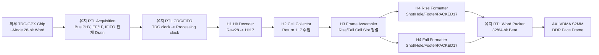
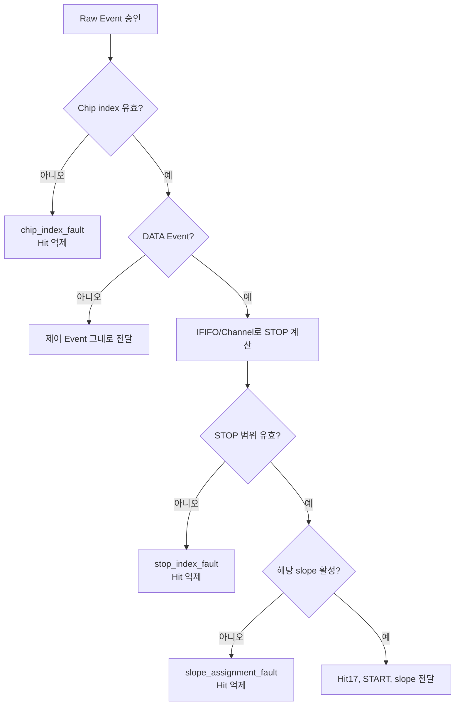

# V3 HLS 코드 상세 해설서

## 1. 문서 목적

이 문서는 `tdc_gpx_lidar_ctrl_v3`의 HLS 데이터 경로를 신호처리 엔지니어가
소스코드 순서대로 읽고, 각 상태와 출력 데이터가 왜 필요한지 판단할 수 있도록
설명한다. 현재 기준은 H0~H4 HLS ABI `3.2`, 최종 AXI4-Stream 출력 폭
32/64 bit, 외부 TDC-GPX I-Mode 28-bit 입력이다.

이 문서가 답하는 질문은 다음과 같다.

- 외부 TDC-GPX 28-bit Word가 17-bit 거리 Hit로 어떻게 분해되는가?
- Return 1~7개가 어느 메모리에 어떤 주소로 모이는가?
- Cell, Cell Slot, Shot Line, Face Frame은 서로 어떤 관계인가?
- Rise/Fall이 같은 Chip에서 동시에 활성화될 때 정렬 순서는 무엇인가?
- 누락 Shot과 누락 Cell을 삭제하지 않고 Hole/placeholder로 만드는 이유는 무엇인가?
- PACKED17은 17-bit AXIS가 아닌데 왜 그런 이름을 사용하는가?
- HLS의 `static` 상태, `ap_ctrl_none`, `ap_ctrl_hs`, `PIPELINE II=1`은 RTL에서
  어떤 회로와 handshake를 뜻하는가?
- HLS와 유지 RTL의 경계, Abort, Clock Domain Crossing (CDC), VDMA 책임은
  어디에서 나뉘는가?

정확한 전체 Bit 위치는
[`V3_H0_H4_HEADER_CONTRACT_KO.md`](V3_H0_H4_HEADER_CONTRACT_KO.md)가 단일
기준이다. 이 문서는 그 Bit가 코드에서 **언제 읽히고, 어떤 상태를 거쳐, 왜 다음
단계로 전달되는지**를 설명한다.

## 2. 전체 구조



HLS는 Processing clock 한 도메인에서만 동작한다. 다음 기능은 HLS로 옮기지
않고 RTL에 유지한다.

| 유지 RTL 기능 | RTL 유지 이유 |
|---|---|
| TDC-GPX Pin과 버스 PHY | `RDN/WRN/CSN/OEN/ADR/DATA`의 물리 I/O 타이밍과 IOB 배치가 필요함 |
| EF/LF 기반 IFIFO 전체 Drain | 외부 Chip 상태와 Runtime TDC-GPX 버스 읽기 타이밍 (`BUS_CLK_DIV`, `BUS_TICKS`)을 직접 제어함 |
| 모터 Decoder, Face tracker, Shot scheduler | Encoder 사건에 대한 고정 지연과 레이저 발사 위치를 Clock 단위로 보장해야 함 |
| `fire_done` 승인과 `start_tdc` | 측정 시작 기준시점 (T0)을 초저지연 순차논리로 확정해야 함 |
| CDC, XPM FIFO, Reset | HLS 한 함수가 여러 비동기 Clock 도메인을 소유하지 않음 |
| AXI4-Lite CSR, Shadow/Active COMMIT, IRQ | 기존 Runtime ABI와 원자적 적용 정책을 유지함 |
| 최종 32/64-bit AXIS Packer | 합성 시 출력 폭 선택과 `TKEEP/TLAST/TUSER` 생성 경계를 단순화함 |

## 3. 먼저 알아야 할 용어

| 용어 | 이 설계에서의 정확한 뜻 |
|---|---|
| Return | 한 Shot에서 한 STOP 채널에 순서대로 들어온 거리 Hit 하나 |
| Hit17 | TDC-GPX I-Mode Word `[16:0]`의 17-bit 거리 원자료 |
| Cell | `Shot 하나 x TDC-GPX Chip 하나 x STOP 하나 x slope 하나`의 Return 묶음 |
| Cell Slot | 한 slope의 Shot Line 안에서 Cell이 차지하는 고정 정렬 위치 |
| Shot column | 한 Face 활성 구간 안에서 레이저를 발사한 위치 번호 |
| Shot Line | Shot Metadata 4 Word와 해당 slope의 모든 Cell Word를 합친 VDMA 한 Line |
| Hole Shot Line | 예정된 Shot column이 누락됐을 때 같은 HSIZE로 생성하는 명시적 빈 Line |
| Face Frame | 예정 Shot Line 전체와 마지막 Face Footer Line을 합친 VDMA Frame |
| AXIS transfer/Beat | `TVALID=1`과 `TREADY=1`이 같은 Clock에 성립해 승인된 전송 한 번 |
| HLS Event | H1~H4 사이의 넓은 내부 AXIS payload 한 개. 최종 DDR Beat와 같은 뜻이 아님 |
| Canonical Word | H4가 만든 폭 독립적인 32-bit DDR 의미 Word |
| PACKED17 | Hit의 하위 16 bit는 Hit Word, Bit 16은 Cell Metadata에 저장하는 형식 |
| Reset Epoch | 짧은 Abort pulse 대신 다음 승인 Event에 실어 보내는 8-bit Abort 세대 번호 |

측정 시작 기준시점 (T0)은 물리 모드에서 동기화된 `fire_done`을 승인하고
`start_tdc`를 발생시키는 사건이다. Shot Metadata의 timestamp는 이 사건의
시각을 나타낸다.

## 4. 권장 코드 읽기 순서

1. [`lidar_v3_hls_limits.hpp`](../hls/common/include/lidar_v3_hls_limits.hpp)
2. [`lidar_v3_hls_bit_field.hpp`](../hls/common/include/lidar_v3_hls_bit_field.hpp)
3. [`lidar_v3_h1_raw_hit_contract.hpp`](../hls/common/include/lidar_v3_h1_raw_hit_contract.hpp)
4. [`gpx_hit_decoder_hls.cpp`](../hls/gpx_hit_decoder/src/gpx_hit_decoder_hls.cpp)
5. [`lidar_v3_h2_cell_contract.hpp`](../hls/common/include/lidar_v3_h2_cell_contract.hpp)
6. [`gpx_cell_collector_hls.cpp`](../hls/gpx_cell_collector/src/gpx_cell_collector_hls.cpp)
7. [`lidar_v3_h3_frame_contract.hpp`](../hls/common/include/lidar_v3_h3_frame_contract.hpp)
8. [`gpx_frame_assembler_hls.cpp`](../hls/gpx_frame_assembler/src/gpx_frame_assembler_hls.cpp)
9. [`lidar_v3_h4_word_contract.hpp`](../hls/common/include/lidar_v3_h4_word_contract.hpp)
10. [`gpx_lane_word_formatter_hls.cpp`](../hls/gpx_lane_word_formatter/src/gpx_lane_word_formatter_hls.cpp)
11. [`rtl/bridges`](../rtl/bridges)의 네 HLS Adapter
12. [`lidar_gpx_hls_mixed_data_top.vhd`](../rtl/top/lidar_gpx_hls_mixed_data_top.vhd)
13. [`lidar_gpx_hls_parent_data_subsystem.vhd`](../rtl/top/lidar_gpx_hls_parent_data_subsystem.vhd)
14. [`tdc_gpx_lidar_ctrl_v3_top.vhd`](../rtl/top/tdc_gpx_lidar_ctrl_v3_top.vhd)

Header를 먼저 읽는 이유는 `data.range(31, 18)` 같은 숫자 해석을 구현 파일에서
추측하지 않기 위해서다. 모든 packed Bit의 소유자는 Header이며, 알고리즘은
`read_field`, `write_field`, `read_flag`, `write_flag`로 그 의미를 사용한다.

## 5. H0 공통 계약층

### 5.1 `lidar_v3_hls_limits.hpp`

이 파일은 HLS 회로의 최대 합성 용량을 정의한다.

| 상수 | 값 | 의미 |
|---|---:|---|
| `kMaximumTdcGpxChipCount` | 4 | HLS 배열이 수용할 수 있는 최대 TDC-GPX Chip 수 |
| `kMaximumStopChannelsPerChip` | 8 | Chip 하나의 최대 STOP 채널 수 |
| `kMaximumReturnCountPerStop` | 7 | Cell 하나의 최대 Return 수 |
| `kMaximumMirrorFaceCount` | 5 | 최대 다면미러 Face 수 |

이 값은 제품 Generic의 현재 활성값과 다르다. 예를 들어 합성 Generic이 Chip 2개면
회로는 2개만 활성화하지만, HLS ABI의 상한과 Bit 폭은 최대 4개를 표현할 수 있게
유지된다.

`tdc_edge_slope_t`는 `fall=0`, `rise=1`을 H1~H4 전체에서 공유한다. 같은 Chip을
Rise mask와 Fall mask에 모두 포함하면 한 Chip의 Rising/Falling Cell이 각각
생성된다.

### 5.2 `lidar_v3_hls_bit_field.hpp`

`bit_field_t<Low, Width>`는 네 값을 컴파일 시점에 만든다.

```text
low   = 필드의 최하위 Bit
width = 필드 폭
high  = low + width - 1
end   = 다음 필드가 시작할 Bit
```

다음 필드는 항상 앞 필드의 `end`에서 시작하므로 같은 숫자를 여러 곳에 반복하지
않는다. `static_assert`는 필드가 payload 폭을 넘으면 HLS 합성 전에 컴파일을
실패시킨다.

### 5.3 데이터 타입 선택 원칙

- `std::uint8_t/16_t/32_t`는 카운터, 비교, 주소, 제어 계산에 사용한다.
- `bool`은 한 Bit 상태에 사용한다.
- `ap_uint<N>`은 17 bit, 162 bit, 319 bit처럼 표준 C 정수로 정확히 표현할 수
  없는 packed 저장소와 HLS/RTL 경계에만 사용한다.
- `hls::stream<T>`는 AXI4-Stream handshake로 합성되는 단계 입출력에 사용한다.

따라서 이 구현은 AMD 전용 타입을 모든 계산에 퍼뜨리지 않고, 임의 Bit 폭이 꼭
필요한 하드웨어 ABI에만 제한한다.

## 6. 공통 Shot Context 162 bit

Shot Context는 한 Shot의 Hit와 Cell이 공유하는 불변 문맥이다. 주요 필드는 다음과
같다.

| 필드 | 코드에서 사용하는 목적 |
|---|---|
| `mirror_face_index` | Face가 바뀌지 않았는지 검사하고 Footer에 기록 |
| `encoder_position_state` | Viewer가 Shot의 미러 위치를 복원하도록 Shot Metadata에 기록 |
| `direction_is_ccw` | State 증가/감소 방향과 Face 연속성 검사 |
| `shot_column_index` | Face 안의 H-Line 위치 및 Hole 수 계산 |
| `is_last_shot_column_in_face` | 계획된 마지막 Shot인지 Geometry 검사 |
| `source_is_simulation` | 물리/가상 Encoder 출처 구분 |
| `active_configuration_version` | Shot 도중 Runtime Active 설정이 바뀌지 않았음을 확인 |
| `fire_command_to_t0_latency_clks` | `fire_pulse`부터 측정 시작 기준시점 (T0)까지 지연 기록 |
| `measurement_start_t0_timestamp_ticks` | 수신 데이터 시점 동기화를 위한 64-bit timestamp |
| `measurement_start_timestamp_is_valid` | timestamp 값 자체가 유효한지 표시 |
| `measurement_start_time_sync_is_valid` | 외부/시스템 시간 동기 상태가 유효한지 표시 |

H3와 H4의 `contexts_equal`은 162-bit 전체를 비교한다. 직접 162-bit 비교기를 만들면
7-series에서 긴 carry 경로가 생겼기 때문에, 32-bit XOR 다섯 조각과 마지막 2-bit를
OR-reduction한다. 논리적 비교 결과는 동일하지만 물리 경로는 얕아진다.

## 7. H1 `gpx_hit_decoder_hls`

### 7.1 역할

H1은 외부 TDC-GPX I-Mode 28-bit Word의 필드를 해석하고, Chip/STOP/slope가 현재
Topology에서 유효한지 검사한 뒤 Hit17 Event를 만든다. 상태를 저장하지 않는
순수 Event 변환 단계다.

```text
I-Mode Word [27:0]

[27:26] IFIFO 안 Channel 0~3
[25:18] START number
[17]    1=Rise, 0=Fall
[16:0]  거리 Hit17
```

논리 STOP 번호는 다음 식으로 만든다.

```text
logical_stop = channel_index_within_ififo + (ififo_bank_select ? 4 : 0)
```

즉 IFIFO0은 STOP 0~3, IFIFO1은 STOP 4~7이다.

### 7.2 함수별 읽기

| 함수 | 역할 |
|---|---|
| `edge_slope_is_enabled` | 해당 Chip Bit가 Rise 또는 Fall Active mask에 있는지 검사 |
| `decode_gpx_raw_event` | Raw Event 하나를 해석하고 fault/Hit 결과를 조립하는 핵심 함수 |
| `gpx_hit_decoder_hls` | AXIS와 scalar 포트를 정의하는 HLS Top 함수 |

`decode_gpx_raw_event`는 먼저 Event 종류, Chip, IFIFO, Shot Context와 sequence를
출력 레코드에 복사한다. 그 다음 DATA Event에서만 I-Mode Word를 해석한다.



잘못된 DATA는 `contains_hit_event=0`으로 H2에 전달하지 않지만, 결과
acknowledgement와 fault는 반드시 출력한다. DATA가 아닌 IFIFO 진행/Drain/Timeout
Event는 Hit 값이 없어도 H2가 Shot을 닫아야 하므로 `contains_hit_event=1`이다.

### 7.3 HLS 지시문

```cpp
#pragma HLS INTERFACE ap_ctrl_none port=return
#pragma HLS PIPELINE II=1 style=flp
```

`ap_ctrl_none`은 함수 시작/완료 pulse 없이 항상 실행되는 스트림 회로를 뜻한다.
`II=1`은 연속 입력에서 매 Clock 새 Event를 받을 수 있다는 목표다. `style=flp`는
입력이 긴 시간 끊겨도 마지막 Event를 다음 입력 없이 배출하게 한다. 외부 GPX
Event는 희소하게 들어올 수 있으므로 이 속성이 데이터 무결성에 중요하다.

## 8. H2 `gpx_cell_collector_hls`

### 8.1 역할

H2는 같은 Shot/Chip/STOP/slope로 들어오는 Hit17을 Return 순서대로 모아 Cell을
만든다. 물리 IFIFO는 앞단 RTL이 EF 완료까지 **모두 Drain**한다. H2는 그중 현재
Runtime 직렬화(전시) Return 슬롯 수까지만 Cell에 저장하며, 그보다 많은 정상
Return은 의도적으로 필터링한다.

```text
물리 Return:       R0 R1 R2 R3 R4 R5 R6  -> 외부 IFIFO에서 모두 읽음
Runtime 설정=3:    R0 R1 R2              -> Cell에 직렬화
의도적 필터:                R3 R4 R5 R6  -> fault 아님
합성 최대 초과:                         R7 -> return_overflow
```

### 8.2 저장 메모리와 주소

H2의 최대 Cell 저장 주소 수는 다음과 같다.

```text
4 Chip x 2 slope x 8 STOP = 64 Cell 주소
```

주소 식은 다음과 같다.

```text
cell_address = chip * 16
             + (Rise ? 0 : 8)
             + stop
```

| 상태 배열 | 의미 | 합성 의도 |
|---|---|---|
| `distance_hit_banks[7][64]` | Return index별 17-bit Hit 저장 | Return 차원을 완전 분할한 LUTRAM |
| `received_return_count[64]` | Cell 주소별 물리 수신 Return 수 | LUTRAM |
| `return_overflow[64]` | 합성 최대 Return 초과 여부 | LUTRAM |
| `cell_error[64]` | START number 오류 등 Cell 오류 | LUTRAM |
| `shot_is_active[4]` | Chip별 열린 Shot 존재 여부 | 작은 상태 RAM |
| `owner_shot_context[4]` | Chip별 최초 승인 Shot Context | Shot 도중 설정 변경 검출 |
| `owner_visible_return_count[4]` | Shot 시작 시 고정한 Runtime Return 수 | Face/Shot 원자성 유지 |

새 Shot이 열릴 때 `scrub_chip_cell_state`가 그 Chip의 16개 Cell 주소에서 count와
fault를 지운다. Hit 데이터 RAM 전체를 매 Shot 0으로 초기화하지 않아도 count가
0이면 오래된 Hit를 읽지 않으므로 불필요한 대규모 Reset 회로를 피한다.

### 8.3 함수별 읽기

| 함수 | 역할 |
|---|---|
| `calculate_cell_slot_address` | Chip/slope/STOP을 0~63 LUTRAM 주소로 변환 |
| `calculate_effective_visible_return_count` | Runtime 값과 합성 최대값을 안전 범위 1~7로 제한 |
| `shot_identity_matches` | sequence, version, Shot column, Face, Simulation 출처 비교 |
| `build_status_result` | 입력 Event 하나에 대한 fault acknowledgement 생성 |
| `build_data_cell_event` | 한 STOP/slope의 Return과 Metadata를 319-bit Cell로 조립 |
| `build_control_cell_event` | IFIFO1 완료, Drain 완료, Timeout 제어 Cell 생성 |
| `scrub_chip_cell_state` | 새 Shot 시작 전 해당 Chip Cell 상태 초기화 |
| `gpx_cell_collector_hls` | Event 종류별 저장, Cell 방출, Shot 종료를 수행하는 Top |

### 8.4 Event별 동작

| 입력 Event | H2 동작 |
|---|---|
| DATA | Hit를 해당 Cell 주소의 다음 Return 위치에 저장하고 status 결과 한 개 출력 |
| IFIFO1_DONE | STOP 0~3의 활성 Rise/Fall Cell을 출력하고 Chip Shot은 계속 유지 |
| DRAIN_DONE | 아직 출력하지 않은 STOP 4~7 또는 전체 STOP Cell을 출력하고 Shot 종료 |
| TIMEOUT | 남은 Cell을 `error_fill_inserted=1`로 출력하고 Shot fault 후 종료 |

Cell 방출 순서는 한 Chip 안에서 `Rise STOP 오름차순 → Fall STOP 오름차순 → 제어
Cell`이다. 최종 시스템 정렬은 H3가 다시 수행하므로, 여러 Chip 사이의 H2 도착
순서에는 의존하지 않는다.

### 8.5 `ap_ctrl_hs`가 필요한 이유

Terminal Event 하나는 최대 여러 Cell을 연속 출력한다. 따라서 입력 하나와 출력
하나가 고정 대응하는 H1과 달리 호출 완료시점이 가변이다.

```cpp
#pragma HLS INTERFACE ap_ctrl_hs port=return
```

RTL Adapter는 `ap_start='1'`을 계속 유지하고, 승인 입력부터 `ap_done`까지
`hls_inflight`를 추적한다. Cell 출력 Loop 자체는 `II=1`이지만 Top 호출 간격은
방출 Cell 수에 따라 달라진다.

## 9. H3 `gpx_frame_assembler_hls`

### 9.1 역할

H3는 여러 Chip에서 순서가 섞여 도착한 Cell을 한 Shot 단위로 모은 뒤 Rise와
Fall Lane을 각각 `활성 Chip 오름차순 → STOP 오름차순`으로 출력한다.

```text
예: Rise mask=0101, STOP/Chip=3

입력 가능 순서 : C2S2, C0S1, C2S0, C0S0, ...
출력 Cell Slot : C0S0, C0S1, C0S2, C2S0, C2S1, C2S2
Slot index     :   0,    1,    2,    3,    4,    5
```

Slope별 Cell Slot 수는 다음 식이다.

```text
Rise slots = popcount(Rise Active mask) x STOP/Chip
Fall slots = popcount(Fall Active mask) x STOP/Chip
```

한 Chip이 두 mask에 모두 있으면 같은 Chip/STOP의 Rise Cell과 Fall Cell이 각 Lane에
한 번씩 존재한다. 최대 구성은 Rise 32 Slot과 Fall 32 Slot이다.

### 9.2 상태와 LUTRAM

| 상태 | 의미 |
|---|---|
| `rise_cells[32]`, `fall_cells[32]` | slope별 `chip*8+stop` 주소의 Cell 저장 |
| `rise_present`, `fall_present` | 각 주소에 이번 Shot Cell이 들어왔는지 표시하는 32-bit bitmap |
| `shot_terminal_mask` | 활성 Chip별 DRAIN_DONE/TIMEOUT 수신 여부 |
| `shot_context` | 현재 열린 Shot의 162-bit Context |
| `shot_rise_mask`, `shot_fall_mask` | Shot 시작 시 고정한 Active topology |
| `history_*` | 앞 Shot column과 Face 연속성을 검사하고 Hole 수를 계산하는 이력 |

H2의 Chip별 DRAIN_DONE/TIMEOUT 제어 Cell이 오면 해당 Chip Bit를
`shot_terminal_mask`에 기록한다. Rise/Fall 양쪽을 지원하는 Chip도 물리 Drain은
한 번이므로 terminal Bit 역시 Chip당 한 개다.

```text
shot_complete = 모든 활성 Chip의 terminal Bit가 수신됨
```

### 9.3 함수별 읽기

| 함수 | 역할 |
|---|---|
| `cell_address` | 한 slope 안의 Chip/STOP을 0~31 저장 주소로 변환 |
| `popcount4` | Active Chip 수 계산 |
| `slot_address` | 연속 Slot index를 실제 활성 Chip/STOP 주소로 역변환 |
| `contexts_equal` | 162-bit 전체 Context를 32-bit XOR 조각으로 비교 |
| `pack_lane_cell` | H2 Cell에서 Shot 공통 Context를 제외한 변화 필드만 LUTRAM에 저장 |
| `make_frame_cell` | 저장 Cell 또는 누락 placeholder를 360-bit 정렬 Cell로 복원 |
| `process_face_close` | 마지막 정상 Shot 뒤 trailing Hole 수와 Face 오류를 계산 |
| `gpx_frame_assembler_hls` | Shot 수집, 중복/누락 검사, Rise/Fall 정렬 출력 수행 |

### 9.4 누락 처리

Shot 종료 시 필요한 Cell이 없으면 그 Slot을 제거하지 않는다. `make_frame_cell`이
같은 Chip/STOP/slope identity를 가진 빈 Cell을 만들고 다음 값을 표시한다.

```text
is_missing_cell_placeholder = 1
error_fill_inserted         = 1
cell_is_faulted             = 1
```

이 방식으로 뒤 Cell의 채널 위치가 앞으로 당겨지지 않는다. PS와 Viewer는 Cell
Metadata의 Chip/STOP/slope와 Slot 위치를 믿고 일정한 H-Line을 복원할 수 있다.

Shot column 자체가 누락된 경우 H3는 첫 정상 Shot의
`missing_shot_columns_before` 또는 Face-close의
`trailing_missing_shot_columns`로 개수만 전달한다. 실제 같은 HSIZE의 Hole Line은
H4와 후단 RTL Packer가 함께 만든다. H4는 Shot 원본 Word 수만큼 Hole Metadata와
0 Cell Word를 만들고, 64-bit 정렬이 필요하면 Packer가 마지막 32-bit Padding
Word를 추가한다.

### 9.5 독립 Rise/Fall Backpressure

H3 Adapter는 Rise/Fall 출력에 각각 360-bit x 32-entry FIFO를 둔다. 한 Lane의
소비자가 정지해도 다른 Lane은 독립적으로 소비할 수 있다. 외부 `shot_done`은 HLS
계산 완료가 아니라 활성 Lane의 마지막 Cell이 실제 `valid/ready`로 모두 소비된
후에만 발생한다.

## 10. H4 `gpx_lane_word_formatter_hls`

### 10.1 역할

H4는 Rise 또는 Fall 한 Lane의 정렬 Cell을 DDR 형식의 32-bit Canonical Word로
변환한다.

```text
Shot Line = Shot Metadata 4 Word
          + Cell 0 PACKED17 Words
          + Cell 1 PACKED17 Words
          + ...

Face Frame = 계획된 모든 Shot/Hole Line
           + Face Footer 8 logical Word를 담는 1~2 Line
```

H4 HLS 출력 AXIS 폭은 항상 64 bit지만, 그 의미는 다음과 같다.

```text
[31:0]  실제 DDR Canonical Word
[58:32] Word 종류, index, Line/Frame 경계와 fault 제어
[63:59] reserved zero
```

즉 H4가 64-bit DDR 데이터를 만드는 것이 아니다. 후단 RTL Packer가 low 32-bit
Canonical Word를 합성 Generic에 따라 32-bit Beat 하나 또는 64-bit Beat의 절반으로
조립한다.

### 10.2 Active Lane Profile

상위 RTL은 COMMIT 후 Face 안전 경계에서 다음 값을 미리 계산해 H4에 등록한다.

| Profile 필드 | 의미 |
|---|---|
| `lane_is_enabled` | 해당 Rise/Fall Lane 사용 여부 |
| `output_axis_width_code` | 0=32 bit, 1=64 bit |
| `lane_cell_slot_count` | 해당 slope의 활성 Chip 수 x STOP/Chip |
| `serialized_return_slot_count` | Runtime 직렬화(전시) Return 슬롯 수 1~7 |
| `serialized_cell_word_count` | Cell 하나의 PACKED17 Word 수 |
| `planned_shot_column_count` | Face에 예정된 Shot Line 수 |
| `raw_shot_line_word_count` | Padding 전 Shot Line 32-bit Word 수 |
| `aligned_hsize_word_count` | 최종 VDMA HSIZE에 맞춘 32-bit Word 수 |
| `hsize_bytes` | VDMA HSIZE byte |
| `face_footer_line_count` | Footer를 담는 Line 수 1 또는 2 |
| `vsize_line_count` | Shot/Hole Line 수 + Footer Line 수 |
| `active_configuration_version` | 이 Profile이 속한 Active 설정 버전 |

`profile_is_consistent`는 이 값을 다시 계산해 상호 일치 여부를 검사한다. Streaming
경로에서 가변 나눗셈을 하지 않으면서 잘못된 Profile은 fault로 검출하는 구조다.

### 10.3 Geometry 계산

```text
Cell Word 수
  = ceil(Runtime Return 슬롯 수 / 2) + 1 Cell Metadata Word

Shot 원본 Word 수
  = 4 Shot Metadata Word + Cell Slot 수 x Cell Word 수

HSIZE Word 수
  = 32-bit 출력: Shot 원본 Word 수
  = 64-bit 출력: 홀수이면 32-bit Padding Word 하나를 더해 짝수로 정렬

HSIZE byte
  = HSIZE Word 수 x 4

Footer Line 수
  = HSIZE Word 수가 8 이상이면 1, 아니면 2

VSIZE Line 수
  = 계획 Shot column 수 + Footer Line 수
```

32-bit 출력에는 폭 정렬 Padding이 없다. 64-bit 출력도 Shot 원본 Word 수가 홀수일
때 Line 마지막에 4 byte 하나만 추가한다. 128-bit 고정 정렬이나 16-byte 강제
정렬은 현재 V3 계약에 없다.

### 10.4 함수별 읽기

| 함수 | 역할 |
|---|---|
| `decode_profile` | 104-bit packed Profile을 표준 C++ 필드 구조로 변환 |
| `multiply_cell_count_by_word_count` | Cell Word 수 2~5를 shift/add로 곱해 DSP/가변 곱셈 제거 |
| `profile_is_consistent` | Return/Cell/HSIZE/VSIZE 계산 계약 검증 |
| `make_missing_context_from_real` | 정상 Shot 앞의 Hole Context 생성 |
| `make_missing_context_from_close` | Face 끝의 trailing/all-hole Context 생성 |
| `make_shot_metadata_word` | 측정 시작 기준시점 (T0), Shot column, Encoder 위치와 flag 직렬화 |
| `make_packed17_cell_word` | Hit 하위 16 bit와 Cell Metadata를 Word로 직렬화 |
| `emit_missing_shot_line` | Hole Metadata와 0 Cell Word를 Shot 원본 Word 수만큼 생성 |
| `make_footer_word` | Face 완료 상태를 8개 logical Word로 생성 |
| `emit_footer` | HSIZE에 따라 Footer를 1~2 Line에 배치 |
| `gpx_lane_word_formatter_hls` | 입력별 검증, Hole/Shot/Footer 방출과 Face 상태 관리 |

## 11. DDR Word 구조

### 11.1 Shot Metadata 4 Word

```text
Word 0: 측정 시작 기준시점 (T0) timestamp [31:0]
Word 1: 측정 시작 기준시점 (T0) timestamp [63:32]
Word 2: [15:0] Shot column, [31:16] Encoder position
Word 3: Shot 상태와 latency
```

Word 3의 주요 Bit는 다음과 같다.

| Bit | 의미 |
|---:|---|
| 0 | 정상 데이터 Line |
| 1 | Hole Line |
| 2 | CCW 방향 |
| 3 | Simulation source |
| 4~5 | Shot timeout/abort 예약, 현재 0 |
| 6 | Shot Line fault |
| 7 | 측정 시작 기준시점 (T0) timestamp 유효 |
| 8 | 시간 동기 상태 유효 |
| 9 | Face의 마지막 Shot column |
| 10 | Encoder-to-scheduler latency 유효 |
| 18:11 | Encoder-to-scheduler latency, Processing clock 수 |

Hole Line은 timestamp를 0, Encoder 위치를 `0xFFFF`로 기록하고 Hole Bit를 세트한다.

### 11.2 PACKED17 Cell

Return 두 개의 하위 16 bit를 32-bit Hit Word 하나에 넣는다.

```text
Hit Word N
┌───────────────────────────────┬───────────────────────────────┐
│ Return 2N+1 low 16 bit        │ Return 2N low 16 bit          │
└───────────────────────────────┴───────────────────────────────┘
 31                            16 15                             0
```

마지막 Cell Metadata Word는 다음과 같다.

| Bit | 의미 |
|---:|---|
| 6:0 | Return 0~6의 Hit[16] |
| 13:7 | Return 0~6 valid bitmap |
| 16:14 | 실제 유효 Return 수 |
| 17 | 1=Rise, 0=Fall |
| 19:18 | Chip index |
| 22:20 | STOP index |
| 23 | 누락 Cell placeholder |
| 24 | Timeout/Error-fill |
| 25 | 의도하지 않은 Hit 손실 예약 Flag |
| 26 | 합성 최대 Return 초과 |
| 27 | Cell 또는 Shot Line fault |
| 30:28 | TDC-GPX IFIFO Drain timeout 원인 |
| 31 | Cell Metadata 식별 Tag, 항상 1 |

PACKED17은 17-bit 값의 손실을 막으면서 PS가 32-bit Word 단위로 빠르게 읽도록 한
ABI다. Hit[16]을 Metadata에 모았으므로 각 Hit를 3 byte로 흩어 저장하지 않는다.

### 11.3 Face Footer 8 Word

| Word | 내용 |
|---:|---|
| 0 | Magic `0x47504631`, ASCII `GPF1` |
| 1 | 32-bit Frame identifier |
| 2 | Face index, slope, 방향, Simulation, 출력 폭 code |
| 3 | Active configuration version |
| 4 | 계획 Shot column 수, Cell Slot 수, Runtime Return 슬롯 수 |
| 5 | HSIZE byte, VSIZE Line 수 |
| 6 | 완료 Line 수와 Face/개수/Shot/Hole/all-hole summary |
| 7 | Commit `0x434F4D54`, ASCII `COMT` |

Footer의 마지막 Word와 AXIS `frame_end`가 모두 정상이어야 PS가 해당 Face Frame을
완료 데이터로 승인할 수 있다. Footer 뒤 나머지 HSIZE 영역은 0으로 채운다.

## 12. 수치 예제

다음 합성 및 Runtime 조건을 가정한다.

```text
TDC-GPX Chip       = 4
STOP/Chip          = 8
Rise mask          = 0011
Fall mask          = 1100
Runtime Return     = 3
AXIS 출력 폭       = 64 bit
Face당 Shot column = 1800
```

Rise와 Fall은 각각 활성 Chip 2개이므로 Lane별 Cell Slot은 16개다.

```text
Cell Word 수       = ceil(3/2) + 1 = 3 Word
Shot 원본 Word 수 = 4 + 16 x 3 = 52 Word
HSIZE              = 52 x 4 = 208 byte
64-bit Beat/Line   = 52 / 2 = 26 Beat
Footer Line 수     = 1
VSIZE              = 1800 + 1 = 1801 Line
Lane별 Frame 크기  = 208 x 1801 = 374,608 byte
```

Rise와 Fall VDMA Frame은 서로 독립이며 각각 위 크기를 사용한다. Footer의 실제
정보는 8 Word뿐이지만 VDMA Line 폭을 바꾸지 않기 위해 Footer Line 전체 HSIZE를
유지한다.

최소 예인 Cell Slot 1개, Runtime Return 1개는 다음과 같다.

```text
Cell Word 수       = 2 Word
Shot 원본 Word 수 = 4 + 1 x 2 = 6 Word = 24 byte
Footer 8 Word      = HSIZE 6 Word보다 큼
Footer Line 수     = 2
VSIZE              = 계획 Shot 수 + 2
```

Footer가 두 Line이 되는 이유는 VDMA Frame 안에서 모든 Line이 같은 HSIZE를 가져야
하기 때문이다. 첫 Footer Line에 6 Word, 둘째 Line에 나머지 2 Word와 0 Padding을
넣고 둘째 Line 끝에서 Frame을 종료한다.

## 13. Reset, Abort, Backpressure

### 13.1 H1

H1 Adapter는 `i_abort` 동안 HLS reset을 직접 활성화하고 입력/출력을 숨긴다. H1은
상태가 없으므로 별도 Reset Epoch가 필요하지 않다.

### 13.2 H2~H4

H2~H4는 가변 개수 출력을 만들 수 있어 Abort 시점에 HLS 내부나 출력 Register에
오래된 데이터가 남을 수 있다. Adapter는 다음 순서를 사용한다.

1. Abort 상승 Edge에서 8-bit Reset Epoch를 증가시킨다.
2. 입력 Skid와 출력 FIFO/Skid를 Flush한다.
3. 이미 시작한 HLS 호출은 `ap_done`까지 소비하되 외부에는 출력하지 않는다.
4. 관측 가능한 오래된 출력이 모두 사라지면 입력을 다시 허용한다.
5. 다음 승인 Event가 새 Reset Epoch를 HLS에 전달한다.
6. HLS는 Epoch 변화 확인 후 부분 Shot/Face 상태를 지운다.

짧은 Abort pulse를 HLS scalar 입력으로 직접 전달하지 않는 이유는 Backpressure 중
pulse를 놓칠 수 있기 때문이다. 세대 번호는 다음 Event payload에 묶여 handshake로
전달되므로 유실되지 않는다.

### 13.3 Backpressure 규칙

- AXIS payload는 `TVALID=1`, `TREADY=0` 동안 바뀌면 안 된다.
- H2/H4 Adapter의 2-slot Skid는 넓은 HLS 경계의 Ready 조합 경로를 끊는다.
- H3 Rise/Fall FIFO는 Lane별 Backpressure를 분리한다.
- `ap_ready` 또는 입력 `TREADY`만 보고 호출 완료를 판단하지 않는다.
- Adapter의 `hls_inflight`와 `ap_done`이 오래된 출력 Drain 완료를 판정한다.

## 14. HLS와 RTL 통합 파일

| 파일 | 연결 책임 |
|---|---|
| `lidar_gpx_hit_decoder_hls_adapter.vhd` | V2 Raw record ↔ H1 AXIS, fault pulse/sticky, inflight count |
| `lidar_gpx_cell_collector_hls_adapter.vhd` | H1 Hit ↔ H2 AXIS, Reset Epoch, stale result Drain |
| `lidar_gpx_frame_lane_assembler_hls_adapter.vhd` | H2 Cell/Face-close ↔ H3, Rise/Fall 독립 FIFO, shot_done |
| `lidar_gpx_lane_word_formatter_hls_adapter.vhd` | H3 Cell ↔ H4, Active Profile, Canonical Word와 fault |
| `lidar_gpx_hls_hit_cell_frame_pipeline.vhd` | H1→H2→H3 연결과 통합 idle 검사 |
| `lidar_gpx_hls_axis_output_subsystem.vhd` | Rise/Fall H4와 최종 32/64-bit Packer 연결 |
| `lidar_gpx_hls_mixed_data_top.vhd` | H1~H4 전체 Processing 데이터 경로 |
| `lidar_gpx_hls_parent_data_subsystem.vhd` | 유지 Acquisition/CDC와 HLS 경로 연결, Face-close 순서 보장 |
| `tdc_gpx_lidar_ctrl_v3_top.vhd` | CSR, Motor/Laser, Echo, TDC-GPX, HLS, AXIS를 통합한 공개 IP Top |

Face-close는 H3에 입력됐다는 사실만으로 완료되지 않는다. 활성 Lane의 H4 Footer가
최종 AXIS에서 소비된 뒤 ACK해야 다음 Face 설정과 VDMA Profile을 안전하게 적용할
수 있다.

## 15. Pipeline과 타이밍 해석

| 단계 | HLS scheduling 목표 | 핵심 처리율 특성 |
|---|---:|---|
| H1 | 5 ns | Top `II=1`, 희소 Event flush 가능 |
| H2 | 5 ns | Cell 방출 Loop `II=1`, 호출 간격은 Cell 수에 따라 가변 |
| H3 | 4 ns | Cell Slot 방출 Loop `II=1`, 200 MHz 배선 여유 확보용 강화 목표 |
| H4 | 5 ns | Word 방출 Loop `II=1`, 호출 간격은 Line/Hole/Footer 크기에 따라 가변 |

HLS scheduling 목표는 실제 제품 Clock Generic과 같은 뜻이 아니다. 생성 RTL은
Processing clock 150/200 MHz에서 별도 Vivado 배치·배선 Sign-off를 수행한다.

`#pragma HLS BIND_STORAGE ... impl=lutram`은 작은 상태 배열을 LUTRAM으로 유도한다.
이는 대용량 순차 FIFO를 뜻하지 않는다. H2/H3의 주소 기반 임시 Cell 저장에는
LUTRAM이 적합하고, Stage 간 흐름 제어와 Backpressure에는 RTL FIFO/Skid가 적합하다.

## 16. 테스트벤치 읽기와 검증 소유권

| 단계 | CSim 테스트의 핵심 | 추가 Sign-off |
|---|---|---|
| H1 | 네 Topology, 모든 field, Hit[16], Chip/STOP/slope fault | C/RTL CoSim, V2 차등, 150/200 MHz 구현 |
| H2 | Return 1~7, Runtime 필터, 8번째 overflow, IFIFO 분할, Timeout, Epoch | C/RTL CoSim, V2 차등, Abort/backpressure |
| H3 | 역순 Cell 정렬, 양 Edge, 누락/중복, Hole, Face-close, 여덟 fault | C/RTL CoSim, V2 차등, 독립 Lane backpressure |
| H4 | Return sweep, PACKED17, Hole, Footer, 32/64 profile, 일곱 fault | 최종 Beat V2 직접 비교, 150/200 MHz 구현 |

HLS CSim은 알고리즘과 Bit 계약을 빠르게 검사하지만 다음을 단독으로 증명하지
못한다.

- 생성 RTL의 실제 handshake latency
- HLS Adapter의 Abort와 stale-output 차단
- Rise/Fall FIFO Backpressure
- CDC와 비동기 Clock 비율
- 최종 AXIS `TKEEP/TLAST/TUSER`
- Vivado 배치·배선 Timing

따라서 유지보수 변경은 CSim만 통과하고 끝내면 안 된다. 단계별 상세 시험 목적은
[`V3_H2_TESTBENCH_GUIDE_KO.md`](V3_H2_TESTBENCH_GUIDE_KO.md),
[`V3_H3_TESTBENCH_GUIDE_KO.md`](V3_H3_TESTBENCH_GUIDE_KO.md),
[`V3_H4_TESTBENCH_GUIDE_KO.md`](V3_H4_TESTBENCH_GUIDE_KO.md),
[`V3_H5_TESTBENCH_GUIDE_KO.md`](V3_H5_TESTBENCH_GUIDE_KO.md),
[`V3_H6_TESTBENCH_GUIDE_KO.md`](V3_H6_TESTBENCH_GUIDE_KO.md)를 따른다.

## 17. 디버깅 순서

데이터가 DDR에서 잘못 보일 때 뒤에서부터 무작정 추적하지 말고 다음 순서로
경계를 확인한다.

1. 외부 I-Mode Word의 `[16:0]`, slope, START number, IFIFO Channel을 확인한다.
2. H1 결과에서 Chip/STOP/slope fault와 Hit17을 확인한다.
3. H2 Cell의 `visible_return_count`, `serialized_return_slot_count`, Return 배열,
   overflow와 timeout bitmap을 확인한다.
4. H3에서 Lane Cell Slot index와 Chip/STOP 순서, placeholder, Shot gap을 확인한다.
5. H4 Shot Metadata Word 0~3과 각 Cell Metadata Tag Bit 31을 확인한다.
6. Face Footer의 `GPF1`, Active version, HSIZE/VSIZE, 완료 Line 수, `COMT`를 확인한다.
7. RTL Packer 출력의 `TKEEP`, `TLAST`, `TUSER(SOF)`를 확인한다.
8. VDMA가 적용한 HSIZE/VSIZE/STRIDE와 Active Profile version이 같은지 확인한다.
9. PS가 DMA cache 동기화 후 같은 Footer와 Word를 읽는지 확인한다.

Fault가 보이면 해당 Stage의 control bitmap과 Adapter sticky를 함께 본다. Event
pulse는 한 Clock일 수 있지만 sticky는 CSR Clear 전까지 원인을 보존한다.

## 18. 변경 영향 표

| 변경하려는 항목 | 반드시 함께 수정/검증할 위치 |
|---|---|
| Chip/STOP/Return/Face 최대값 | `lidar_v3_hls_limits.hpp`, 모든 contract `static_assert`, VHDL contract package, CSim, V2 차등, 구현 |
| Shot Context 필드 | H1 contract, H3/H4 비교와 Metadata, VHDL pack/unpack, ABI Major/Minor |
| I-Mode 28-bit 해석 | H1 contract/decoder, 외부 GPX RTL, H1 Golden과 데이터시트 계약 |
| Runtime Return 의미 | H2 저장/필터, H4 Profile/Cell Metadata, VDMA HSIZE, PS decoder |
| Cell 정렬 순서 | H3 `slot_address`, Viewer 채널 mapping, H3/H5 차등 테스트 |
| Shot Metadata | H4 serializer, PS parser, Ethernet ABI, Golden Vector |
| Face Footer | H4 Footer, VDMA VSIZE, PS Frame 완료 판정, ABI version |
| 32/64-bit 출력 | Profile manager, H4 Profile 검사, RTL Packer, VDMA 폭, Parent BD |
| Abort 정책 | H2~H4 Adapter Epoch/Flush, 통합 idle, backpressure/abort 회귀 |

Bit ABI가 바뀌면 같은 폭 안의 작은 변경이라도 `kHlsContractAbiMinor`와 PS/Viewer
호환성을 검토한다. 기존 필드 의미가 바뀌거나 폭/순서가 깨지면 ABI Major 변경이
필요하다.

## 19. 생성 RTL 관리

Vitis HLS가 만든 Verilog는 C++ 원본이 아니다. 다음 파일은 직접 수정하지 않는다.

```text
system_integration/v3/ip_repo/tdc_gpx_lidar_ctrl_v3_3_0/
  src/hls_generated/
```

원본은 `system_integration/v3/hls/` 아래의 C++와 Header다. 변경 후 각 HLS 실행기로
CSim, C synthesis, C/RTL CoSim을 수행하고, IP 패키징 실행기가 `.work`의 생성 RTL을
Self-contained IP 안으로 복사한다.

대표 재현 명령은 다음과 같다.

```powershell
./system_integration/v3/scripts/run_v3_hls_hit_decoder.ps1 -Step all
./system_integration/v3/scripts/run_v3_hls_cell_collector.ps1 -Step all
./system_integration/v3/scripts/run_v3_hls_frame_assembler.ps1 -Step all
./system_integration/v3/scripts/run_v3_hls_lane_word_formatter.ps1 -Step all
./system_integration/v3/scripts/run_v3_ip_package.ps1 -SkipHlsSynthesis
```

실제 단계별 실행기 이름과 Sign-off 명령은 각 결과 문서와
[`README.md`](../README.md)를 기준으로 한다. `.work/`의 로그와 생성 프로젝트는
재현 산출물이며 Git 추적 원본이 아니다.

## 20. 코드 검토 체크리스트

- packed Bit를 숫자로 직접 자르지 않고 계약 Header 이름을 사용했는가?
- 일반 계산은 표준 고정폭 정수형을 우선했는가?
- Runtime 설정은 승인 Event/Face 경계에서 원자적으로 고정되는가?
- 실제 유효 Return 수와 Runtime 직렬화 Return 슬롯 수를 혼용하지 않았는가?
- Return 수를 줄여도 외부 IFIFO 전체 Drain 계약이 유지되는가?
- 같은 Chip의 Rise/Fall 동시 활성에서 두 Lane Cell이 모두 생성되는가?
- 누락 Cell/Shot이 뒤 채널과 column을 밀지 않고 placeholder/Hole로 남는가?
- `TVALID && !TREADY` 동안 payload와 경계가 안정적인가?
- Abort 뒤 오래된 HLS 출력이 외부로 다시 나타나지 않는가?
- Face Footer의 Active version, HSIZE, VSIZE와 VDMA 적용값이 일치하는가?
- CSim뿐 아니라 C/RTL CoSim, V2 차등, 150/200 MHz 구현을 필요한 범위만큼 다시
  수행했는가?

이 체크리스트를 모두 만족해야 HLS 알고리즘 변경을 통합 IP 변경으로 승격할 수
있다.
